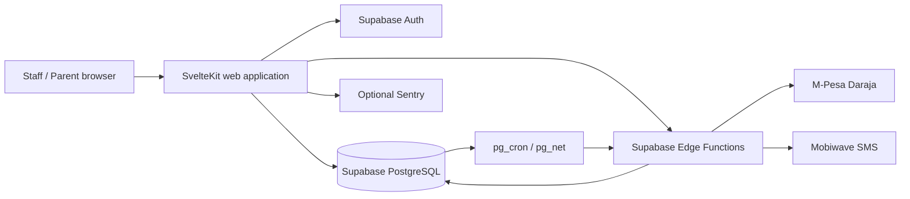

# eShule Architecture

> **Current-state reference — 1 September 2026.** This document describes the architecture represented by the current codebase. It is implementation documentation, not a claim that every integration or deployment path has been proven in production.

## Product boundary

eShule is a multi-tenant school-operations platform. **ReClass is the remedial learning and programme-management module within eShule**, not the global product identity.

Core domains:

- **School administration** — students, guardians, teachers, classes, subjects, schedules and operational records.
- **Teaching & learning** — teacher workspaces, attendance and academic workflows.
- **School finance** — fees, invoices, receivables, reconciliation and financial reporting.
- **ReClass** — remedial sessions, attendance, programme operations and committee governance.
- **Payroll** — teacher compensation, allowances, remedial payments, committee payments and role-specific compensation.
- **Receipts** — evidence of successful payments, distinct from invoices, obligations and payroll sheets.
- **Communication** — parent/guardian and teacher messaging, notifications and delivery tracking.
- **Governance & audit** — responsibilities, approvals, separation of duties and evidence.

## Responsibility and rights model

```text
User
  -> Base role
  -> Functional / committee assignment
  -> Responsibilities
  -> Rights / capabilities
  -> Derived navigation
  -> Dashboard / queues
  -> Allowed actions
```

The UI is not a security boundary. Every mutation is independently protected by server-side authorization and, where applicable, database/RLS controls.

| Domain | Owner |
|---|---|
| School finance | **Bursar** |
| Remedial operations | **ReClass** |
| Teacher compensation | **Payroll** |
| Actual payment evidence | **Receipts** |
| Notifications and audit | **Shared services** |

The Principal provides oversight and approval where assigned. The Principal does not replace the Bursar as owner of school finance or the ReClass committee as operator of remedial workflows.

## Runtime architecture



The application is a **modular monolith**. SvelteKit routes, server services and shared UI deploy together. Edge Functions isolate external payment/SMS integrations and scheduled workers. PostgreSQL is the durable system of record.

## Application layers

| Layer | Responsibility |
|---|---|
| `src/routes/` | Page UI, server loads, form actions and HTTP handlers |
| `src/lib/components/` | Shared presentation and interaction components |
| `src/lib/server/` | Authentication context, authorization, ownership, domain services and server-only operations |
| `src/lib/supabase/` | Browser/server clients and generated database types |
| `supabase/migrations/` | Schema, functions, triggers, constraints, indexes and RLS policies |
| `supabase/functions/` | Payment, SMS and scheduled integration workers |
| `scripts/` | Static and CI verification tooling |
| `e2e/` | Playwright end-to-end specifications |

The domain-service boundary is pragmatic rather than a strict clean-architecture boundary. New privileged operations should use shared authorization/domain helpers instead of duplicating policy logic in pages.

## Authentication and authorization

1. Supabase Auth establishes the authenticated identity.
2. The server resolves tenant and role information from authoritative records.
3. Functional and committee assignments add responsibilities and capabilities.
4. Route guards control broad navigation.
5. Server actions and domain functions independently enforce authorization and ownership.
6. Database controls provide additional isolation where configured.

Service-role access bypasses RLS. Privileged application queries therefore require explicit tenant and ownership scoping. Tenant-isolation verification is maintained as a CI/static gate.

## Teacher and committee model

Teacher delivery scope is represented by `teacher_type`:

- `classroom`
- `remedial`
- `both`

`remedial_role` is a governance assignment, not a replacement for teacher type.

Remedial duties are separated:

- **Teacher** — delivers sessions and records attendance.
- **Authorized committee member/chairman** — reviews/approves attendance.
- **Treasurer** — prepares/runs remedial payroll and initiates payout.
- **Chairman** — approves payroll/authorizes payout where required.

Generic teaching access does not automatically grant governance approval rights.

## Financial model

Student/parent obligations, actual payments and teacher compensation are separate concepts.

```text
Invoice / obligation
        |
        v
Payment transaction
        |
        v
Receipt / payment evidence

Payroll definition -> Payroll run -> Payment -> Teacher receipt
```

ReClass remedial fees belong to the student/parent obligation side. ReClass teaching and committee compensation belongs to Payroll. The Bursar owns school finance operations; Payroll owns compensation processing.

Payment reconciliation is tenant-scoped and idempotent. External M-Pesa transaction identifiers must not create duplicate accounting events.

## Notifications and audit

Notifications and audit are shared services across domains.

Notifications follow an event/template/delivery model with explicit delivery states and retry handling. Audit records should capture actor, action, affected record, time, result and relevant approval/context data. Automated events distinguish the system-generated event from the human action that triggered them.

## Background processing

Scheduled work uses PostgreSQL scheduling plus Edge Functions. Current jobs include payment reminders, notification delivery, cleanup and domain maintenance.

The database-backed notification queue is suitable for the current architecture but is not a substitute for a durable broker at high scale. Before high-volume production, queue claiming, leases, retry/dead-letter behavior and observability should be hardened.

## Deployment boundary

The authoritative web deployment direction is SvelteKit/Vercel with Supabase for database, authentication and Edge Functions. Historical Docker/VPS material should not be treated as the active deployment path unless deliberately reintroduced and validated.

Production readiness requires evidence for clean migration replay, live authorization/RLS verification, provider sandbox/callback testing, backup/restore drills, CI/build/type/test gates, observability and rollback procedures.

## Development invariants

1. Never use client visibility as the authorization boundary.
2. Derive tenant context from the verified server session.
3. Preserve separation of duties for attendance, payroll and payment approval.
4. Keep school finance under the Bursar.
5. Keep remedial operations under ReClass.
6. Keep teacher compensation under Payroll.
7. Treat receipts as payment evidence, not invoices or payroll sheets.
8. Treat notifications and audit as shared infrastructure.
9. Add tenant/ownership checks to privileged queries and mutations.
10. Update tests and documentation when changing a business invariant.

## Related documentation

- [`README.md`](README.md) — product and developer entry point
- [`API.md`](API.md) — implemented application interfaces and actions
- [`DATABASE.md`](DATABASE.md) — schema, integrity and isolation reference
- [`SECURITY.md`](SECURITY.md) — security model and release blockers
- [`DEPLOYMENT.md`](DEPLOYMENT.md) — deployment and release process
- [`OPERATIONS.md`](OPERATIONS.md) — operational procedures and observability
- [`CONTRIBUTING.md`](CONTRIBUTING.md) — development and review rules
- [`ROADMAP.md`](ROADMAP.md) — prioritized product and engineering work
- [`CHANGELOG.md`](CHANGELOG.md) — implementation history
