# ReClass Architecture

> Current-state note (2026-08-01): use [AUDIT-2026-08.md](AUDIT-2026-08.md) for the latest cross-cutting assessment and diagrams; this file contains the expanded architecture reference.

**Audit date:** 2026-07-22  
**Scope:** implementation-grounded description of the repository at this date. "Current" means code or deployment configuration present in the repository; it does not prove that every migration, function, or deployment is active in production. "Target" is a recommended design for sustained operation at millions of users and is not implemented.

## 1. System Purpose and Boundaries

ReClass is a multi-tenant remedial-class management SaaS for Kenyan schools. It serves six roles (`super_admin`, `school_admin`, `principal`, `teacher`, `bursar`, and `parent`) and covers scheduling, teacher attendance and payroll, students and guardians, invoices and waivers, M-Pesa payments, SMS notifications, messaging, and exam results.

The current system is a modular SvelteKit application backed by managed Supabase services. It is not a microservice system: route handlers and domain modules share one deployment and one PostgreSQL schema. Supabase Edge Functions form a separate integration boundary for payments and SMS.

### Current System Architecture

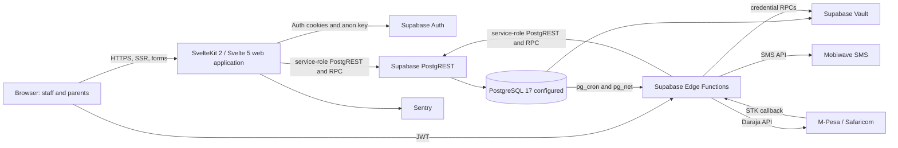

Evidence: `src/hooks.server.ts`, `src/lib/supabase/server.ts`, `supabase/functions/`, `supabase/migrations/20260714000001_cron_schedules.sql`, `package.json`.

## 2. Architectural Layers

The repository has pragmatic layers, but does not enforce dependency inversion or a database repository interface.

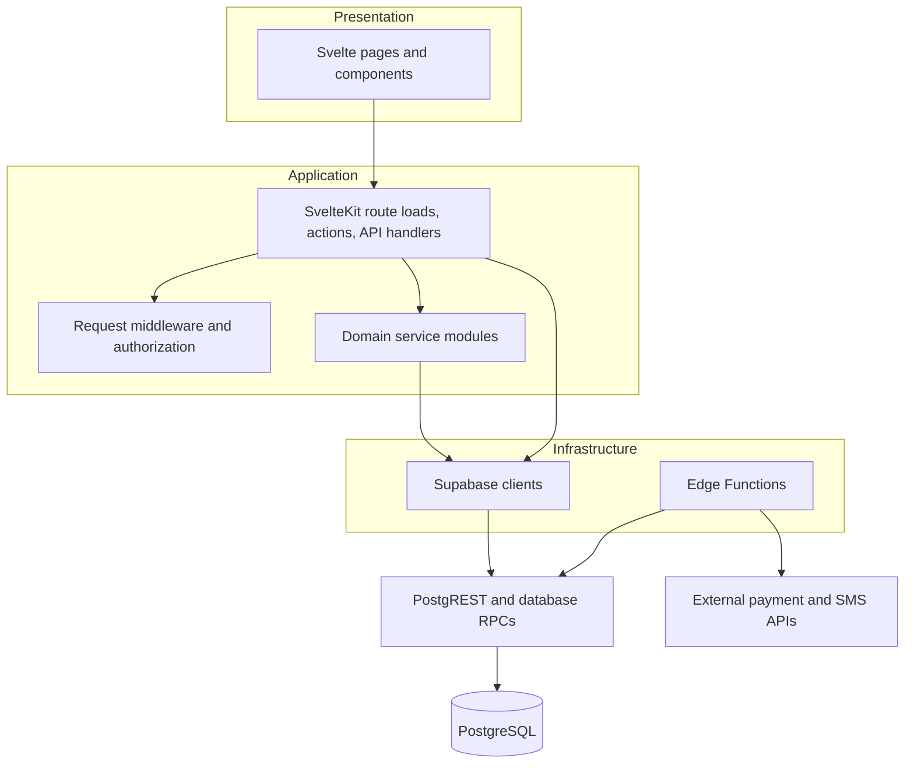

| Layer | Implemented responsibility | Primary evidence |
|---|---|---|
| Presentation | Svelte 5 pages, shared layout/UI components, local form state | `src/routes/**/*.svelte`, `src/lib/components/` |
| Request/application | SSR loads, form actions, HTTP handlers, role checks | `src/routes/**/*.{server.ts,ts}`, `src/lib/server/auth.ts` |
| Cross-cutting middleware | Client initialization, user resolution, impersonation, request ID, headers, route guard | `src/hooks.server.ts`, `src/lib/server/middleware.ts` |
| Domain services | Queries and mutations for invoices, attendance, students, payroll, credentials, scheduling, and waivers | `src/lib/server/` |
| Persistence | Typed Supabase clients, PostgREST queries, PostgreSQL functions/triggers | `src/lib/supabase/`, `supabase/migrations/` |
| Integrations/jobs | M-Pesa STK/callback, SMS dispatch, reminders, credential tests | `supabase/functions/` |

Routes still contain direct database access, so the domain-service layer is partial rather than a strict boundary.

## 3. Folder Architecture

```mermaid
flowchart TB
    ROOT[Repository root] --> SRC[src]
    ROOT --> SUPA[supabase]
    ROOT --> DOCS[docs]
    ROOT --> OPS[Dockerfile, CI, Sentry config]
    SRC --> ROUTES[routes]
    SRC --> LIB[lib]
    ROUTES --> PUBLIC[public/login/API routes]
    ROUTES --> APP[(app) authenticated role routes]
    LIB --> SERVER[server domain and middleware]
    LIB --> COMPONENTS[components]
    LIB --> STORES[stores and client utilities]
    LIB --> CLIENTS[supabase clients and generated types]
    SUPA --> MIG[migrations]
    SUPA --> FUN[Edge Functions and shared helpers]
    SUPA --> SEED[seed SQL]
```

Key ownership:

| Path | Purpose |
|---|---|
| `src/routes/(app)/admin/` | School administration and academic operations |
| `src/routes/(app)/parent/` | Parent-owned students, fees, payments, messages, results |
| `src/routes/(app)/teacher/`, `principal/`, `bursar/` | Role-specific operational views |
| `src/routes/(app)/super-admin/` | Cross-tenant management, audit, impersonation |
| `src/lib/server/` | Shared server-only authorization, ownership, queries, rate limiting, domain operations |
| `src/lib/supabase/` | Browser/session and service-role clients plus generated schema types |
| `supabase/functions/` | Deno HTTP integration endpoints and cron-invoked workers |
| `supabase/migrations/` | Ordered schema, function, policy, trigger, index, and cron changes |

## 4. Request and API Flows

### Normal Request Flow

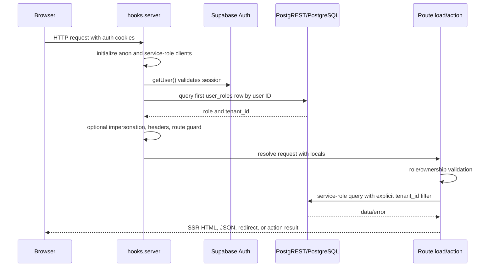

`locals.srv` bypasses RLS. Correct tenant isolation therefore requires every tenant query and write to include `tenant_id`, and parent/teacher operations additionally use ownership helpers where implemented (`src/lib/server/ownership.ts`).

### Authentication and Authorization

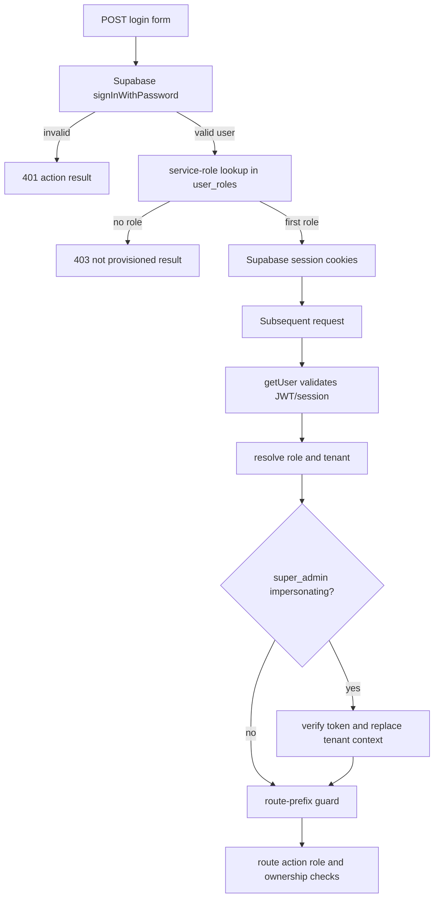

Important behavior:

- Identity is established with the cookie-aware anon client and `auth.getUser()`, not by trusting browser metadata.
- Role and tenant are loaded with the service role from `user_roles`; only the earliest role is used (`src/lib/server/middleware.ts:61-71`). Multiple role assignments are not selectable.
- The global guard controls top-level route prefixes. Mutating actions must still call role/ownership checks.
- Browser code uses the anon client; server routes and Edge Functions use the service-role key (`src/lib/supabase/server.ts`, `supabase/functions/_shared/supabase.ts`).

### API and Integration Flow

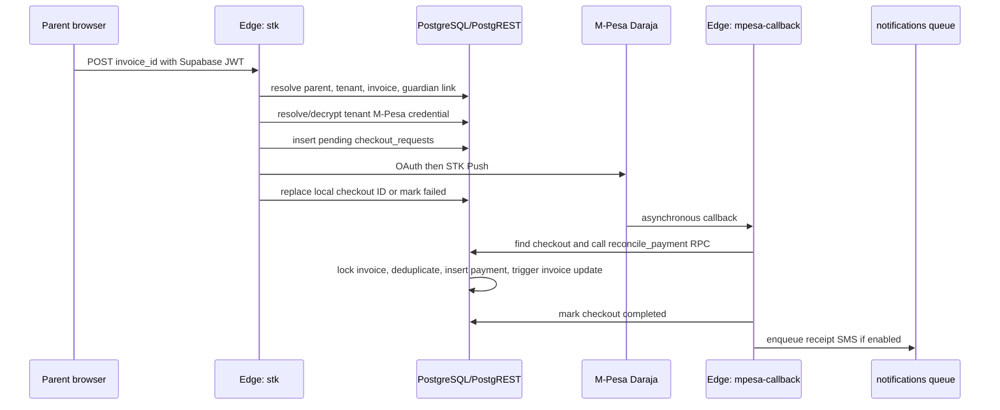

Application APIs are mostly SvelteKit form actions and page loads. Explicit HTTP endpoints include logout and health checks under `src/routes/api/`; external integration endpoints are Supabase Edge Functions. There is no versioned public REST API or API gateway in the repository.

## 5. Background Jobs and Queue Processing

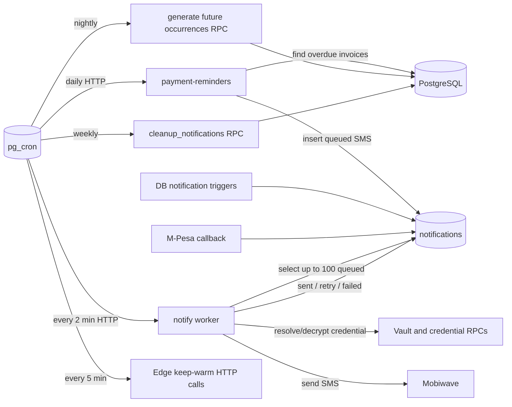

Current queue semantics:

- `notifications` is a database-backed work table, not a broker.
- `notify` polls `status = 'queued'`, processes sequentially, retries at most three times, and records `next_retry_at` (`supabase/functions/notify/index.ts`). The selection does not filter `next_retry_at` and does not atomically claim rows.
- Payment reminders batch tenant settings, optimistically update `last_reminded_at`, then insert a notification (`supabase/functions/payment-reminders/index.ts`). Those two writes are not one transaction.
- Cron calls require Vault URLs and a service-role secret provisioned outside migrations (`supabase/migrations/20260714000001_cron_schedules.sql`).

## 6. Service Dependencies

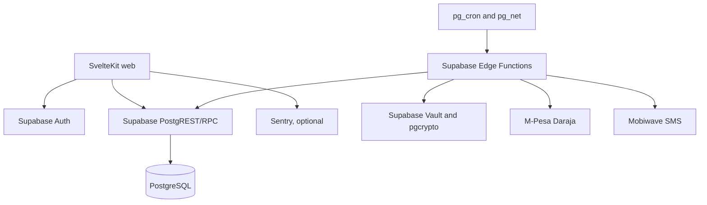

| Dependency | Failure impact | Current handling |
|---|---|---|
| Supabase Auth | New login/session validation unavailable | Auth failures become anonymous/redirect; no alternate identity provider |
| PostgREST/PostgreSQL | Most pages and all durable writes unavailable | Route-level errors; Sentry configured; health endpoint does not test DB availability |
| Vault/credential RPCs | Payments and SMS cannot resolve secrets | Functions return credential errors or failed notifications |
| M-Pesa Daraja | STK initiation/callback delayed or unavailable | Pending/failed checkout tracking; callback idempotency through checkout/payment keys |
| Mobiwave SMS | Messages queue/retry then fail | Three attempts with simple backoff |
| pg_cron/pg_net | Reminders, queue drain, cleanup, and occurrence generation stop | No application watchdog or job-lag alert is implemented |
| Sentry | Reduced diagnostics only | Optional environment-controlled integration |

## 7. Data Flow

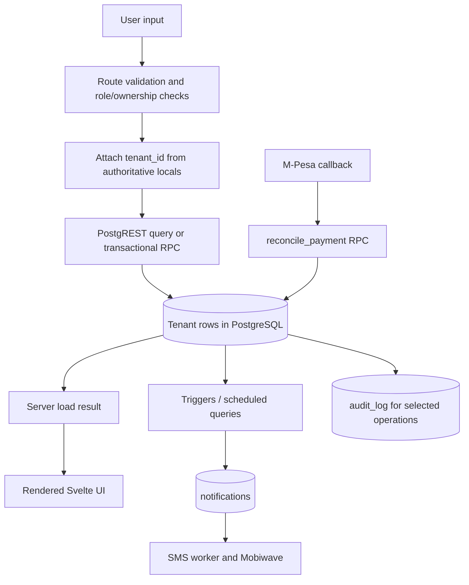

Audit data is not universal: some database functions write `audit_log`, but the middleware does not automatically audit every mutation. CSV exports stream from server handlers; there is no object-storage export pipeline in current code.

## 8. State Management

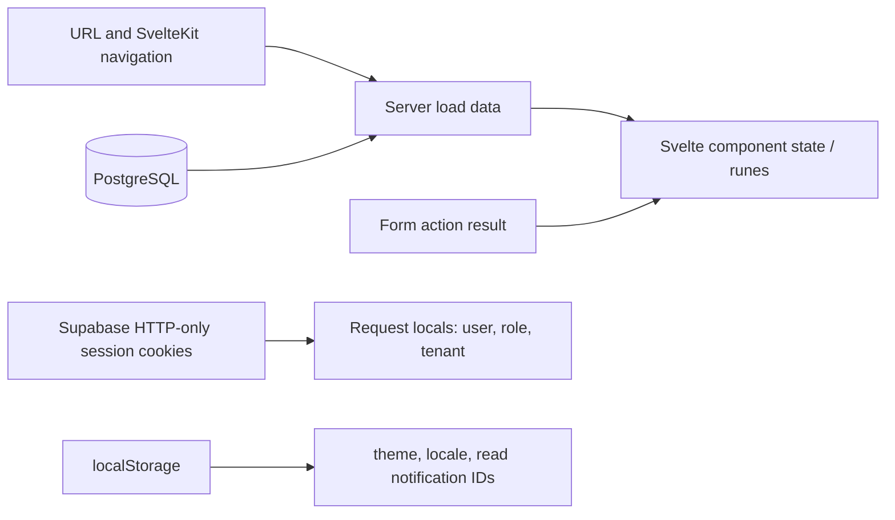

- Durable domain state lives in PostgreSQL.
- Auth state lives in Supabase cookies and is revalidated for each request.
- Request-scoped authority lives in `event.locals`; it is not a client store.
- Server loads provide page state; forms/actions trigger invalidation or navigation.
- `theme` and `locale` writable stores persist to local storage (`src/lib/stores/theme.ts`, `src/lib/stores/locale.ts`).
- Notification read state is browser-local rather than user/account state (`src/lib/notifications.ts`), so it does not synchronize across devices.
- No Redux-like global domain store, offline mutation queue, Redis cache, or implemented Supabase Realtime subscription was found.

## 9. Deployment

### Historical VPS Design Present in Repository Docs

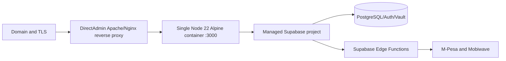

`docs/deployment.md` describes one VPS and reverse proxy. The root `Dockerfile` attempts to build a single Node process and rewrites the Svelte adapter from Vercel to Node during image construction. Conversely, `svelte.config.js` directly configures `adapter-vercel`. The diagram is therefore historical design intent, not an established current topology. The repository contains no Compose file, infrastructure as code, autoscaling configuration, load balancer health policy, or deployment workflow. Actual production topology and migration state cannot be established from source alone.

### Target Deployment for Millions

Scale the existing modular architecture before splitting by business domain. The first target should remove single-process state and database/security bottlenecks, while retaining PostgreSQL transactions for financial correctness.

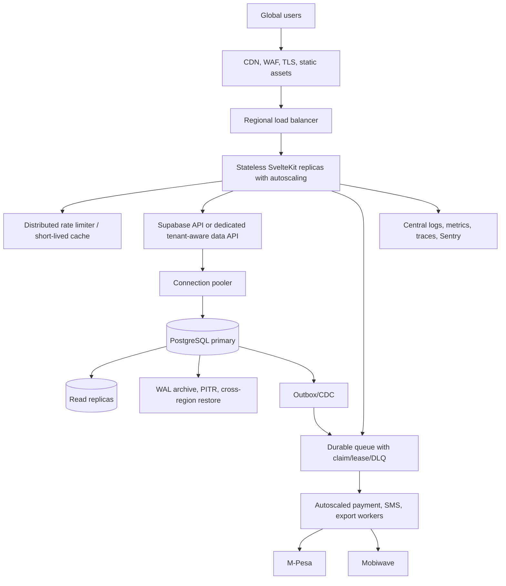

Target changes, in order:

1. Establish one reproducible migration chain and CI `supabase db reset` gate.
2. Replace service-role-by-default reads/writes with user JWT plus valid RLS, or centralize all privileged access in a small tenant-aware data layer with mandatory tenant context and database-enforced composite tenant foreign keys.
3. Make web replicas stateless: move rate limits to Redis/managed KV and account-level notification read state to PostgreSQL.
4. Replace table polling with an atomic claim/lease queue and dead-letter handling; use an outbox in the same transaction as business writes.
5. Add connection pooling, query telemetry, bounded pagination, read replicas for reports, and partition high-growth notification/audit/payment-event tables.
6. Add multi-zone web deployment, tested PITR, cross-region recovery, WAF/bot controls, secret rotation, and SLO-based monitoring.
7. Split services only when independent scaling, team ownership, or failure isolation is measured; likely boundaries are payments, notifications, and asynchronous reporting.

## 10. Current vs Target Summary

| Concern | Current | Target |
|---|---|---|
| Compute | One documented VPS container or Vercel adapter | Stateless autoscaled replicas behind CDN/WAF/LB |
| Application shape | Modular monolith plus Edge Functions | Modular core; independently scaled integration workers as justified |
| Tenant boundary | Explicit filters on service-role queries; ineffective/inconsistent RLS defense | Database-enforced RLS or mandatory tenant-aware API plus composite tenant FKs |
| Queue | `notifications` table polling via cron | Durable claim/lease queue, retries, idempotency, DLQ, outbox |
| Rate limiting | Per-process in-memory maps | Shared distributed limiter |
| Database | One managed PostgreSQL project | Pooled primary, replicas, partitioning, tested PITR/DR |
| Observability | Sentry and request IDs; Supabase logs assumed | Metrics, traces, structured logs, job lag, DB and business SLO alerts |
| Delivery | Manual/documented VPS and Edge Function steps | Immutable CI/CD, migration gates, canary/rollback, IaC |

## 11. Architectural Risks

| Priority | Risk and impact | Evidence |
|---|---|---|
| Critical | Service-role access bypasses RLS, making one omitted `.eq('tenant_id', ...)` a cross-tenant disclosure or mutation. Helpers use `any`, so this contract is not type-enforced. | `src/lib/supabase/server.ts:21-25`, `src/lib/server/query.ts`, direct `locals.srv` calls under `src/routes/` |
| Critical | Clean migration replay is currently blocked/untrusted: late policies call undefined `app.tenant_id()`, while earlier policies use session settings. A fresh environment cannot be treated as reproducible. | `supabase/migrations/20260722000006_create_messages.sql:19-20`, `20260722000007_create_exams.sql:18-19,41-42`; no `app` function definition in `supabase/migrations/` |
| High | The notification worker does not atomically claim rows; overlapping cron invocations can send duplicate SMS. It also records but does not honor `next_retry_at`. | `supabase/functions/notify/index.ts:21-23,29-72` |
| High | In-memory rate limits are per process and unbounded by distributed identity; horizontal replicas reset and bypass limits. | `src/lib/server/rate-limit.ts` |
| High | M-Pesa callback authentication is optional when `MPESA_CALLBACK_SECRET` is absent. Correctness relies on an unverified environment setting and checkout lookup. | `supabase/functions/mpesa-callback/index.ts:5-14` |
| High | Deployment is ambiguous: Vercel is configured in source, while Docker mutates config at build time and deployment docs describe one VPS. This impairs reproducibility and rollback. | `svelte.config.js`, `Dockerfile:6-13`, `docs/deployment.md` |
| High | Health check reports process/auth status but does not probe database, job health, or critical dependencies, so orchestration may route traffic to a broken instance. | `src/routes/api/healthz/+server.ts` |
| Medium | Cron and Edge functions depend on manually provisioned Vault URLs/secrets; missing values can silently stop jobs. No job-lag monitor is implemented. | `supabase/migrations/20260714000001_cron_schedules.sql:13-17`, `20260722000004_edge_function_keepwarm.sql:6-9` |
| Medium | Role resolution selects only the first assigned role; role ordering becomes authorization behavior and users cannot intentionally switch roles. | `src/lib/server/middleware.ts:61-71`, `src/routes/login/+page.server.ts:34-47` |
| Medium | Parent message threads and some reporting assemble/filter datasets in application memory, which will degrade with high cardinality. | `src/routes/(app)/parent/messages/+page.server.ts:34-57`, reporting routes under `src/routes/(app)/` |
| Medium | Read/unread notification state is device-local and can grow indefinitely; it is not authoritative user state. | `src/lib/notifications.ts:16-53` |
| Medium | The documented architecture in `docs/architecture.md` claims offline queues, storage, realtime, repository abstraction, and hard RLS boundaries that are not present in current implementation. Relying on it would create operational/security assumptions. | `docs/architecture.md` compared with `src/lib/`, `src/routes/`, and `README.md:57-61` |

## 12. Architectural Invariants

Until the target tenant boundary is implemented, every change must preserve these current invariants:

- Never expose `SUPABASE_SERVICE_ROLE_KEY` or `locals.srv` to browser code.
- Derive tenant and role from the validated user/session, never request form fields or route parameters.
- Include tenant predicates on every service-role read, update, delete, and referenced-object validation.
- Use ownership checks for parent and teacher resources, not tenant membership alone.
- Keep payment and waiver balance changes in locking, idempotent database RPCs.
- Treat external callbacks and scheduled jobs as retryable and potentially duplicated.
- Apply schema changes only through a clean-replay-tested migration chain; regenerate `database.types.ts` after successful deployment.
