# ReClass Complete Technical Audit — 2026-08-01

## Executive summary

ReClass is a SvelteKit 2/Svelte 5 modular monolith for multi-tenant school administration. It serves six role families, stores transactional data in Supabase PostgreSQL, and delegates M-Pesa and SMS integration to Supabase Edge Functions. The codebase has good feature breadth, a meaningful server-side domain layer, tenant predicates, payment/waiver RPCs, request IDs, Sentry hooks, and 105 passing Vitest tests.

It is not yet ready for millions of users or production financial/academic data. The dominant risks are architectural: the normal server path uses a Supabase service-role client that bypasses RLS; tenant isolation is therefore convention-based in application code; migration replay is not proven and policy creation depends on a helper added later in the migration chain; privileged actions are not consistently audited; and there is no live database, E2E, load, restore, or security gate in CI. Payment callback authentication and credential encryption have improved, but callback field binding, secret rotation, idempotency, and provider observability remain incomplete.

This report is the current-state companion to the detailed root documents. Where a July document conflicts with source observed on 2026-08-01, this file is authoritative until those documents are refreshed.

## Evidence and validation

Reviewed repository source, migrations, Edge Functions, configuration, package metadata, tests, CI, Dockerfile, generated types, and existing documentation. No hosted Supabase project, production deployment, provider account, Vault, DNS, backup, or live traffic was inspected.

Observed checks:

- `npm test -- --run`: 105 tests passed across 10 files.
- `npm run lint`: 0 errors, 38 warnings; warnings are mainly unused values, Svelte `prefer-const`, and `any` casts.
- `npm run check`: started successfully but the runner did not return a completion status.
- `npm run build`: reached Vite SSR transformation but the runner did not return a completion status; this is a verification gap, not a confirmed build failure.
- Playwright, live Supabase reset/migration, Edge runtime checks, `npm audit`, Docker build, load test, accessibility scan, and restore drill were not completed in this pass.

## Discovery inventory

| Area | Current implementation |
|---|---|
| Runtime | Node `>=22 <23`, SvelteKit 2, Svelte 5, TypeScript, Vite |
| UI | Tailwind 4, Bits UI, Lucide, D3 charts, Anime.js, shared workspace package |
| Server | SvelteKit SSR loads/actions/handlers; partial domain services under `src/lib/server` |
| Database | Supabase PostgreSQL, PostgREST, SQL migrations, RPCs, RLS, pg_cron |
| Auth | Supabase Auth cookies/JWT; role rows in `user_roles`; app-level route guard |
| Integrations | Safaricom Daraja M-Pesa STK/callback; Mobiwave SMS; optional Sentry |
| Storage/messaging | Supabase Storage/realtime configured; notification table acts as an application queue |
| Deployment | Vercel adapter is authoritative in config; Docker contains a separate adapter-switching path |
| CI/CD | GitHub Actions npm checks; no deploy, migration, image, E2E, or recovery pipeline |
| AI | No implemented model, RAG, embedding, agent, or vector integration |
| Caching | No application cache; database/indexes and browser local storage only |
| Feature flags | Tenant settings/toggles, not a centralized rollout system |
| Secrets | Environment variables, Supabase Vault references in SQL, encrypted credential RPC; production rotation is not evidenced |

Environment names include `PUBLIC_SUPABASE_URL`, `PUBLIC_SUPABASE_ANON_KEY`, `SUPABASE_SERVICE_ROLE_KEY`, `SECRET_KEY`, `IMPERSONATION_SECRET`, Sentry DSNs, `MPESA_CALLBACK_SECRET`, `MOBIWAVE_BASE`, and Edge Supabase credentials. The example file contains local demo JWTs; they must never be reused in a real environment.

## Architecture diagrams

### System architecture

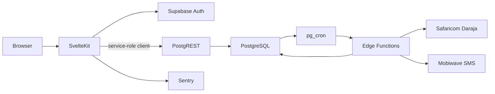

### Application layers

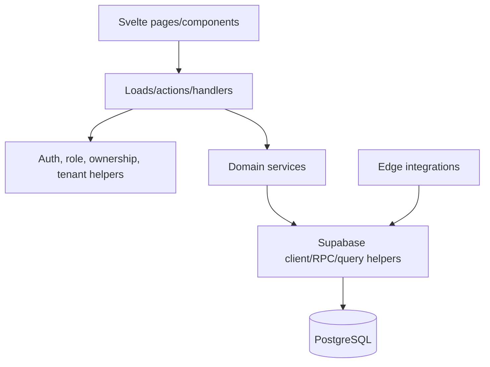

### Folder architecture

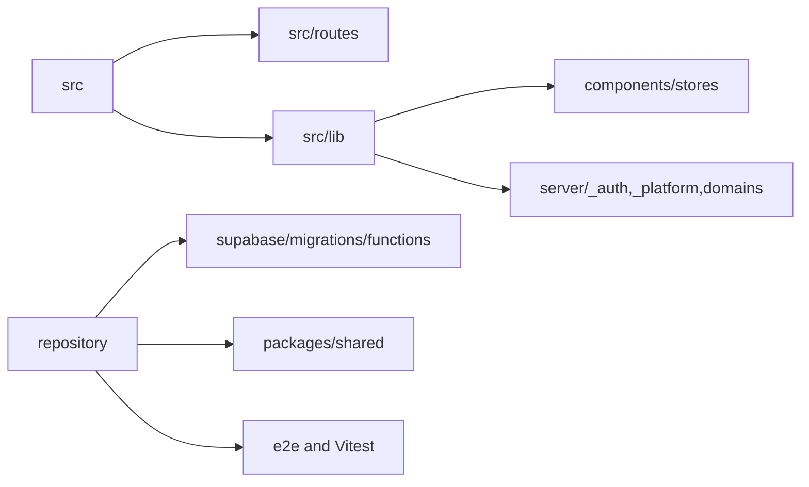

### Request flow

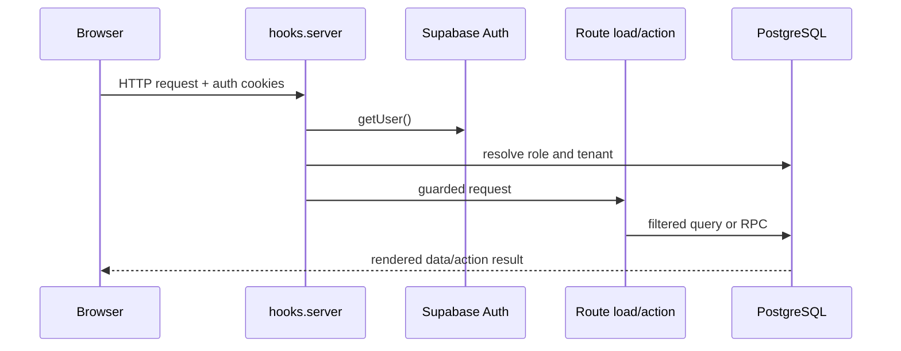

### Authentication and authorization

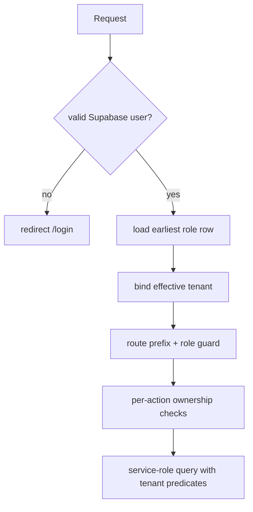

### Database relationships

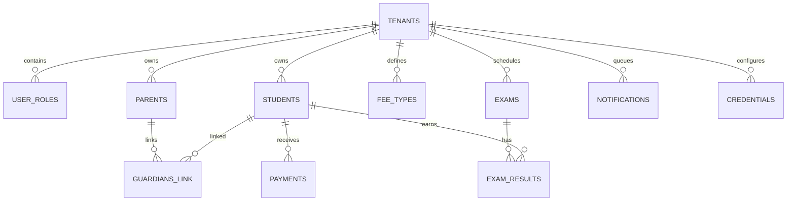

### API flow

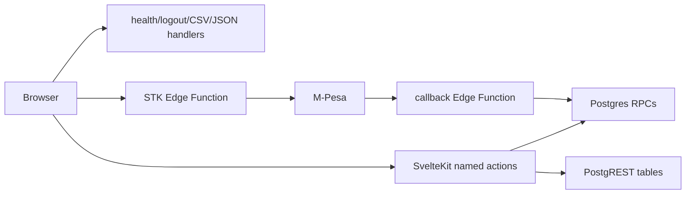

### Background jobs and queue processing

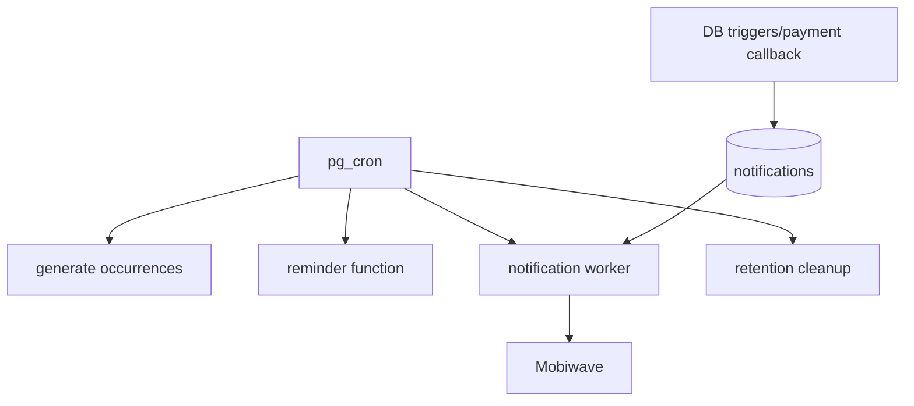

### Deployment architecture

```mermaid
flowchart LR
  GitHub --> CI[GitHub Actions]
  CI --> Vercel[Vercel SvelteKit]
  CI --> Supabase[Supabase migrations/functions]
  Vercel --> Supabase
  Supabase --> Daraja
  Supabase --> Mobiwave
  Sentry[Sentry] <-- Vercel
```

### Service dependencies

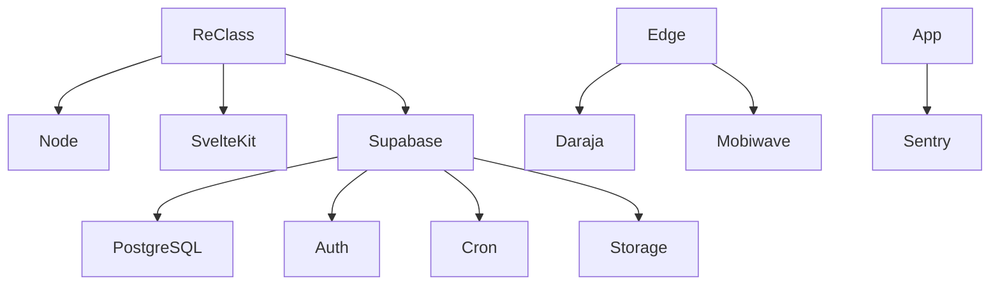

### Data flow

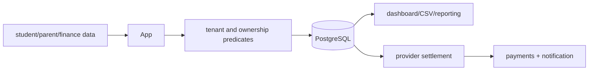

### State management

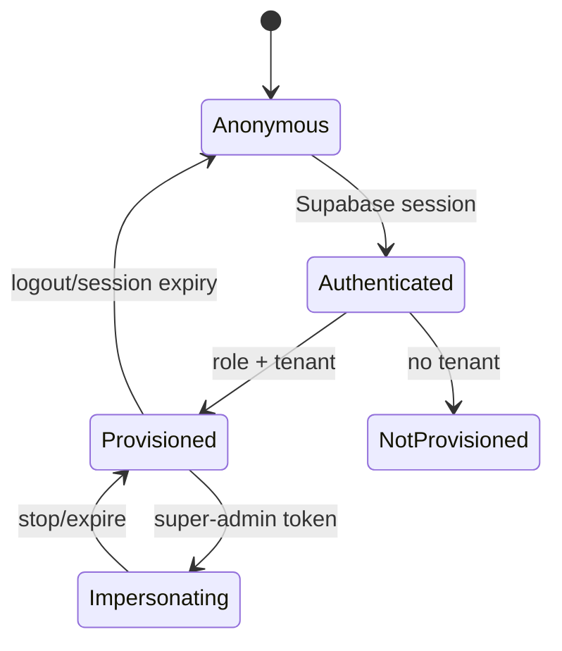

## Business capability audit

Implemented domains are identity/tenancy, school users, students, parents and guardians, teachers/subjects, admissions/classes, exams/results, timetable/sessions, teacher delivery attendance, principal review, payroll, fee types/invoices, parent payments, M-Pesa reconciliation, waivers, receipts, reports/CSV, credentials, settings, announcements/templates, notifications, and super-admin tenant oversight.

The core business invariants are: every operational row belongs to one tenant; parents may act only for linked students; financial amounts are server-derived or RPC-controlled; payment settlement must be idempotent; role routes must not imply action authorization; and academic/financial history should not be hard-deleted without an auditable reversal.

Material gaps:

- role selection uses the earliest role row rather than an explicit active-role/tenant switch;
- service-role access makes a missing predicate a cross-tenant incident;
- many foreign keys validate IDs but not equal tenant IDs;
- result replacement is delete-then-insert rather than one database transaction and does not validate score bounds, duplicate entries, or stale edits;
- import CSV parsing is naive and whole-file buffered, although the current path allowlists fields and caps records at 500;
- parent messaging needs explicit participant/conversation authorization;
- payment callback secret is fail-closed, but callback amount/phone should be compared against the checkout/provider truth in the settlement RPC;
- notification processing needs leases, crash recovery, and an idempotency key for provider sends;
- hard deletes can erase historical academic/financial evidence;
- exports are capped but CSV cells are not formula-neutralized.

## Code quality and maintainability

| Dimension | Score | Assessment |
|---|---:|---|
| Readability | 72 | Conventional SvelteKit structure and useful domain names |
| Maintainability | 58 | Partial services coexist with direct route persistence and migration patches |
| Modularity | 64 | Good shared helpers, but no enforced repository boundary |
| Type safety | 58 | Strict checks pass, but generated types/`any` casts reduce confidence |
| Testability | 57 | Pure helpers are testable; DB/Edge/concurrency paths are not integrated |
| Error handling | 52 | Generic paths exist, but action/Edge error contracts vary |
| Observability | 40 | Request IDs/Sentry exist; metrics, structured event coverage, and alerts do not |
| Documentation | 70 | Extensive docs, but July/current-state drift is significant |

Observed smells include repeated CRUD validation, raw `locals.srv` use in routes, broad casts in tenant proxy and loads, magic limits, hard-delete semantics, duplicate historical migrations, local-device notification state, and an adapter-switching Docker build that mutates configuration.

## Security audit

| ID | Severity | Finding | Recommended control |
|---|---|---|---|
| SEC-001 | Critical | Service-role client is the default server data client and bypasses RLS | Use user-scoped DB authorization for ordinary requests; isolate privileged RPCs |
| SEC-002 | High | Tenant isolation is not uniformly database-enforced across relationships | Composite tenant foreign keys, real-DB cross-tenant tests, typed access layer |
| SEC-003 | High | Academic replacement is nontransactional and weakly bounded | Transactional RPC, score/duplicate/version validation |
| SEC-004 | High | Parent message participant/conversation checks are incomplete | Derive participants server-side and enforce same-tenant membership |
| SEC-005 | Medium | Callback secret is present in code path, but amount/phone mismatch handling is not strict enough | Reject mismatches; verify provider status; rate-limit and audit callbacks |
| SEC-006 | Medium | Import parser buffers input and accepts naive CSV syntax | Byte limits, streaming parser, schema validation, staging transaction |
| SEC-007 | Medium | Rate limiter fails open on DB errors and coverage is narrow | Fail closed for money/admin paths; add per-user/tenant/resource limits |
| SEC-008 | Medium | Impersonation still falls back to service-role secret and is not backed by revocable token rows | Dedicated mandatory secret, target validation, secure cookie, audit/revoke |
| SEC-009 | Medium | CSP is present but allows unsafe inline and same-origin framing | Move to nonce/hash CSP and restrictive `frame-ancestors` |
| SEC-010 | Medium | CSV formula injection remains possible | Prefix dangerous cells and test spreadsheet exports |
| SEC-011 | Medium | Audit events are sparse and not demonstrably append-only | Central audit RPC/trigger with actor, effective tenant, request ID, outcome |
| SEC-012 | Low | Supply-chain, image, Deno import, and action pinning gates are incomplete | SBOM, SCA/SAST/secret scan, immutable pins, image signing/scanning |

No string-built SQL, request-controlled outbound URL, or direct shell execution was found. Supabase escaping helps with XSS, but HTML-string rendering and privileged persistence still require defense in depth.

## Database, API, frontend, backend, and DevOps assessment

Database strengths are monetary checks, uniqueness constraints, useful indexes, restricted credential RPCs, and locking in reconciliation/waiver paths. Database blockers are migration-order replay risk, mixed RLS context conventions, incomplete tenant composite keys, stale generated types, unverified hosted migration state, and no proven backup/restore/offboarding process.

The API is primarily SvelteKit named actions plus health/logout/CSV/JSON handlers and five Edge Functions. There is no public versioned API contract, consistent error envelope, idempotency-key protocol, cursor pagination standard, or contract-test suite. Health is not a dependency-aware readiness check.

The frontend has a coherent role shell, responsive Tailwind patterns, charts, shared UI components, and server-loaded data. Missing evidence includes axe/WCAG testing, keyboard/screen-reader checks, contrast/reflow validation, robust focus management, low-bandwidth behavior, and consistent translated strings.

Backend scaling is constrained by broad service-role use, unbounded or capped-at-1000 reads, in-memory CSV/aggregation, sequential provider work, no cache, no query telemetry, and no load baseline. Keep the modular monolith; extract services only after the tenant/security and observability foundations are reliable.

DevOps has a Vercel adapter, a non-authoritative Docker path, and basic npm CI. It lacks migration promotion, staging smoke tests, E2E/a11y/security/coverage gates, IaC, immutable artifacts, SBOM/image scans, canary/blue-green automation, and tested rollback/recovery.

## AI assessment

No AI integration exists. Future low-risk options are draft report summaries, anomaly triage, import-column suggestions, and natural-language report filters. AI must never autonomously change grades, attendance, invoices, payments, waivers, payroll, access, or student-welfare decisions. Any future implementation needs tenant-isolated retrieval, prompt-injection defenses, PII minimization, no-provider-training guarantees, model/version/cost telemetry, human confirmation, citations/uncertainty, kill switches, and a deterministic fallback.

## Performance and scale risks

Priorities for million-user readiness are: bound every list with cursor pagination; move dashboard/report aggregates into SQL; add tenant-aware indexes based on query plans; claim queue work with `FOR UPDATE SKIP LOCKED` or leases; add provider timeouts/circuit breakers; cache stable metadata; split high-cost routes; stream or async large imports/exports; and measure p95/p99 latency, DB saturation, queue lag, provider failures, and memory. Do not add microservices before these controls.

## Scores

Scores are current implementation readiness, not production SLA evidence.

| Category | Score |
|---|---:|
| Security | 45/100 |
| Scalability | 42/100 |
| Code quality | 62/100 |
| Maintainability | 58/100 |
| Performance | 55/100 |
| Architecture | 61/100 |
| Technical debt health | 40/100 |
| Overall project readiness | 50/100 |

Strengths: broad product coverage, coherent modular-monolith direction, useful SQL invariants, improved current payment/credential controls, and a green unit/static baseline.

Weaknesses: privileged data plane, migration uncertainty, missing operational proof, inconsistent authorization/error/audit patterns, and stale documentation.

## Prioritized action plan

The detailed execution roadmap is maintained in [ROADMAP.md](ROADMAP.md), including phase gates, owners, effort, and decision rules.

### Next 24 hours — release blockers (2–4 engineer-days)

1. Reconcile and execute the full migration chain on a disposable and staging Supabase database; fix policy/helper ordering and regenerate types.
2. Inventory every `locals.srv` query and require an explicit tenant/ownership proof or a named privileged RPC.
3. Make `IMPERSONATION_SECRET` and `MPESA_CALLBACK_SECRET` mandatory in production; rotate any previously exposed secrets.
4. Add cross-tenant denial tests for students, parents, finance, academic records, messages, credentials, and exports.

### Next week — correctness and security (8–15 engineer-days)

1. Convert academic replacement, payment settlement, and message append to transactional RPCs.
2. Add composite tenant foreign keys/constraints where the relationship is same-tenant by rule.
3. Add append-only audit events for roles, credentials, impersonation, imports, academic records, invoices, waivers, payroll, and payment decisions.
4. Harden imports, callbacks, CSV exports, rate-limit failure behavior, and impersonation revocation.
5. Refresh all root and lower-case docs from the current source.

### Next month — delivery and observability (15–30 engineer-days)

1. Add real-DB integration tests, Playwright CI, accessibility checks, coverage thresholds, SCA/SAST/secret scanning, and Edge checks.
2. Establish dependency-aware readiness, structured logs, traces/request correlation, metrics, dashboards, alerts, and SLOs.
3. Select one deployment target, build immutable artifacts, automate migrations/promotions, and document rollback.
4. Add queue leases, idempotency, retry/dead-letter handling, and provider reconciliation dashboards.

### Next quarter — scale foundation (30–60 engineer-days)

1. Introduce cursor pagination, SQL reporting views/materialized aggregates, query-plan reviews, and cache policy.
2. Run staged load, soak, provider-failure, tenant-isolation, and restore drills.
3. Add tenant lifecycle operations: onboarding, suspension, export, deletion, retention/legal hold, and audit-log retention.
4. Implement explicit role/tenant switching and MFA/recent-auth controls for privileged users.

### Next 12 months — product and platform maturity (multi-quarter)

Build a versioned external API only if needed, formalize event-driven integrations, add premium analytics and workflow automation, introduce AI only under governance, and adopt regional/tenant sharding only after measured database limits justify it. Expected business impact is safer financial operations, fewer cross-tenant incidents, reliable school workflows, and a credible enterprise/compliance posture.

## Release exit criteria

Release only after clean and upgrade migration tests pass; cross-tenant live DB tests pass; credentials/payment/SMS secrets are rotated and verified; privileged operations are audited; callback and queue idempotency is tested under concurrency; E2E and accessibility gates pass; production readiness/rollback is rehearsed; backup restore is proven; and performance budgets/SLOs are measured in staging.
