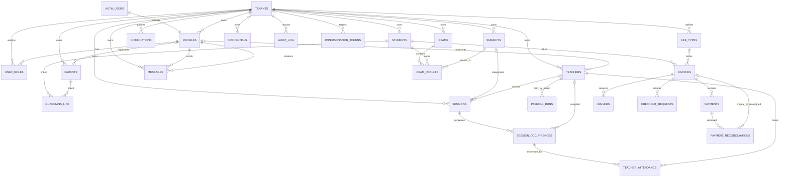

# ReClass Database

**Audit date:** 2026-07-22  
**Scope:** intended final PostgreSQL schema after the ordered migrations in `supabase/migrations/`, reconciled against `src/lib/supabase/database.types.ts` and application queries. This is not a claim that the hosted database is at that state. A clean migration replay is currently blocked, as documented below.

## 1. Database Role and Conventions

ReClass uses a shared-schema, row-per-tenant PostgreSQL model through Supabase PostgREST. Supabase Auth owns `auth.users`; `public.profiles` and `public.user_roles` attach application identity, tenant, and role. Domain primary keys are UUIDs except `audit_log.id` (`bigserial`). Timestamps are `timestamptz`, monetary values are `numeric`, and most tenant-owned entities carry `tenant_id`.

The intended final schema no longer includes `attendance`, `remedial_groups`, or `group_members`. The implemented attendance domain records teacher delivery in `teacher_attendance`; sessions directly hold class, subject, and teacher.

Sources of truth, in precedence order:

1. Successfully replayed migrations and live introspection, once replay is repaired.
2. Ordered SQL in `supabase/migrations/`.
3. Generated `src/lib/supabase/database.types.ts`, which is currently stale because it still includes dropped `attendance` and omits some late-added columns.
4. Application query shape under `src/`.

## 2. Intended Final Entities

| Area | Entity | Purpose and principal relationships |
|---|---|---|
| Tenancy/auth | `tenants` | School boundary, branding, settings, timezone, payroll rate |
| Tenancy/auth | `profiles` | One-to-one extension of `auth.users`; belongs to tenant |
| Tenancy/auth | `user_roles` | User roles within a tenant; unique tenant/user/role |
| Tenancy/auth | `impersonation_tokens` | Time-limited super-admin tenant impersonation records |
| People | `students` | Tenant student with unique admission number per tenant |
| People | `parents` | Guardian identity; optionally linked to a profile |
| People | `guardians_link` | Student-parent many-to-many relationship with tenant consistency trigger |
| People | `teachers` | Teacher identity; optionally linked to a profile; legacy subject UUIDs stored as `text[]` |
| Scheduling | `subjects` | Tenant subject catalog |
| Scheduling | `sessions` | Recurring whole-class slot assigned to subject and teacher |
| Scheduling | `session_occurrences` | Materialized dated occurrence of a session |
| Delivery/payroll | `teacher_attendance` | Teacher delivery mark and principal approval for an occurrence |
| Delivery/payroll | `payroll_runs` | Teacher-period aggregate, rate, amount, and payment state |
| Billing | `fee_types` | Tenant fee definition and default amount/due date |
| Billing | `invoices` | Student obligation with cached paid/waived amount and status |
| Billing | `payments` | Applied payment; M-Pesa checkout ID provides idempotency |
| Billing | `waivers` | Approved amount applied against invoice balance |
| Billing | `checkout_requests` | Pre-provider STK request/callback lifecycle |
| Billing | `payment_reconciliations` | Misallocation and overpayment review records |
| Communications | `notifications` | SMS/email/in-app queue and delivery history |
| Communications | `messages` | Profile-to-profile conversation messages |
| Academics | `exams` | Tenant exam definition and maximum score |
| Academics | `exam_results` | Student subject score per exam |
| Security/ops | `credentials` | Encrypted tenant/platform provider credentials |
| Security/ops | `audit_log` | Selected mutation history with before/after JSON |

## 3. Entity Relationship Diagram

The diagram shows intended final cardinality; it omits `auth.users` fields and low-value columns for readability.



## 4. Core Integrity Model

### Keys and Uniqueness

- Tenant slugs are globally unique: `tenants(slug)`.
- Student admission numbers are tenant-unique: `students(tenant_id, admission_no)`.
- A user may hold each role once per tenant: `user_roles(tenant_id, user_id, role)`.
- A session produces at most one occurrence per date: `session_occurrences(session_id, occurs_on)`.
- A teacher has at most one attendance row per occurrence: `teacher_attendance(occurrence_id, teacher_id)`.
- Active payroll runs are unique per tenant/teacher/period through a partial unique index.
- M-Pesa checkout identifiers are unique on `payments.mpesa_checkout_id` and `checkout_requests.checkout_id`.
- An exam has one result per student/subject: `exam_results(exam_id, student_id, subject_id)`.
- A student-parent pair is the primary key in `guardians_link`; a later unique constraint also includes `tenant_id`.

### Checks

- Role, status, channel, credential scope/purpose/provider/environment, attendance approval, and session slot values use `CHECK` constraints.
- `payments.amount > 0`, `waivers.amount > 0`, `invoices.amount_due >= 0`, and `payroll_runs.amount >= 0` are added by `20260722000002_database_fixes.sql`.
- `notifications.attempts` is constrained to `0..10`.
- `exam_results.score >= 0`, but there is no database constraint enforcing `score <= exams.max_score`.
- Session `end_time > start_time`, payroll `period_end >= period_start`, and non-negative tenant payroll rate are not database-enforced.

### Foreign Keys and Deletes

Most child rows reference parent UUIDs, but tenant equality is usually not encoded in the foreign key. Later migrations add cascades from students to invoices, invoices to payments/waivers/checkout requests, students/parents to guardian links, teachers to teacher attendance, and exams/students to exam results. Because most business entities use soft deletion, destructive cascades should be reserved for explicit retention/offboarding flows.

Financial-history concern: cascading `students -> invoices -> payments` can erase payment evidence if hard deletes are ever issued (`supabase/migrations/20260722000002_database_fixes.sql:64-110`). Prefer restricting financial parent deletes and anonymizing personal fields.

## 5. Migrations and Current Replay Failure

There are 32 timestamped migration files. They express several design reversals and repairs:

- Core initially creates student `attendance` and grouped sessions (`20260712230000_core_tables.sql`).
- Teacher attendance later drops student attendance (`20260713010004_attendance_payroll.sql`).
- Student attendance is restored (`20260713010005_restore_student_attendance.sql`) and then dropped twice (`20260719000001_drop_orphaned_attendance.sql`, `20260722000005_drop_orphaned_attendance.sql`).
- `group_members` is created and then group abstractions are collapsed into direct session columns (`20260716000001_group_members.sql`, `20260716000002_collapse_remedial_groups.sql`).
- Payment, waiver, payroll, timestamp, index, and RPC defects are repaired in later migrations rather than consolidated.

### Confirmed Clean-Replay Blocker

`20260722000006_create_messages.sql` and `20260722000007_create_exams.sql` create policies using `app.tenant_id()`. No migration creates schema `app` or that function. PostgreSQL must resolve policy expressions at `CREATE POLICY`, so clean replay reaches the messages migration and fails with an undefined schema/function. Earlier policies use `current_setting('app.tenant_id', ...)`, which is a different mechanism.

Additional replay/deployment concerns:

- CI runs lint, typecheck, unit tests, and application build, but does not start Supabase or run `supabase db reset` (`.github/workflows/ci.yml`).
- `src/routes/__tests__/migrations.test.ts` regex-checks only messages/exams SQL text; it does not execute SQL and therefore cannot catch the undefined RLS helper.
- `README.md` and `FINAL_REPORT.md` state migrations were not applied from the development network and require manual SQL Editor execution. Hosted migration state is therefore not evidenced.
- Cron migrations require `pg_cron`, `pg_net`, Vault, and manually created secrets. `20260722000003_phase6_db_fixes.sql` assumes `cron` is already available from an earlier migration.
- Credential encryption functions use Vault and `pgp_sym_encrypt`/`pgp_sym_decrypt`; the migration chain does not explicitly enable `pgcrypto` and assumes the hosted Supabase environment supplies required facilities.
- `supabase/config.toml` uses a stale project identifier (`Cal.com_-_Calendly_clone`) and enables local signup. Invite-only provisioning is the recommended production policy in this audit, but hosted Auth settings are not evidenced by the repository.
- Generated types still expose `attendance`, although the final migration drops it. Types also do not show all columns added in late migrations, such as reconciliation overpayment fields and some `updated_at` columns.

### Required Migration Acceptance Gate

Do not add another forward-only patch as the sole verification. Build an empty PostgreSQL/Supabase environment and require:

1. `supabase db reset` succeeds from zero twice.
2. Seed SQL succeeds and application-generated types are regenerated.
3. Schema assertions verify final tables, columns, constraints, functions, triggers, policies, grants, extensions, and cron jobs.
4. Tenant-isolation integration tests run as `anon`, `authenticated`, and `service_role` users.
5. Upgrade is rehearsed against a production-like snapshot and separately verified from clean state.

## 6. Indexes

Implemented high-value indexes include:

| Workload | Indexes/evidence |
|---|---|
| Tenant/status invoices | `idx_invoices_tenant`, `idx_invoices_student` partial, `idx_invoices_tenant_status` |
| Payment lookup | `idx_payments_tenant`, `idx_payments_invoice`, unique checkout ID |
| Notification queue | partial queued-status index, tenant index, `(tenant_id,status,channel)`, `created_at` |
| Session calendar | session teacher/day, occurrence tenant/date, teacher/date, session FK |
| Attendance/payroll | occurrence/teacher partial indexes, pending approval partial index, tenant/status/date, unique active payroll period |
| Reconciliation | tenant, payment, week, status, tenant/week partial indexes |
| Messaging | `(tenant_id,conversation_id,created_at)`, tenant/sender, tenant/recipient |
| Exams | tenant exam, tenant/exam result, tenant/student result |
| JSON/arrays | GIN on `tenants.settings` and `teachers.subjects` |
| Audit | `(tenant_id,created_at DESC)` and actor |

Index caveats and target changes:

- Most tenant queries should use tenant-leading composites matching filters and sort order, not isolated single-column indexes. Validate each proposal with `EXPLAIN (ANALYZE, BUFFERS)` on production-like volumes.
- Queue dequeue needs a partial index matching the actual claim predicate, for example `(next_retry_at, created_at)` where status is queued, after the worker starts honoring retry time.
- Parent payment history needs `(tenant_id, invoice_id, created_at DESC)`; current separate tenant/invoice indexes may require extra sorting.
- Soft-delete workloads need consistent partial indexes (`WHERE deleted_at IS NULL`) for active rows.
- Duplicate indexes exist under different names for some session/occurrence paths. Inventory with `pg_stat_user_indexes` before removal.
- Foreign-key columns still require a complete index audit after final schema replay.
- Use `CREATE INDEX CONCURRENTLY` for production additions; migration files currently use ordinary index creation.

## 7. RLS and Tenant Model Risks

### Current Effective Model

The browser/session client uses the anon key and Supabase JWT. Most server routes and all Edge Functions use `service_role`, which bypasses RLS (`src/lib/supabase/server.ts`). Tenant isolation in those paths is application-enforced with explicit equality filters and RPC tenant parameters.

The RLS policy set is not a reliable hard boundary:

- Most policies compare against `current_setting('app.tenant_id')`, but PostgREST requests use transaction-scoped connections and application code does not establish that setting before ordinary user queries.
- `set_tenant_context` changed signatures and uses session-level `set_config(..., false)` in late migrations, which risks context leaking through pooled connections if used.
- Messages/exams use undefined `app.tenant_id()` and block replay.
- Policies often define only `USING`; write behavior and role grants are not documented as a coherent matrix.
- Service-role traffic bypasses every policy regardless.

### Cross-Tenant Relationship Risk

A row may carry tenant A while referencing a parent row from tenant B because foreign keys usually target only `id`. `guardians_link` has a same-tenant trigger, but invoices/students, payments/invoices, sessions/teachers/subjects, attendance/occurrences/teachers, messages/profiles, and exam results/exams/students/subjects lack equivalent database enforcement.

Target invariant: every tenant-scoped relationship must prove matching tenant IDs. Preferred implementation is composite uniqueness on parent `(tenant_id,id)` plus composite child foreign keys `(tenant_id,parent_id)`, rather than scattered triggers.

### Recommended Tenant Boundary

Choose one coherent model:

1. Preferred Supabase model: include trusted `tenant_id` and roles in JWT claims, use stable `auth.uid()`/claim-based RLS policies with explicit `USING` and `WITH CHECK`, and use service role only in narrow workers/RPCs.
2. Alternative privileged API model: deny browser table access, route all domain operations through a tenant-aware server/API, enforce composite tenant FKs and mandatory database tenant context, and statically prohibit raw service-role queries outside that layer.

Do not rely on setting a session variable through one PostgREST RPC and expecting it to persist into a later request.

## 8. Transactions and Concurrency

Implemented transaction-safe paths:

- `reconcile_payment` runs in one PostgreSQL function, locks the invoice `FOR UPDATE`, checks duplicate checkout ID, inserts the applied payment, and relies on the payment trigger to update invoice balance/status (`20260722000001_fix_rpc_bugs.sql`).
- `grant_waiver` locks the same invoice row, validates outstanding balance, inserts waiver, updates invoice, and writes audit in one function (`20260720000004_fix_payment_and_waiver.sql`).
- Unique checkout IDs provide a second idempotency guard.

Gaps:

- STK initiation spans local insert, external M-Pesa request, and local update. This is necessarily a saga, but failed local updates/retries need reconciliation and expiry jobs.
- The pending checkout duplicate check and insert are separate operations; concurrent STK calls can both pass because there is no unique partial constraint on active invoice checkouts (`supabase/functions/stk/index.ts:37-42,69-75`).
- Callback marks checkout complete after reconciliation in a separate request; idempotent payment lookup limits damage, but state can temporarily disagree.
- Payment reminders update `last_reminded_at` then insert a notification in separate statements. A failed insert suppresses reminders for three days (`supabase/functions/payment-reminders/index.ts:70-88`).
- Notification workers select and update without `FOR UPDATE SKIP LOCKED` or a lease, allowing duplicate delivery.
- Bulk invoice generation uses application-side select then insert and has no natural uniqueness constraint preventing rerun duplicates (`src/routes/(app)/admin/invoices/+page.server.ts`).
- Invoice `amount_paid` is a cached aggregate maintained only on paid-payment insert. Reversal/update/delete handling is not implemented in the trigger (`supabase/migrations/20260713000005_triggers.sql`).

Use transaction-scoped RPCs for business invariants, an outbox for external side effects, and atomic queue claims. Add reconciliation jobs that derive invoice balances from immutable payment/waiver ledgers and report drift.

## 9. Query and N+1 Performance

Positive implementation choices:

- Shared pagination performs count and bounded data queries in parallel (`src/lib/server/query.ts`).
- Dashboard loads and several route loads use `Promise.all`.
- Payroll aggregation moved into one grouped RPC.
- Payment reminders batch tenant settings instead of querying each tenant per invoice.
- Parent payment history fetches invoices and payments in two set queries.

Current hotspots:

- `notify` resolves credentials per notification; sender IDs are cached per tenant, but credential resolution/decryption is not (`supabase/functions/notify/index.ts:26-52`).
- Notification sending is sequential and capped at 100; throughput and cron overlap become problematic at scale.
- Parent messages fetch all parent-sent thread IDs, all thread messages, then filter each thread in memory. It also does not paginate (`src/routes/(app)/parent/messages/+page.server.ts`).
- Some dashboards load bounded but broad row sets and aggregate in Node rather than SQL.
- Many route queries have no explicit `.range()`/limit and depend only on Supabase's configured `max_rows = 1000`, producing truncation rather than correct pagination.
- Offset pagination in `paginatedQuery` slows on deep pages; high-volume tables need cursor/keyset pagination.
- PostgREST nested selects should be inspected for join plans and row amplification at production cardinality.

Performance work must start with `pg_stat_statements`, slow-query logs, and `EXPLAIN (ANALYZE, BUFFERS)`. Do not add speculative indexes without validating planner use.

## 10. Backup, Recovery, and Retention

Repository status:

- `docs/deployment.md` calls for Supabase daily backups and point-in-time recovery, but no backup policy, retention configuration, restore evidence, RPO, or RTO is versioned.
- `cleanup_notifications(90)` permanently deletes sent/failed notifications weekly. There is no archive despite the migration heading calling it archival (`20260722000003_phase6_db_fixes.sql`).
- No tenant export/offboarding procedure or legal-hold mechanism is implemented.
- `audit_log` has no partition, immutability enforcement, or repository-defined retention job.

Minimum production policy:

| Control | Target |
|---|---|
| RPO | At most 5 minutes for billing/payment data through continuous WAL/PITR |
| RTO | Documented target, initially 4 hours; reduce as SLO requires |
| Backups | Managed daily snapshots plus PITR/WAL; encrypted copy in a separate account/region |
| Restore tests | Automated monthly restore and integrity checks; quarterly application recovery exercise |
| Retention | Explicit per table and jurisdiction; preserve financial/audit evidence, minimize PII |
| Tenant offboarding | Verified export, retention hold, anonymization/deletion workflow, and audit record |
| Secrets | Vault backup/rotation procedure separate from database row backup |

Backups are not complete until restore is tested. Recovery tests must verify Auth/profile linkage, functions, extensions, Vault dependencies, cron jobs, grants/RLS, and application behavior, not only table rows.

## 11. Scaling Strategy

### Near Term

- Repair and squash or baseline migrations only after preserving a tested upgrade path for existing environments.
- Enable Supabase connection pooling and set explicit statement timeouts.
- Add query and table-growth telemetry, autovacuum monitoring, and `pg_stat_statements` review.
- Paginate every list/export path; use keyset pagination for payments, messages, notifications, and audit.
- Atomically claim queue work and move completed notification history out of the hot queue path.

### High Volume / Millions

- Partition append-heavy `notifications`, `audit_log`, payment event/checkouts, and possibly `messages` by time, with tenant-aware indexes. Partition only after measured table/index growth justifies operations cost.
- Use read replicas for dashboards/reports with an explicit staleness contract; keep payment reconciliation and authoritative reads on primary.
- Precompute expensive tenant dashboards via incremental summaries/materialized views where query evidence supports it.
- Move asynchronous side effects to a durable broker or PostgreSQL queue with leases, outbox, retry policy, and DLQ.
- Archive cold immutable records to encrypted object storage while retaining searchable metadata.
- If a small number of tenants dominate volume, introduce tenant placement/sharding behind an authoritative tenant directory. Avoid sharding before pooling, indexing, partitioning, and read scaling are exhausted.
- Keep financial transactions for one invoice on one primary/shard; never use eventually consistent replicas for balance decisions.

## 12. Remediation Priorities

| Priority | Action | Acceptance evidence |
|---|---|---|
| P0 | Repair the undefined `app.tenant_id()` policies and unify the RLS model | Two clean `supabase db reset` runs; policy integration tests for all roles |
| P0 | Establish the actual hosted schema/migration state before applying more SQL | Captured migration ledger, schema diff, reviewed upgrade plan and backup |
| P0 | Enforce tenant equality across relationships and reduce service-role query surface | Composite tenant FKs or equivalent DB constraints; negative cross-tenant tests |
| P0 | Protect financial history and verify reconciliation invariants | No destructive cascades for ledger evidence; concurrent payment/waiver tests; drift query returns zero |
| P1 | Make notification dequeue and reminder enqueue atomic/idempotent | Concurrent worker test proves one send; retry schedule and DLQ tests |
| P1 | Add migration execution to CI and regenerate database types | CI fails on SQL replay; generated types match final introspection |
| P1 | Add missing business constraints and idempotency keys | Constraint tests for time ranges, score max, payroll period, bulk invoice identity, active checkout |
| P1 | Add complete pagination and query-plan baselines | No silent 1,000-row truncation; recorded plans at production-like volume |
| P1 | Define/test backup, PITR, retention, and tenant offboarding | Successful timed restore report and approved RPO/RTO/runbooks |
| P2 | Consolidate duplicate/stale indexes and tune autovacuum | `pg_stat_user_indexes` review, planner verification, bloat/dead-tuple alerts |
| P2 | Partition/archive append-heavy tables when thresholds are reached | Capacity threshold, tested partition maintenance and archive restore |

## 13. Operational Verification Queries

Run these against a non-production restore first and adapt to Supabase permissions.

```sql
-- Final table inventory and estimated size.
SELECT relname, n_live_tup, n_dead_tup
FROM pg_stat_user_tables
ORDER BY n_live_tup DESC;

-- RLS and forced-RLS state.
SELECT c.relname, c.relrowsecurity, c.relforcerowsecurity
FROM pg_class c
JOIN pg_namespace n ON n.oid = c.relnamespace
WHERE n.nspname = 'public' AND c.relkind = 'r'
ORDER BY c.relname;

-- Policies and their expressions.
SELECT tablename, policyname, roles, cmd, qual, with_check
FROM pg_policies
WHERE schemaname = 'public'
ORDER BY tablename, policyname;

-- Unused or low-use indexes need workload-duration context before removal.
SELECT relname, indexrelname, idx_scan, pg_size_pretty(pg_relation_size(indexrelid)) AS size
FROM pg_stat_user_indexes
ORDER BY idx_scan, pg_relation_size(indexrelid) DESC;

-- Invoice cache drift; extend for payment reversals and waiver semantics.
SELECT i.id, i.tenant_id, i.amount_paid,
       coalesce(sum(p.amount) FILTER (WHERE p.status = 'paid'), 0) AS paid_ledger
FROM invoices i
LEFT JOIN payments p ON p.invoice_id = i.id AND p.tenant_id = i.tenant_id
GROUP BY i.id, i.tenant_id, i.amount_paid
HAVING i.amount_paid <> coalesce(sum(p.amount) FILTER (WHERE p.status = 'paid'), 0);
```
