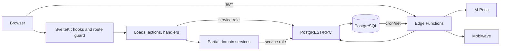
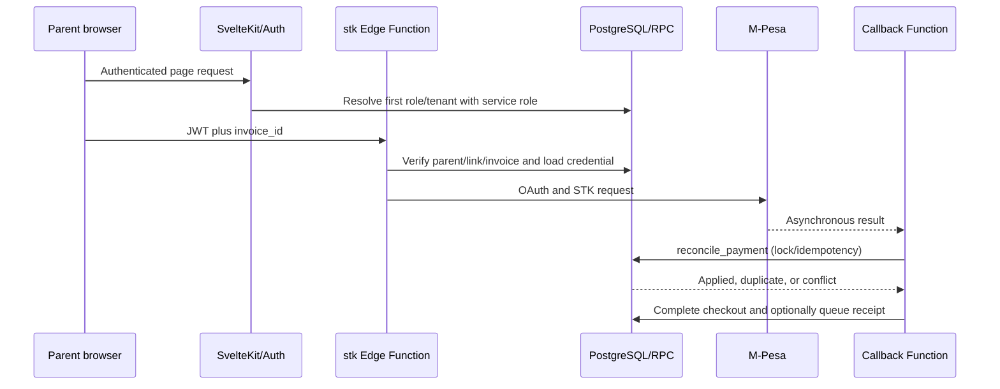

# ReClass Consolidated Final Audit Report

**Audit date:** 2026-08-01

**Current-state supplement:** [AUDIT-2026-08.md](AUDIT-2026-08.md) supersedes contradictory July implementation claims and records the latest verification results.

> Sections below preserve the detailed July evidence trail. For current severity ratings, source corrections, validation results, and release decisions, use the August supplement above.

**Repository:** `/home/malingi/Projects/Custom/ReClass`

**Version observed:** `0.2.0`

**Release status:** **BLOCKED / NOT PRODUCTION-READY**

## 1. Methodology, Scope, and Evidence Standard

This report consolidates the requested 18-phase review into one implementation-grounded assessment. Static coverage included repository inventory, route/action and module tracing, targeted manual review of security-, tenant-, payment-, messaging-, academic-, database-, deployment-, and operationally significant paths, pattern searches across the source tree, migration-order reconciliation, generated-type comparison, dependency audit, and execution of available application checks. Specialist/agent sampling and targeted static analysis were used for broad areas; this report does **not** claim that every line of every file was manually reviewed.

Observed facts are directly present in source/configuration or reproduced by a command on the audit host. Inferred conclusions connect those facts to likely behavior and are labeled as risks/recommendations. Hosted Supabase schema, migration ledger, Auth settings, Edge deployments, Vault contents, cron execution, provider accounts, production traffic, backups/PITR, DNS, and Vercel state were not accessed. No production penetration test, live-provider transaction, destructive database test, load test, restore drill, or legal/compliance certification was performed.

Primary evidence is in `src/`, `supabase/`, `package.json`, `.github/workflows/ci.yml`, `svelte.config.js`, and `Dockerfile`. Detailed dated audits are [ARCHITECTURE.md](ARCHITECTURE.md), [API.md](API.md), [DATABASE.md](DATABASE.md), [SECURITY.md](SECURITY.md), [DEPLOYMENT.md](DEPLOYMENT.md), and [OPERATIONS.md](OPERATIONS.md). Lower-case material under `docs/` is historical/aspirational where it conflicts with implementation.

Commands reproduced on 2026-07-22:

| Command | Observed result |
|---|---|
| `npm run test` | 8 test files and 81 tests passed |
| `npm run check` | 0 errors, 11 warnings in 5 files |
| `npm run build` | Passed with Vercel adapter; same 11 accessibility/HTML warnings plus adapter dependency-location warnings |
| `npm audit --audit-level=low` | 4 low, 0 moderate/high/critical; transitive `cookie` advisory `GHSA-pxg6-pf52-xh8x` |
| `docker --version` | Failed: `docker: command not found`; Docker was not available |

Lint was represented in current CI and prior audit evidence but was not rerun in this final documentation-only pass. Database/E2E/a11y/provider/recovery checks are not current gates.

## 2. Executive Summary

ReClass has a substantial role-based school workflow implemented as a SvelteKit modular monolith with Supabase and separate payment/SMS Edge Functions. Strong points include verified-session auth, route-role checks, widespread tenant predicates, ownership helpers, atomic locking RPCs for reconciliation and waivers, useful domain modules, request IDs, Sentry hooks, and a green 81-test application baseline.

It must not be released with production data or credentials. The migration chain cannot replay because message/exam policies call undefined `app.tenant_id()` (`supabase/migrations/20260722000006_create_messages.sql`, `20260722000007_create_exams.sql`). The web server normally uses a service-role client that bypasses RLS (`src/lib/supabase/server.ts`), while same-tenant relationships are not comprehensively database-enforced. Credential input described as encrypted is stored directly (`src/lib/server/credentials.ts`). Academic result replacement is unvalidated and nontransactional; parent messaging lacks participant validation; callback authentication is optional; notifications can double-send; imports are unbounded; audit coverage is sparse; and deployment configuration is contradictory.

Green unit/static checks mean the source compiles and selected contracts behave as asserted. They do not prove migrations execute, tenants are isolated, payment/SMS flows work, accessibility meets WCAG, or a deployment is recoverable. The immediate business objective is not more features: it is a reproducible database, enforceable tenant boundary, protected credentials/financial evidence, and a verified release process.

## 3. Eighteen-Phase Audit Disposition

| Phase | Area | Result and principal evidence |
|---:|---|---|
| 1 | Discovery/inventory | Completed statically: SvelteKit modular monolith, 32 migrations, five Edge Functions, six roles, broad route surface; hosted state not observed |
| 2 | Requirements/business model | Implemented workflows mapped; planning documents contain unimplemented claims and are historical |
| 3 | Architecture | Current/request/data/deployment and target diagrams documented in `ARCHITECTURE.md`; partial layering, no strict repository boundary |
| 4 | Business features | Domain matrix below records purpose, I/O, dependencies, validation, roles, errors, rules, edge cases, and bugs |
| 5 | Code quality | Mixed: readable conventions and extracted services, but direct route DB access, weak types, inconsistent errors, and sparse logging |
| 6 | Security | Release-blocking: 1 critical, 4 high, 8 medium, 2 low implementation findings in `SECURITY.md` |
| 7 | Database | Release-blocking clean replay/RLS/tenant-FK issues; financial RPC strengths; schema types stale |
| 8 | API/integrations | No public `/v1` API; form actions plus direct handlers/Edge Functions; contracts and errors inconsistent |
| 9 | Backend/service layer | Useful server modules exist, but extraction is partial and privileged client usage remains broad |
| 10 | DevOps/deployment | CI npm subset passes; Vercel/Docker/VPS conflict, no IaC/release pipeline, Docker unusable and untested |
| 11 | AI | No AI feature implemented; ideas remain roadmap items requiring governance and human authority |
| 12 | Performance/scalability | Some parallel/batched queries and indexes; unbounded lists, memory aggregation, offset paging, sequential unsafe queue |
| 13 | Technical debt | Prioritized below; migration/tenant/security/deployment debt dominates |
| 14 | Missing/product features | Core gaps, premium, automation, analytics, and monetization opportunities identified without claiming implementation |
| 15 | Documentation | Root dated audits are authoritative; lower-case `docs/` contains material drift |
| 16 | Frontend/UX/accessibility | Consistent responsive shell/patterns, but 11 compiler warnings and no automated/manual WCAG evidence |
| 17 | Testing/quality gates | 81 tests pass; no executable DB integration, E2E CI, coverage gate, accessibility, load, DAST, or recovery exercise |
| 18 | Consolidation/action plan | This report provides scores, risks, migration strategy, and sequenced 24h-to-12-month plan |

## 4. Discovery Inventory

| Area | Observed inventory | Evidence/qualification |
|---|---|---|
| Application | SvelteKit/Svelte role application with SSR loads, named actions, direct handlers | `src/routes/`, `src/hooks.server.ts` |
| Roles | `super_admin`, `school_admin`, `principal`, `teacher`, `bursar`, `parent` | `src/lib/auth.ts`, role layouts |
| Shared server layer | Auth, middleware, ownership, queries, CSV, rate limiting, logging, impersonation, dashboard, student, invoice, attendance, payroll, credential, scheduling, waiver modules | `src/lib/server/` |
| Data | Shared-schema Supabase/PostgreSQL tenancy with 27 intended final entities and 32 timestamped migrations | `DATABASE.md:19-47,124-146`, `supabase/migrations/` |
| Edge | `stk`, `mpesa-callback`, `notify`, `payment-reminders`, `credentials-test` | `supabase/functions/*/index.ts` |
| Explicit HTTP | Health, logout, parent message JSON, six CSV downloads; remaining mutations are SvelteKit actions | `API.md` |
| Background work | Database cron invokes reminders, queue worker, occurrence generation, cleanup, and ineffective keep-warm calls | `OPERATIONS.md:151-161` |
| Tests | Eight Vitest files: auth, tenant/static contracts, notifications, query, CSV, class utility, page load, migration text | `src/**/__tests__/`, 81 passing |
| E2E | One Playwright specification, not in npm scripts or CI | `e2e/app.spec.ts`, `playwright.config.ts` |
| Delivery | GitHub Actions npm checks, committed Vercel adapter, conflicting Dockerfile, no IaC/deployment workflow | `.github/workflows/ci.yml`, `svelte.config.js`, `Dockerfile` |
| Historical docs | Planning-era API/architecture/security/deployment/roadmap and guides | `docs/`; not authoritative on implementation |

## 5. Architecture and Key Flows

Detailed container, layer, folder, auth, queue, state, deployment, and target-scale diagrams are in `ARCHITECTURE.md`. The present system is a modular monolith plus integration Edge Functions:

The architectural fault line is privilege: `locals.srv` bypasses RLS, direct route queries coexist with services, and database relationships do not uniformly enforce equal tenants. One missing filter or unchecked foreign ID can cross the logical boundary.

### Request and Payment Flow

Observed strengths are server-derived amount/phone, ownership checks, checkout tracking, invoice locking, and unique checkout IDs. Blocking weaknesses are broken credential context/storage, optional callback trust, no active-checkout atomic uniqueness, split checkout/reconciliation state, and insufficient rate limiting/telemetry (`SECURITY.md:84-138`, `DATABASE.md:214-232`).

## 6. Business Feature Audit by Domain

Each row records the implemented purpose; primary inputs and outputs; dependencies; validation/error behavior; authorized role; and material rules/edge cases/bugs. `API.md` is the exhaustive action-by-action contract.

### Identity, Tenancy, and Platform Administration

| Feature | Purpose / inputs -> outputs | Dependencies, validation, errors, roles | Rules, edge cases, bugs |
|---|---|---|---|
| Login/session | Email/password -> Supabase session and role landing route | Supabase Auth, `user_roles`; required fields; 400/401/403/429; all provisioned roles | Oldest role wins; process-local IP limit; no MFA/recent-auth; public route behavior in `src/routes/login/+page.server.ts` |
| Route authorization | Cookie request -> verified user, role, tenant, guarded route | `auth.getUser`, hooks/layouts; redirects anonymous/wrong role | Prefix guard is not action authorization; service-role context magnifies omissions (`src/lib/server/middleware.ts`) |
| Users/roles | Same-tenant profile and role -> role row CRUD | `school_admin`; role enum and profile check; duplicate 409 | Cannot assign super admin; update ignores submitted user ID; can remove self/last admin; no audit (`admin/users`) |
| Tenant overview | Platform counts/tenants -> cross-tenant dashboard | `super_admin`; service-role reads | Source presence does not prove tenant lifecycle/onboarding/offboarding |
| Impersonation | Tenant ID -> signed one-hour cookie/effective tenant | `super_admin`; HMAC helper | Target not verified; cookie lacks `Secure`; fallback secret, no revocation/current-actor binding/audit (`super-admin/tenants`) |
| Audit view | Query -> newest 100 audit rows | `super_admin`; `audit_log` | Waiver is the only explicit audit insertion found; log is not immutable/comprehensive |

### People, Guardians, Subjects, and Imports

| Feature | Purpose / inputs -> outputs | Dependencies, validation, errors, roles | Rules, edge cases, bugs |
|---|---|---|---|
| Students | Names, admission, grade/status -> tenant student CRUD/list | `school_admin`; Zod lengths/status; duplicate 409; DB errors often exposed | Hard delete; zero-row update/delete reports success; financial cascades can erase evidence (`admin/students`, `DATABASE.md:118-123`) |
| Student import | JSON records or CSV file -> bulk student insert/count | `school_admin`; extension/nonempty only | Whole body buffered, naive CSV, arbitrary columns/mass assignment, no row/size/schema/transaction bounds (`admin/students/import`) |
| Parents | Name/phone/email/locale/consent -> parent CRUD | `school_admin`; weak length/coercion checks | Phone/email semantics weak; consent defaults true; no guardian link creation; hard delete |
| Guardian links | Parent-to-student ownership -> parent access | Ownership helper, `guardians_link`, tenant trigger | No complete administration workflow observed; trigger is stronger than most cross-tenant FKs |
| Teachers | Identity/employee/subjects -> teacher CRUD | `school_admin`; basic lengths | `subjects` remains legacy `text[]`; hard delete and weak linkage lifecycle |
| Subjects | Name/code -> subject CRUD/export | `school_admin`; basic lengths | Hard delete; reference behavior relies on DB; CSV formula risk |

### Scheduling, Delivery, Attendance, and Payroll

| Feature | Purpose / inputs -> outputs | Dependencies, validation, errors, roles | Rules, edge cases, bugs |
|---|---|---|---|
| Sessions/scheduling | Class, subject, teacher, weekday/time/room -> recurring session | `school_admin`; same-tenant subject/teacher, day and lexical time checks; 409 overlaps | Application overlap check races; toggle can reactivate conflict and does not clear `deleted_at`; IDs/time formats weak (`server/scheduling.ts`) |
| Occurrence generation | Sessions/date horizon -> dated occurrences | DB RPC/cron | Hosted cron unverified; no holiday/calendar exception workflow; keep-warm jobs are malformed health calls |
| Teacher timetable | Linked teacher -> assigned schedule | `teacher`; ownership link | No substitution/temporary assignment workflow; no offline support |
| Teacher attendance | Occurrence plus `present|late` -> pending delivery record | `teacher`; linked teacher and service-only RPC; 400/403/500 | Implements teacher delivery, not student attendance; RPC is a strong boundary (`teacher/+page.server.ts`) |
| Principal review | Attendance ID, approve/reject, note -> reviewed status | `principal`; rejection note required; service-only RPC | Note unbounded; no complete audit trail; stale states mapped to 400 |
| Reports/effectiveness | Attendance/session datasets -> oversight aggregates | `principal`, `school_admin`; server queries and in-memory shaping | Metric definitions/freshness incomplete; broad/unbounded datasets risk truncation |
| Payroll | Date range/rate -> draft runs; approve; pay | `school_admin`; positive tenant rate; aggregate RPC; state prechecks | Date syntax weak; read/update race does not verify affected row; no disbursement integration/audit (`server/payroll.ts`) |

### Billing, Waivers, Payments, and Reconciliation

| Feature | Purpose / inputs -> outputs | Dependencies, validation, errors, roles | Rules, edge cases, bugs |
|---|---|---|---|
| Fee types | Name, amount, due date, term -> fee CRUD | `school_admin`; nonnegative amount/basic strings | Date not semantically validated; hard delete/reference implications |
| Invoices | Student/amount/date/status -> obligation CRUD | `school_admin`; same-tenant student, amount/status; 404/DB errors | Caller can set financial status/amount directly; hard delete despite payments; no optimistic concurrency |
| Bulk invoices | Grade and fee type -> invoices for active students | `school_admin`; same-tenant fee and nonempty selection | No idempotency/natural uniqueness/batch cap; reruns duplicate obligations |
| Parent fees/history | Linked children -> fees, invoices, payment receipts | `parent`; ownership helper and set queries | Mostly read-only; correctness depends on links and ledger/cache integrity |
| STK initiation | Invoice ID -> pending checkout and Daraja response | `parent`; JWT, ownership, state, phone, balance, credential checks | Credential decryption context is broken; no caller idempotency/rate/timeout; upstream rejection may be HTTP 200 (`functions/stk`) |
| Callback/reconciliation | Daraja callback -> payment/invoice/checkout state | Edge service role and `reconcile_payment`; invoice lock/checkout uniqueness | Auth optional; supplied amount/phone trusted; method/body/rate controls absent; state update split (`mpesa-callback`) |
| Manual reconciliation | Payment exception -> reassignment/overpayment views/actions | `school_admin`; DB reconciliation structures | Hosted behavior not proven; immutable ledger/drift controls incomplete |
| Waivers | Invoice, positive amount, reason -> waiver and balance update | `bursar`; linked role; atomic locking `grant_waiver`; 400/404/500 | Strongest audited financial path; reason unbounded; only explicitly audited mutation |
| Revenue/aging/exports | Invoice/payment data -> dashboards and CSV | `bursar`, admins; tenant filters, fixed limits | Silent caps/memory materialization/formula injection; no async exports or freshness contract |

### Communications, Credentials, Settings, and Notifications

| Feature | Purpose / inputs -> outputs | Dependencies, validation, errors, roles | Rules, edge cases, bugs |
|---|---|---|---|
| Provider credentials | Provider/environment/blob -> credential record/test state | `school_admin`; presence/enum coercion; unique provider/env | Critical: plaintext is submitted/stored as `encrypted_blob`; test response contract mismatches and DB context prevents decryption (`server/credentials.ts`) |
| Tenant settings | Branding, year, payment IDs, timezone/currency/rate/toggles -> tenant update | `school_admin`; only name and shortcode/paybill materially checked | Invalid rate becomes zero; URL/color/timezone/currency unvalidated; settings object replaced; no audit |
| Notification queue | Business event/reminder -> queued SMS state | DB table/triggers/functions, Vault credentials | DB table is not a broker; incomplete consent; account read state is local storage |
| SMS worker | Queued rows and optional limit -> sent/retry/failed | Service-role bearer, Mobiwave, credential decrypt | No atomic claim, ignores `next_retry_at`, unbounded limit, sequential sends, duplicate-charge risk (`functions/notify`) |
| Payment reminders | Overdue invoices -> reminder SMS rows | Cron, invoice/parent/settings | Marker and enqueue are split; concurrent duplication/suppression; first guardian only; no consent check (`payment-reminders`) |
| Parent messaging | Teacher/conversation/body -> message | `parent`; JSON body nonempty; DB errors may be exposed | Recipient profile mismatch, no conversation participation/same-tenant teacher proof, malformed JSON unhandled (`parent/messages`) |
| Admin message log | Tenant messages -> paged oversight table | `school_admin`; page size 100 | Oversight/privacy policy and retention not established |
| Notification dashboard/inbox | Delivery rows/read IDs -> metrics and UI state | Admin DB loads/browser local storage | Counts load broad state; read status is device-local, unsynchronized, and unbounded |

### Academics, Reporting, UI, and Operations

| Feature | Purpose / inputs -> outputs | Dependencies, validation, errors, roles | Rules, edge cases, bugs |
|---|---|---|---|
| Exams | Name/term/date/max -> exam CRUD | `school_admin`; name and positive max only | Date/term weak; hard delete cascades results; no audit |
| Result replacement | JSON entries -> full exam result set | `school_admin`; declared schema unused | Cross-tenant IDs unchecked, scores/max/duplicates unchecked, delete then nontransactional insert can lose all results (`academic/[examId]/edit`) |
| Parent academic report | Linked student -> exam subject scores | `parent`; guardian ownership | Trusts result referential integrity currently not tenant-enforced |
| CSV reports | Tenant rows -> quoted downloadable CSV | Admin/bursar; process-local 120/min tenant bucket, 5k/10k limits | Formula injection, complete memory buffering, no filters/cursors, errors not consistently checked |
| Dashboard/UI | Loads -> KPIs, tables, forms, charts, responsive shell | Svelte components, Tailwind, route data | Consistent patterns but 11 accessibility/HTML warnings; no axe/keyboard/screen-reader proof |
| Health/observability | Request -> status/uptime/auth flag and request ID | SvelteKit, Supabase Auth, optional Sentry | Health is authenticated/shallow and says OK without DB readiness; sparse structured logs, no metrics/alerts (`api/healthz`, `OPERATIONS.md`) |

## 7. Code Quality Review

Scores are 0-100, where higher is healthier. They assess the audited repository, not developer capability or production behavior.

| Category | Score | Evidence-based assessment |
|---|---:|---|
| Readability | 72 | Conventional SvelteKit layout and small helpers; some large forms/routes and implicit Supabase shapes increase reading cost |
| Maintainability | 58 | Domain extraction helps, but direct queries, doc/schema drift, and migration repair chain raise change risk |
| Complexity | 61 | Modular monolith is appropriate; payment/queue/tenant rules are distributed across routes, Edge, RPCs, triggers, and cron |
| Naming | 68 | Generally domain-aligned; `encrypted_blob` client input is dangerously false, `PUBLIC_URL` is overloaded, attendance terminology changed |
| Modularity | 64 | `src/lib/server/` has useful boundaries; routes still bypass them and no enforced data-access interface exists |
| DRY | 62 | Shared auth/query/CSV/components reduce duplication; CRUD validation/error/query patterns repeat and migration indexes/policies duplicate |
| SOLID | 55 | Some single-purpose services; dependency inversion/interface segregation are weak because modules depend directly on Supabase and broad service role |
| Clean architecture | 48 | Presentation/application/infrastructure layers are recognizable but not enforced; routes and domain logic know persistence details |
| Testability | 57 | Pure helpers test well; global clients, Edge network calls, route DB access, and SQL text tests limit isolation/integration confidence |
| Reusability | 65 | UI, query, ownership, CSV, auth, and domain modules are reusable within the app; contracts remain framework/database-coupled |
| Type safety | 58 | Strict TS/check passes; generated DB types are stale and privileged helpers/RPC/UI paths retain `any` casts |
| Error handling | 49 | Some stable status mapping exists; errors are inconsistent, provider/database detail leaks, zero-row writes succeed, and Edge errors are swallowed |
| Logging/observability | 38 | Request ID, Sentry, and one JSON error helper exist; correlation, structured coverage, metrics, audit events, release tags, and alerts are absent |
| Documentation | 75 | New root audits are extensive and evidence-labeled; historical lower-case docs materially conflict and must remain clearly historical |

### Module Groups

| Group | Strengths | Weaknesses/evidence |
|---|---|---|
| Hooks/auth/ownership | Verified `auth.getUser`, route map, reusable role and ownership checks | First role wins; broad service client; incomplete MFA/session/impersonation controls (`middleware.ts`, `ownership.ts`) |
| Domain services | Reduced route size; clear invoice/payroll/scheduling/waiver responsibilities | Partial adoption; Supabase types often broad; transactional rules not consistently centralized (`src/lib/server/`) |
| Routes/actions | Feature discoverability and direct SvelteKit conventions | Repeated CRUD, inconsistent validation/errors, zero-row success, unbounded reads, hard deletes (`src/routes/(app)`) |
| Components/frontend | Consistent shell/cards/tables and responsive Tailwind patterns | HTML-string surfaces, local notification reads, 11 compiler warnings, no formal a11y gate (`components/`) |
| Edge Functions | Clear integration boundaries and shared auth/response/CORS helpers | Missing method/limit/timeout/idempotency/claim controls; credential context broken; sparse logs (`supabase/functions/`) |
| SQL/migrations | Strong payment/waiver RPC concepts, many constraints/indexes, restricted sensitive RPCs | Clean replay blocked, policy models conflict, patch-on-patch history, duplicate indexes, cross-tenant FKs missing (`supabase/migrations/`) |
| Tests | Fast deterministic suite, meaningful helper and static-contract coverage | Migration regex tests cannot execute SQL; tenant tests are not live DB denial tests; critical workflows/concurrency/E2E absent |
| Delivery/ops | CI npm gates and Sentry hooks exist | No DB/Edge/E2E/security/recovery gates, contradictory artifacts, no IaC or release automation |

### Dead, Duplicate, Unused, and Mis-sized Design

- Dead/stale: generated `database.types.ts` retains dropped `attendance` and omits late fields; `SECRET_KEY` has no located runtime consumer; `impersonation_tokens` is created but unused; historical `docs/` describes absent APIs/services.
- Duplicate: migrations repeatedly drop/restore/drop attendance, collapse groups, and repair payment/RLS/index behavior; duplicate session/occurrence indexes need live usage review before removal.
- Under-engineered: tenant enforcement, credential encryption, imports, academic replacement, queue claims, callback trust, audit, readiness, backup verification, and standardized errors.
- Over-engineered or premature: five-minute keep-warm cron calls hit body/auth-oriented functions with invalid GETs; both Vercel and Docker adapters exist; scaling narratives should not trigger microservice extraction before correctness/telemetry.
- Magic values: page size 100, CSV caps 5,000/10,000, reminders 200, queue limit 100, three retries with 1/5/30-minute delays, 90-day notification deletion, one-hour impersonation, 5/min login and 120/min CSV limits. Some are centralized, but none form an approved capacity/retention policy.
- Unused/weak abstractions: partial services coexist with raw route access; local `set_tenant_context` calls assume session behavior that is unsafe with pooled PostgREST; `withTenant`-style conventions are not type-enforced.

## 8. Prioritized Security Findings

Full exploit/impact/remediation detail and OWASP mapping are in [SECURITY.md](SECURITY.md).

| ID | Severity | Finding | Key evidence |
|---|---|---|---|
| SEC-001 | Critical | Credential plaintext is mislabeled and stored directly; decryption context also breaks payment/SMS | `admin/credentials`, `src/lib/server/credentials.ts`, credential migrations |
| SEC-002 | High | Default service-role database access bypasses RLS | `src/lib/supabase/server.ts`, `middleware.ts`, route queries |
| SEC-003 | High | Academic replacement permits unchecked references and destructive nontransactional failure | `admin/academic/[examId]/edit/+page.server.ts` |
| SEC-004 | High/Medium | M-Pesa callback authentication is optional and supplied values are trusted | `supabase/functions/mpesa-callback/index.ts` |
| SEC-005 | High | Parent message recipient/conversation ownership is not validated | `parent/messages/+server.ts`, messages migration |
| SEC-006 | High | Student import is unbounded, naive, and mass-assignable | `admin/students/import/+page.server.ts` |
| SEC-007 | Medium | Rate limiting is narrow, process-local, bypassable, and misreports headers | `src/lib/server/rate-limit.ts` |
| SEC-008 | Medium | Audit trail is sparse, mutable, and lacks request context | `audit_log`; only `grant_waiver` explicit insertion found |
| SEC-009 | Medium | CSP/Permissions Policy and complete browser hardening are absent | `src/lib/server/middleware.ts` |
| SEC-010 | Medium | Impersonation lacks target validation, secure cookie, revocation, and audit | super-admin tenant action, `impersonation.ts` |
| SEC-011 | Medium | CSV formula injection remains possible | `src/lib/server/csv.ts`, CSV routes |
| SEC-012 | Low | Four low npm issues and incomplete supply-chain gates | npm audit, CI, Deno import, Dockerfile |
| SEC-013 | Medium | MFA, strong provisioning, recent auth, and role selection are incomplete | `supabase/config.toml`, login/middleware |
| SEC-014 | Medium | Worker concurrency/batch behavior can duplicate sends/exhaust resources | `notify`, `payment-reminders` |
| SEC-015 | Low | Database/upstream details leak through inconsistent errors | multiple route actions and parent messaging |

No classic string-built SQL or request-controlled SSRF destination was found. Svelte escaping, fixed outbound destinations, query builders, server-derived payment details, and restricted/locking RPCs are meaningful controls, but they do not offset the release blockers.

## 9. Database Audit

The intended model has tenant/auth, people, scheduling, delivery/payroll, billing, communication, academic, credential, and audit entities; see `DATABASE.md` for the ERD and operational queries. Positive controls include uniqueness for admission/role/occurrence/attendance/checkouts/results, monetary checks, useful indexes, service-only sensitive RPCs, and invoice locks in `reconcile_payment`/`grant_waiver`.

Blocking and high-risk conclusions:

- Clean replay fails at undefined `app.tenant_id()` policy references; current tests inspect SQL text but do not execute it.
- Hosted migration/schema state is unknown, so neither a clean install nor forward upgrade is proven.
- RLS mechanisms conflict (`current_setting` versus missing helper), and service-role traffic bypasses them regardless.
- Most tenant relationships use ID-only foreign keys, allowing tenant A rows to reference tenant B resources unless application checks happen to prevent it.
- Cascading student/invoice/payment deletes can erase financial evidence.
- Generated types are stale.
- Queue/reminder/bulk invoice/checkout operations have concurrency/idempotency gaps.
- Backups, PITR, restore, retention, legal hold, tenant export/offboarding, and audit immutability are not evidenced.

Required gate: reconcile hosted state, repair forward and clean paths, run `supabase db reset` twice, seed, assert schema/grants/policies/functions/triggers/extensions/jobs, regenerate types, test all roles and cross-tenant IDs on a real DB, and rehearse upgrade/restore before deployment.

## 10. API and Integration Audit

There is no implemented public, versioned REST API. The actual surfaces are SvelteKit named actions (`POST /path?/action`), a few direct SvelteKit handlers, generated Supabase PostgREST, and five Edge Functions. `docs/api.md` is historical target design.

Strengths: first-party actions reduce unnecessary public surface; user sessions are verified; important routes repeat role/tenant checks; STK derives amount/phone server-side; CSV output is structurally escaped; shared Edge helpers exist.

Gaps: no common response/error envelope, stable error codes, versioning, idempotency-key protocol, cursor/filter/sort contract, method allowlists on Edge, body limits, provider timeouts, distributed rate limits, request-ID propagation, or API contract tests. Some handlers expose raw DB errors, malformed JSON can become 500, logout mutates through GET, and health is guarded/shallow. See `API.md` for every endpoint/action and exact status behavior.

## 11. Frontend and Accessibility Audit

The frontend has coherent role navigation, server-loaded data, shared `AppShell`, cards, `DataTable`, charts, form enhancement, responsive utility styling, English/Swahili infrastructure, and Svelte's default text escaping. UI feature breadth is high.

Weaknesses include repeated form markup, incomplete persistent labels, modal semantics/focus issues, HTML-string rendering surfaces, device-local notification read state, large tables relying on client behavior, incomplete translation evidence, and no tested low-bandwidth/offline behavior. `npm run check` and build report 11 warnings in `DataTable.svelte`, admin academic/credentials/reclass pages, and bursar waivers. No axe, Lighthouse, keyboard, screen-reader, contrast, reflow, or mobile-device report exists, so WCAG 2.1 AA must not be claimed.

## 12. Backend and Operations Audit

The backend appropriately remains a modular monolith at current evidence/scale. Route loads/actions are easy to trace, domain services reduce some duplication, and PostgreSQL RPCs are suitable for money/state invariants. However, broad service-role access, direct route persistence, inconsistent transaction boundaries, stale types, implicit error contracts, and insufficient observability make security review and safe change difficult.

Operationally, optional Sentry, request IDs, one JSON error helper, a health route, cron definitions, and runbook queries are a start. There is no dependency-aware readiness, central logs, metrics, trace propagation, dashboards, alert rules, SLO evidence, release tags, queue/job-lag watchdog, incident ownership, or tested backup/rollback. The 90-day cleanup permanently deletes notification evidence despite archive-oriented wording. `OPERATIONS.md` supplies proposed SLOs and incident procedures, not proof they are active.

## 13. DevOps, Delivery, and Supply Chain

Current CI runs `npm ci`, lint, typecheck, Vitest, and build. It omits migration execution, generated schema drift, Edge Deno checks, Playwright, accessibility, coverage, SCA, secret/SAST/DAST scans, SBOM, image scanning/signing, deploy/promotion, and recovery checks.

The normal build uses `@sveltejs/adapter-vercel`. Docker edits `svelte.config.js` during build to switch adapters, runs another mutable `npm install`, lacks production dependencies in the runtime image, runs as root, and has no `.dockerignore`; no Compose file exists despite historical instructions. Docker could not be run because it is unavailable on the audit host. There is no IaC, immutable artifact promotion, environment definition, migration deployment automation, or demonstrated rollback. [DEPLOYMENT.md](DEPLOYMENT.md) recommends one Vercel plus managed Supabase path after blockers are fixed.

## 14. AI Audit

No LLM, model, embedding, vector store, prompt pipeline, or AI decision feature is implemented. AI claims must remain future recommendations. Potential low-risk uses are draft summaries, anomaly triage, import-column suggestions, and natural-language report filters. AI must not autonomously alter grades/attendance, reconcile payments, grant waivers, approve payroll, send messages, suspend access, or make student-welfare decisions.

Prerequisites are trusted analytics, explicit tenant opt-in/lawful basis, minimization, no provider training, tenant-isolated retrieval/cache/logs, prompt-injection controls, English/Swahili evaluation, human confirmation, source/uncertainty display, model/version audit, kill switches, cost/quality monitoring, deletion/provider exit, and a non-AI fallback (`ROADMAP.md:201-218`).

## 15. Performance and Scalability

Implemented positives: parallel dashboard/query calls, a shared bounded pagination helper, payroll aggregation RPC, batched reminder settings, set-based parent payment history, fixed export caps, and useful indexes.

Risks: many unbounded route loads rely on Supabase's 1,000-row cap and can silently truncate; offset pagination degrades; CSV/imports fully buffer memory; dashboards and message threads aggregate/filter in Node; notifications send sequentially without atomic claim; credential resolution repeats; external calls lack timeouts/circuit breakers; no cache/connection/query telemetry or load baseline exists. The largest client chunk observed in build output was about 227.5 kB raw/60.1 kB gzip, but no budget or route-level performance acceptance exists.

Do not introduce microservices or speculative indexes first. Repair correctness, instrument `pg_stat_statements` and web/provider/queue SLIs, bound every query, move high-cardinality aggregation to SQL, adopt keyset pagination/async exports, and then use measured plans to tune indexes, caching, replicas, partitioning, durable queues, or service extraction.

## 16. Testing Assessment

The 81 passing tests provide useful regression value for auth maps, utility behavior, notification helpers, page-loading contracts, SQL text shape, and static tenant-filter expectations. They are not broad behavioral coverage and no coverage percentage is configured.

Missing gates:

- Executed migration reset/seed/schema and upgrade tests.
- Real DB RLS/grant/tenant/ownership tests as anon, authenticated roles, super admin, and service role.
- Concurrent/replay tests for reconciliation, waivers, checkout creation/callback, bulk invoice generation, payroll states, reminders, and queue claims.
- Edge Function unit/contract/sandbox tests including timeout/provider failures.
- Playwright critical role and denial flows in CI.
- Accessibility automation/manual WCAG evidence.
- Load/soak tests and query-plan baselines.
- Security scanning, authorized staging penetration/DAST, secret/history scan.
- Backup/PITR restore and disaster-recovery exercises.

Migration regex tests currently pass while the migration chain is known to fail. This is the clearest example of a green test asserting text presence rather than executable behavior.

## 17. Missing Features and Commercial Assessment

### Core Product Gaps

- Guided tenant onboarding/readiness, validated guardian linking/import, provider certification, consent/STOP/quiet hours, announcements, holiday/calendar exceptions, substitute teachers, student attendance if still required, scheduled/PDF reports, failure/recovery queues, reliable audit, tenant export/offboarding, and complete bilingual/accessibility acceptance.
- Offline attendance requires a deterministic sync/conflict/audit design and should follow online correctness, not precede it.
- Parent self-service invitation/recovery and multi-role switching need explicit product/security policy.

### Premium Opportunities

- Multi-campus, custom roles/approval policies, SSO/MFA administration, advanced scheduled/branded reports, longer governed retention, compliance/export packs, provider SLA dashboards, delegated support, and onboarding services.
- Entitlements must be enforced server-side and audited, never only hidden in navigation.

### Automation

- Idempotent occurrence/invoice generation, reconciliation exception handling, payroll preparation, credential-expiry alerts, consent-aware reminder rules, and scheduled reports.
- Every automation requires preview/dry-run where consequential, system attribution, idempotency, bounded retries, visible failures, and compensating action.

### Analytics

- Governed definitions for collection rate, aging, attendance delivery, payroll, notification delivery, parent engagement, and program effectiveness.
- Expose denominator, freshness, filters, completeness, and tenant-safe cohort rules. Do not market unvalidated in-memory aggregates as authoritative analytics.

### Monetization

- Transparent school subscriptions plus optional onboarding/support are lower-risk than opaque usage charging.
- Potential plan dimensions: active students, campuses, message allowance, retention, reporting, and support; keep SMS/payment pass-through explicit.
- Before charging: server-side entitlements, metering reconciliation, invoice evidence, grace/dunning/proration, plan-change audit, and strict separation of platform billing from tenant provider credentials.
- Do not monetize student data, behavioral profiles, or model outputs.

## 18. Technical Debt Register

| Priority | Debt | Effort | Business impact | Engineering impact |
|---|---|---:|---|---|
| P0 | Reconcile hosted schema; repair clean/upgrade migration path and coherent RLS model | 3-7 days | Blocks all safe releases/onboarding | Restores reproducibility and schema trust |
| P0 | Encrypt/rotate provider credentials and repair tenant-safe resolution | 3-7 days plus rotation | Prevents provider compromise and restores payment/SMS | Removes critical false security/control outage |
| P0 | Reduce service-role surface; enforce same-tenant relationships | 2-4 weeks | Prevents platform-wide tenant breach | Central data boundary, composite FKs, negative tests |
| P0 | Transactional academic replacement and safe financial retention/invariants | 1-2 weeks | Protects grades and payment evidence | Adds validation, locks, immutable ledger behavior |
| P1 | Harden callback/STK saga, messaging ownership, and imports | 2-3 weeks | Prevents fraud, data leaks, and admin DoS | Bounded transactional workflows and stable contracts |
| P1 | Atomic notification/reminder queue and distributed rate limits | 1-2 weeks | Prevents duplicate charges/spam/outages | Lease/idempotency/DLQ and shared abuse controls |
| P1 | Executable DB/Edge/E2E/security CI gates | 1-2 weeks | Reduces regression/release risk | Converts inferred safety into repeatable evidence |
| P1 | One deployment path, immutable promotion, readiness, rollback | 1-2 weeks | Enables dependable releases | Removes artifact/config drift |
| P1 | Audit, backup/PITR, retention, offboarding and incident evidence | 2-4 weeks plus drills | Compliance/accountability/recovery | Tamper resistance and tested operations |
| P2 | Pagination, SQL aggregation, query telemetry, async export | 2-3 weeks | Correct reports at growing tenants | Removes truncation/memory hotspots |
| P2 | Refresh generated types, remove weak `any`, standardize validation/errors/logging | 2-4 weeks incremental | Fewer user-visible failures | Better compile-time review/testability |
| P2 | Accessibility and EN/SW completion | 2-4 weeks | Broader usable/admissible product | Removes warnings and establishes WCAG evidence |
| P3 | Premium/analytics/AI after foundational gates | 1-2 quarters each | Future differentiation/revenue | Requires governed data and operational maturity |

### Refactoring and Migration Strategy

1. Freeze ad hoc schema changes and inventory every deployed environment; preserve backups and migration ledgers.
2. Add forward fixes for shared environments while separately proving clean replay. Do not immediately squash unknown deployed history.
3. Choose JWT/claim-based RLS with narrow privileged RPCs, or a strictly centralized privileged data API with denied browser table access. Do not mix session-setting assumptions and raw service-role access.
4. Add composite `(tenant_id, id)` parent uniqueness and child tenant FKs using expand/backfill/validate/contract steps; reject and repair existing contamination before validation.
5. Migrate credential input to typed server-side encryption; rotate provider credentials entered through the old path rather than trusting old plaintext.
6. Move multi-write academic, financial, queue, reminder, and bulk operations into locking/idempotent transactions or outbox-backed workflows.
7. Introduce typed domain services gradually; routes authorize/validate/delegate/shape only. Prohibit new raw privileged access and remove old calls module by module.
8. Standardize public errors and structured redacted logs while propagating request IDs; retain backward-compatible UI action data during migration where needed.
9. Use expand-and-contract for schema/API/deployment changes, bounded restartable backfills, reconciliation queries, canary tenants, explicit abort criteria, and forward database fixes. Application rollback must tolerate expanded schema.
10. Establish a consolidated baseline only after all known environments have a verified bridge and historical-to-current plus baseline-to-current tests.

## 19. Final Scores

Scores are 0-100 and higher is healthier. **Technical Debt Score follows the requested convention: 100 means low debt/healthy; 0 means severe debt.**

| Dimension | Score | Rationale |
|---|---:|---|
| Product feature breadth | 73 | Broad school workflows exist in source, but key reliability/operational gaps remain |
| Architecture | 58 | Appropriate modular monolith and integration boundaries; privilege/data boundaries are weak |
| Code quality | 61 | Generally readable with useful extraction; inconsistent contracts, types, and direct persistence remain |
| Maintainability | 58 | Domain extraction helps, but direct persistence, migration drift, duplicated CRUD, and stale contracts raise change risk |
| Security | 31 | Critical plaintext credential defect and multiple high access/integrity findings block release |
| Database integrity | 38 | Good RPC/index concepts, but replay/RLS/tenant-FK/delete/concurrency defects dominate |
| API/integration quality | 47 | Functional first-party surfaces; inconsistent validation/errors/methods/idempotency/limits |
| Frontend/UX | 67 | Coherent responsive role UI; accessibility and localization proof incomplete |
| Testing | 51 | 81 tests pass, but critical DB/E2E/concurrency/security/recovery gates are absent |
| Performance | 53 | Some batching, parallel loads, bounded helpers, and indexes; buffering and broad in-memory aggregation remain |
| Scalability | 46 | Offset paging, silent row caps, sequential unsafe queues, process-local limits, and absent capacity evidence constrain growth |
| DevOps/operations | 30 | Basic CI/Sentry/runbooks; no reproducible DB/deploy/recovery path and Docker conflict |
| Documentation | 75 | Root audits are strong; historical documentation drift remains substantial |
| AI readiness | 25 | No implementation and prerequisite data/governance controls are not mature |
| Technical Debt Score | 35 | High debt concentrated in release-critical tenant, migration, credential, delivery, and operations controls |
| Overall Project Score | 44 | Broad implementation value is offset by release-blocking security, database, delivery, and operational risk |
| Production readiness | 34 | Source builds, but release-blocking evidence prevents production use |

## 20. Strengths, Weaknesses, and Risks

**Strengths:** substantial role/domain coverage; appropriate modular-monolith shape; verified session identity; reusable role/ownership helpers; many explicit tenant predicates; server-derived payment details; locking/idempotent reconciliation and waiver RPCs; useful query/index work; fast passing test baseline; optional Sentry/request IDs; detailed new root documentation.

**Weaknesses:** service-role-by-default tenancy; unreplayable migrations; false credential encryption; incomplete cross-tenant referential integrity; destructive/nontransactional paths; inconsistent validation/errors; weak queue/callback/import controls; sparse audit/logging; unbounded queries; accessibility warnings; stale generated types/docs; conflicting deployment artifacts.

**Top risks:** cross-tenant disclosure/mutation, provider credential compromise, grade loss/contamination, forged/misapplied payment callback, deletion of financial evidence, duplicate SMS/provider charges, silent report truncation, unrecoverable deployment/schema drift, and inability to investigate incidents. These are credible implementation risks, not claims that exploitation has occurred.

## 21. Sequenced Action Plan

Order is intentional: stop unsafe change, establish state, repair trust boundaries, then improve product and scale.

### Next 24 Hours

| Order | Action | Effort | Business impact | Engineering impact |
|---:|---|---:|---|---|
| 1 | Declare deployment/data/credential freeze; assign owners; capture hosted schema/migration/function/cron/Auth/Vault inventory without secret values | 0.5-1 day | Prevents unsafe launch/change | Establishes factual baseline |
| 2 | Verify restorable backup/PITR point; rotate any credential entered through current UI; require callback and impersonation secrets | 0.5-1 day plus provider coordination | Immediate loss/exposure reduction | Contains critical secret/integrity risks |
| 3 | Reproduce migration failure in isolated Supabase and open P0 issues with acceptance evidence | 0.5 day | Makes blocker visible/manageable | Creates executable remediation target |

### Next Week

| Order | Action | Effort | Business impact | Engineering impact |
|---:|---|---:|---|---|
| 4 | Repair policies via forward migration; prove clean replay twice and upgrade from production-like snapshot; regenerate types | 3-7 days | Unblocks safe environments | Restores schema/migration trust |
| 5 | Implement typed server-side credential encryption/resolution and rotate/test sandbox credentials | 3-7 days | Restores safe payment/SMS capability | Removes SEC-001 and broken DB context |
| 6 | Add DB CI reset/seed/schema/tenant tests and concurrent payment/waiver/checkout tests | 3-5 days | Prevents recurrence | Makes critical contracts executable |
| 7 | Choose Vercel/Supabase path, disable Docker release use, define release/rollback/incident owners | 2-5 days | Clarifies launch process | Removes artifact ambiguity |

### Next Month

| Order | Action | Effort | Business impact | Engineering impact |
|---:|---|---:|---|---|
| 8 | Centralize privileged data access; add highest-risk composite tenant constraints and negative ID-substitution tests | 2-4 weeks | Major breach-risk reduction | Enforceable tenant architecture |
| 9 | Make academic replacement transactional; protect financial deletes/ledger; harden callback/STK, messaging, and imports | 2-3 weeks | Protects academic/financial/customer trust | Bounded validated state machines |
| 10 | Add atomic notification claims/reminders, DLQ, idempotency, timeouts, and distributed limits | 1-2 weeks | Prevents duplicate costs/spam | Reliable async processing |
| 11 | Add readiness, structured correlation, queue/payment metrics/alerts, and staging E2E/security gates | 1-2 weeks | Detectable/recoverable service | Establishes operating feedback loop |

### Next Quarter

| Order | Action | Effort | Business impact | Engineering impact |
|---:|---|---:|---|---|
| 12 | Complete all tenant constraints, keyset pagination/SQL aggregates/async exports, audit immutability, retention/offboarding, and restore drill | 1-3 months | Safe broader tenant onboarding | Removes scale/compliance debt |
| 13 | Close WCAG/EN-SW gaps; add axe/manual assistive testing and critical role E2E | 2-4 weeks | Inclusive, supportable product | Objective UX gates |
| 14 | Deliver consent/STOP, announcements, scheduled reports, holiday/substitution and operational recovery workflows | 1-2 months | Completes school operations | Builds on reliable queue/audit |

### Next 12 Months

| Order | Action | Effort | Business impact | Engineering impact |
|---:|---|---:|---|---|
| 15 | Operate SLO/error budgets; monthly restores/quarterly DR; instrument capacity and add replicas/partitioning only at measured thresholds | Ongoing | Dependable scale | Evidence-driven infrastructure |
| 16 | Add server-enforced plans, metering, dunning, premium reporting/multi-campus/SSO after core controls | 1-2 quarters | Sustainable monetization | Governed entitlement platform |
| 17 | Add offline attendance only with deterministic conflict resolution and audit | 1-2 quarters | Resilience in low-connectivity schools | Safe sync architecture |
| 18 | Pilot constrained AI in opt-in shadow mode after analytics/governance gates; retain human authority and kill switches | 1-2 quarters | Controlled differentiation | Evaluated, reversible AI capability |

## 22. Release Exit Criteria

The BLOCKED status can change only with recorded evidence of: reconciled hosted state; repeatable clean and upgrade migrations; encrypted/rotated credentials; database-backed tenant isolation and relationship tests; protected financial/academic workflows; authenticated/idempotent payment callback; reliable queue/rate controls; one immutable deployment path with staging rollback; executable CI security/DB/Edge/E2E gates; tested backups/PITR; operational readiness/alerts/runbooks; and security, accessibility, and controlled tenant UAT approval.

Until then, ReClass should be described as a substantial pre-production implementation under remediation, not as secure, feature-complete, deployed, or production-ready.
