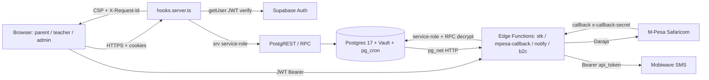
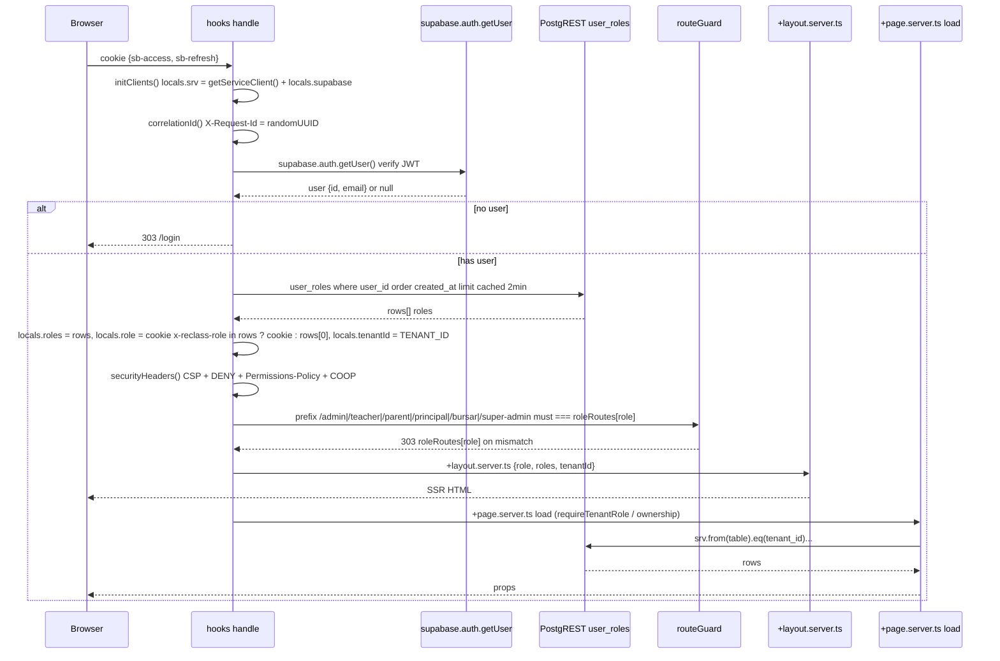
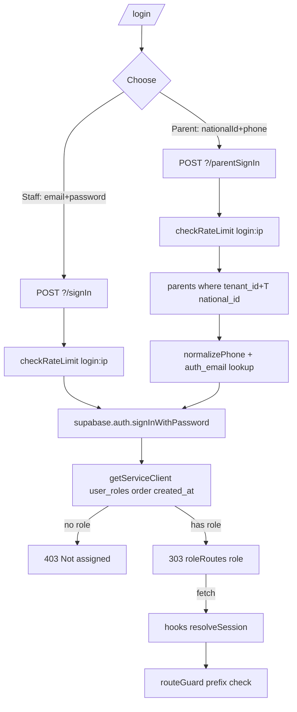
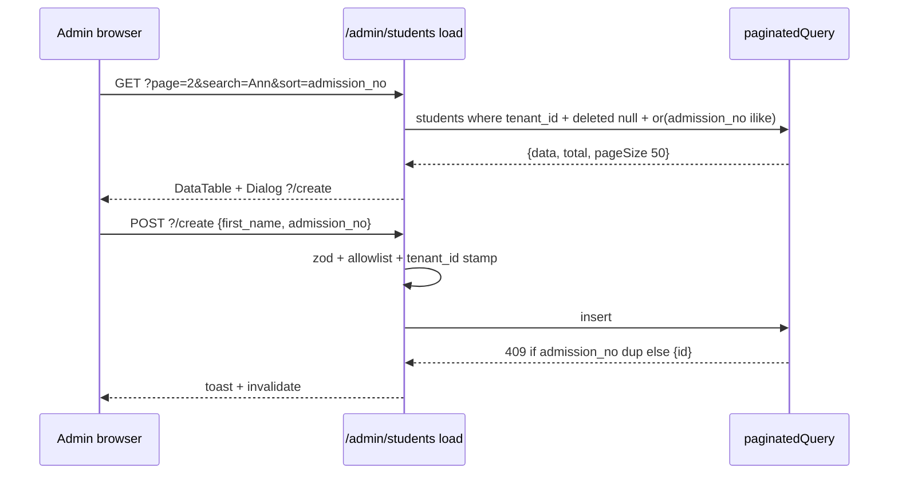
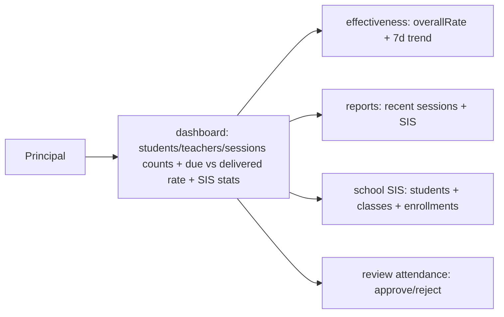
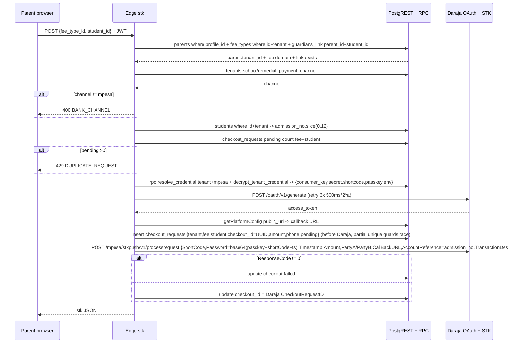
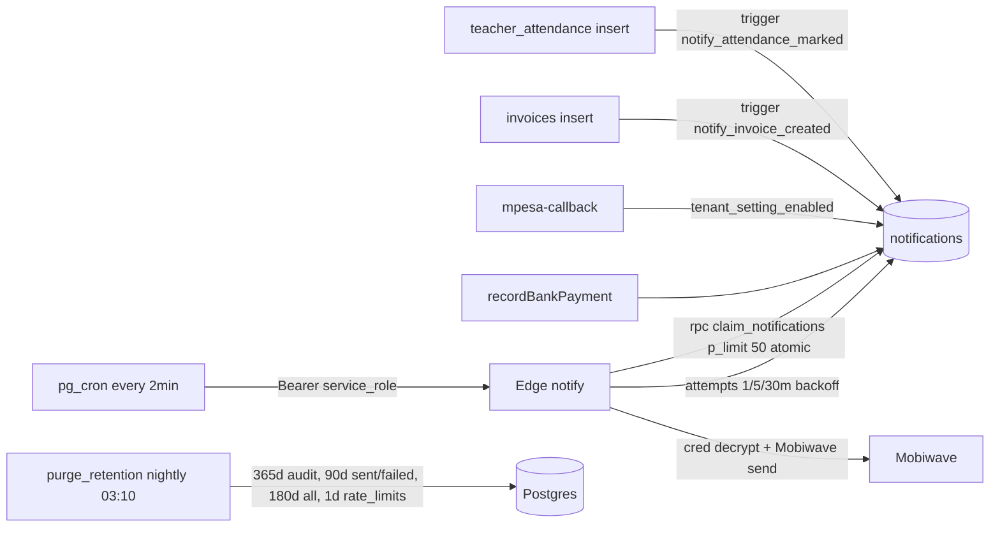

# eShule — End-to-End User Journey, Architecture, Flow, Logic & Implementation

> **Single source of truth for how every role moves through the product, what logic gates each step, and where that logic lives in code.**
> Generated 2026-08-20 from implementation (`src/`, `supabase/`, `packages/shared`). All `file:line` refs are clickable.

---

## 0. Mental Model — One Sentence Per Layer

| Layer | One-liner | Canonical file |
|---|---|---|
| **Browser** | Svelte 5 runes + `bits-ui` + Tailwind, no Redux — SSR loads are the state | `src/routes/**/*.svelte` |
| **Edge** | SvelteKit `hooks.server.ts` → `load`/`actions` → `locals.srv` (service-role, RLS inert) | `src/hooks.server.ts:1-15` |
| **Domain** | Thin `src/lib/server/{_auth,_platform,_sis,_finance,_remedial,_communications,_dashboard}` helpers | `src/lib/server/**` |
| **Data** | Supabase PostgREST + 40 migrations + 6 Edge Functions + `pg_cron/pg_net` queue | `supabase/migrations/*`, `supabase/functions/*` |
| **Tenant** | Single-tenant constant `TENANT_ID = 11111111...` (`packages/shared/src/lib/config.ts:8`) — every `srv` query `eq('tenant_id', TENANT_ID)` | `src/lib/server/_auth/middleware.ts:48` |

**Invariant:** RLS policies exist but are **inert** at runtime (`src/lib/supabase/server.ts:44` comment) — tenant isolation is `tenant_id` predicates + `guardians_link`/`teachers.profile_id` ownership helpers. `verify_tenant_isolation.py` (CI hard gate, 0 leaks/80 files) enforces the convention statically.

---

## 1. Global Architecture



### Request lifecycle (every authenticated page)



**Key files**
| Concern | File:line |
|---|---|
| `initClients` + `srv` | `src/lib/server/_auth/middleware.ts:39-48`, `src/lib/supabase/server.ts:44` |
| `resolveSession` + 2-min roleCache + `x-reclass-role` cookie | `middleware.ts:51-108` |
| `roleRoutes` + `isRole` | `packages/shared/src/lib/auth.ts:12-21`, `packages/shared/src/lib/config.ts:8` |
| `securityHeaders` | `middleware.ts:119-139` |
| `routeGuard` | `middleware.ts:141-169` |
| Login `signIn` / `parentSignIn` | `src/routes/login/+page.server.ts:31-104` |

---

## 2. Login — Two Doors, One Auth



**Implementation**
- Staff `signIn` `login/+page.server.ts:32-53`: `supabase.auth.signInWithPassword({email,password})` → `resolveRoleAndRedirect(user.id):14-28` (`user_roles` `eq(user_id)` `order(created_at)` `limit(1)` → `roleRoutes[role]`).
- Parent `parentSignIn` `login/+page.server.ts:59-104`: `normalizePhone` (`provisioning.ts:39-46` `0→254`, `7xx→2547xx`), lookup `parents` `where tenant_id=national_id` → `auth_email = parent.<id>@eshule.co.ke` + `normalizePhone(phone)` compare → `signInWithPassword({email:auth_email, password:normPhone})`. Password is phone, never shown except via SMS.
- Rate limit `login` `checkRateLimit(srv, ip, 'login')` `login/+page.server.ts:34,61` → `rate-limit.ts:36` `srv.rpc('rate_limit_hit', p_key=login:tenant:ip, p_max=5, window 60s)` fail-closed for `login` `rate-limit.ts:65-70`.
- Cookie `x-reclass-user` `middleware.ts:80-83` `httpOnly secure SameSite lax` + `x-reclass-role` switchable via `POST /api/role/switch` (listed in `PUBLIC_ROUTES`).

**UX:** `src/routes/login/+page.svelte` two tabs (Staff / Parent), form `use:enhance`, error toast on `fail(401)`.

---

## 3. Journey: `school_admin` — The Control Plane

> `school_admin` (and `super_admin` where noted) owns **SIS, Fees, Finance, Remedial, Comms, Settings, Users**. Every page gates `requireTenantRole(locals,'school_admin','super_admin')` `lib/server/_auth/auth.ts:16-22`. Navigation is the admin sidebar `src/routes/(app)/admin/+layout.svelte`.

### 3.1 SIS — Students / Parents / Teachers / Classes

| Sub-journey | Route | Load `→` Action `→` Result | Logic & Validation | File:line |
|---|---|---|---|---|
| **Students list** | `/admin/students` | `load:27` `getStudentsByTenant(srv, tenantId, {page,pageSize:50, search, sort})` `paginatedQuery('students').eq(tenant_id).is(deleted_at,null)` → `create/update/delete` soft `deleted_at` + `status inactive` | `zod` `first_name/last_name 1..100, admission_no 1..50, status active/inactive`, allowlist `STUDENT_SORT_COLUMNS`, `or(ilike)` search `sis/students.ts:7-68` | `admin/(sis)/students/+page.server.ts:9-96`, `lib/server/_sis/students.ts:7-68` |
| **Bulk import** | `/admin/students/import` `?/import` | `MAX_IMPORT_BYTES 512KB, BATCH_LIMIT 500, MAX_FIELD_LENGTH 120, ALLOWED_FIELDS=[admission_no,first_name,last_name,grade,status]` `parseCsv()` RFC4180 quoted → `tenant_id` stamp → `insert(records)` `23505→409 duplicate admission_no` | `parseCsv:11-52`, allowlist `95-101`, `23505:113` | `admin/(sis)/students/import/+page.server.ts:5-113` |
| **Parents + provisioning** | `/admin/parents` | `load:25` `paginatedQuery('parents').eq(tenant_id).is(deleted_at,null)` + `guardians_link in(parentIds)` join students → `?/create` `national_id required` `insert parents` → `provisionParent(srv,tenantId,parentId)` `?/update` `?/resend` `?/delete` soft | `provisioning.ts:39-151` `normalizePhone→254`, `auth_email=parent.<id>@eshule.co.ke`, `ensureAppRows` upsert `profiles + user_roles parent + parents.profile_id`, `enqueueLoginSms` dedup `external_id=parent-login:id:YYYY-MM-DD` + guard `sms_provision_parent` toggle `rpc tenant_setting_enabled` | `admin/(sis)/parents/+page.server.ts:13-175`, `lib/server/_sis/provisioning.ts:1-237` |
| **Teachers** | `/admin/teachers` | `srv.from('teachers').eq(tenant_id).is(deleted_at,null).order(first_name)` → `create {tenant_id, subjects CSV→array, remedial_role}` `update eq(tenant_id)` `delete soft` | `remedial_role enum chairman/treasurer/member/none`, `subjects max500` `38-44` | `admin/(sis)/teachers/+page.server.ts:7-91` |
| **Classes / SIS hub** | `/admin/sis` `/admin/sis/classes` `/admin/sis/enrollments` etc. | `load:7-11` `getSisStats / getSisClasses / getSisAdmissions` `Promise.all count(head:true)` | `students/classes/admissions/enrollments counts` | `admin/(sis)/sis/+page.server.ts:7-11`, `lib/server/_sis/sis.ts:1-60` |

**PP diagram (students)**


### 3.2 Fees & Finance (School domain = bank/KCB, Remedial domain = M-Pesa)

| Journey | Route | Logic |
|---|---|---|
| **Fee types** | `/admin/fees` `feeTypeCrud('school')` | `fee_types where domain=school is_deleted null order name` → `create {tenant_id, name, amount≥0, due_date, domain:school}` `update eq(tenant_id)` `delete hard` | `admin/(finance)/fees/+page.server.ts:1-3`, `lib/server/_finance/feeTypeCrud.ts:18-73` |
| **Finance hub + bank receipt** | `/admin/finance` `?/record-bank` | `load` `payments last year + fee_types school` `Promise.all` → `schoolCollected vs mpesaCollected` → `recordBankPayment(sb, tenantId, userId, FormData)` validates `fee_type.domain===school` else 400 `bank-payments.ts:48`, `student active tenant` `52-60`, `insert payments {tenant_id, student_id, fee_type_id, domain:school, amount, method:bank, bank_reference unique(tenant,bank_reference)→409, receipt_no=RCP-{tenant6}-{YYYYMMDD}-{rand5}, cashier_id, reconciled_at}` → `getStudentPayerPhone` + `enqueuePaymentReceiptSms` | `admin/(finance)/finance/+page.server.ts:6-38`, `lib/server/_finance/bank-payments.ts:29-94` |
| **Income / Expenses** | `/admin/finance/income` `/expenses` `?/create?/update?/delete` | `other_income/expenses where tenant_id order incurred_at limit100` → category breakdown | `finance/income/+page.server.ts:20-120` etc. |
| **Receipts / Reports** | `/admin/finance/receipts` `/admin/finance/reports` `revenue-csv` etc. | `payments where status paid join students+fee_types` → `csvResponse()` with `escape()` `+ prefix '` for `=+-@\t` (formula guard) `10k limit` `EXPORT_MAX_ROWS` | `finance/reports/+page.server.ts`, `lib/server/_platform/csv.ts:2-17` |
| **Remedial fees** | `/admin/remedial-fees` | Same `feeTypeCrud('remedial')` → `domain:remedial` `fee_types` used by STK | `admin/(remedial)/remedial-fees/+page.server.ts` |

### 3.3 Remedial — Scheduling / Attendance / Payroll / B2C

| Journey | Route & File | Flow |
|---|---|---|
| **Scheduling** | `/admin/scheduling` `scheduling.ts:64-95` `createSession` | Form `class,subject_id,teacher_id,room,day_of_week1-7,start_time,end_time,slot` → `rpc create_session_with_conflict(p_tenant,p_class,p_subject,p_teacher,p_day,p_start,p_end,p_room,p_slot)` transport lock → `409 session_conflict/23P01`, `400 session_fk_not_found` (tenant mismatch). `softDelete/toggleActive` `update active+deleted_at eq(tenant_id)` | `admin/(remedial)/scheduling/+page.server.ts`, `lib/server/_remedial/scheduling.ts` |
| **Attendance review** | `/admin/attendance` | `getAttendanceByTenant(srv, tenantId, {pageSize:100})` `paginatedQuery teacher_attendance join teachers` `order marked_at desc` | `admin/(remedial)/attendance/+page.server.ts` |
| **Payroll** | `/admin/payroll` (remedial) & `/admin/finance/payroll` (school) both `payroll.ts` | `generate` → validate dates → `tenants.payroll_rate_per_session` else 400 → `remedial_rate_per_session` map per teacher → `rpc aggregate_payroll_counts(p_tenant,p_start,p_end)` counts `teacher_id,occurrences_count` where `approval_status approved + status present/late + deleted null` join `session_occurrences occurs_on range` → `PayrollDraft {tenant,teacher,period,occurrences,rate,amount,domain}` `upsert onConflict tenant,teacher,period` `23505→409`. **School payroll** variant: `teachers.salary_monthly>0` `amount=salary_monthly, domain:school`. `approve` `draft→approved` count 0→400. `pay` `approved only→409` → `functions.invoke('b2c',{tenant_id,run_id,actor_id})` → `processing` else 502. `getPayrollRuns` `eq tenant+domain order created_at limit100` map `teacher_name` | `admin/(remedial)/payroll/+page.server.ts`, `lib/server/_finance/payroll.ts:51-320` |

### 3.4 Communications & Settings

| Journey | Route | Logic |
|---|---|---|
| **Comms hub** | `/admin/communications` | `Promise.all getCommStats/getAnnouncements/getTemplates/getNotificationLog` each `eq tenant_id limit100` | `admin/(communications)/communications/+page.server.ts`, `lib/server/_communications/communications.ts` |
| **Announcements/Templates** | `/admin/communications/announcements` `templates` `?/create?/delete` | `comm_announcements/comm_templates insert tenant_id` | `announcements/+page.server.ts`, `templates/+page.server.ts` |
| **Notifications queue** | `/admin/notifications` `?page` | `notifications pageSize100 order created_at eq tenant_id` + full `select status eq tenant_id` for counts `total/queued/sent/failed/optout` | `admin/(communications)/notifications/+page.server.ts` |
| **Settings** | `/admin/settings` | `load` `tenants single eq id=tenantId + getTerms+getCredentials` fallback defaults → `save` validates `mpesa_shortcode/paybill 5-7 digits:85-91`, `timezone/currency/payroll_rate, school/remedial_payment_channel bank|mpesa, kcb/buni`, JSONB `settings.{sms_attendance,sms_payment_reminder,sms_payment_receipt,sms_teacher_payout,sms_provision_parent}` → `tenants.update eq id`. Term `createTerm/setCurrentTerm/deleteTerm`, Credentials `saveCredential/delete/test` | `admin/settings/+page.server.ts:7-168` |

---

## 4. Journey: `teacher` — Delivery & Homeroom

> Gated by `teacher/+layout.server.ts:6` `requireTenantRole('teacher')` + `teachers where tenant_id+profile_id` → `teacher_type` → `capabilities = teacherCapabilities(type)` `hasCapability(role,type,cap)` `capabilities.ts:46-59` (`remedial|classroom|both`, `principal/bursar/admin` always true).

```mermaid
flowchart TD
  T[Teacher login] --> D[/teacher dashboard]
  D --> TT[timetable: sessions where teacher_id]
  D --> CL[classes: sis_classes where homeroom_teacher_id]
  D --> ATT[mark attendance: occurrence + status]
  ATT --> REV[committee review if remedial_role]
  CL --> ENR[enrollments: students in homeroom classes]
```

| Page | Load `→` Action | Tenant/Ownership & Cap gate | File:line |
|---|---|---|---|
| **Dashboard** | `load:8` `getTeacherOwnership` → caps → `sessions where teacher_id active tenant` if `remedial:view`, `session_occurrences where teacher_id tenant gte -7d lte +14d` join `sessions(subjects)` + `teacher_attendance` if remedial, `comm_announcements audience all/teachers`, `sis_classes homeroom_teacher_id` if `sis:view` → map `subject/attendance` `57-65` → `action mark:84-116` `markOwnTeacherAttendance` `rpc mark_own_teacher_attendance(p_tenant,p_teacher,p_profile,p_occurrence,p_status)` | `teacher_id + tenantId` everywhere; `hasCapability(..., 'remedial:attendance_mark')` else 403 | `teacher/+page.server.ts:7-116`, `lib/server/_auth/ownership.ts:30-41` |
| **Timetable** | `sessions where tenantId+teacher_id+active order day_of_week` | `teacher_id` | `teacher/timetable/+page.server.ts:6-12` |
| **Classes** | `sis_classes homeroom_teacher_id eq teacher.id tenant order name` → `sis_enrollments where class_id in ids status active tenant` join `students` | Homeroom ownership only | `teacher/classes/+page.server.ts:7-31` |
| **Committee** | `load:11-28` `committeeRole=teacher.remedial_role || none` `chairman/treasurer/member` else 403 → `getAttendanceCounts + getPayrollRuns(remedial) + attendance pending limit100` join teachers+occurrences → `payoutStats` totals `33-44` → `review/generate/approve/pay` 4 actions each re-check `remedial_role` + `rpc review_teacher_attendance` `treasurer→generateRemedialPayroll`, `chairman→approve`, `treasurer→payPayrollRunB2C` | `remedial_role` DB field + RPC verifies `p_profile_id/p_tenant_id` | `teacher/committee/+page.server.ts:10-114` |

---

## 5. Journey: `principal` — Oversight

> `principal/+layout.server.ts:5` `requireTenantRole('principal')`. School-wide read + attendance review is the only write.



| Page | File:line | Load → Action |
|---|---|---|
| **Dashboard** | `principal/+page.server.ts:11-106` | `requireTenantRole('principal')` → cache `statsCache tenant→32s` → `Promise.all` `students/teachers/sessions count(head)` `session_occurrences due where occurs_on -14d..today not cancelled` `teacher_attendance approved present/late join occurrences` `teacher_attendance pending with teachers+occurrences` → `attendanceRate = delivered/due*100` → `getSisStats` + `action review:83-104` `rejected→note required` `rpc review_teacher_attendance` approve/reject |
| **Effectiveness** | `principal/effectiveness/+page.server.ts:6-51` | `requireTenantRole` → `getAttendanceForEffectiveness limit10k + session_occurrences limit10k` → `overallRate present/total, doneSessions/totalSessions, trend per day via occurrence_id join` |
| **Reports / School** | `reports/+page.server.ts:6-29`, `school/+page.server.ts:6-27` | `countRecords`, `session_occurrences recent join subjects` `students paginated + getSisStats/Classes/Enrollments tenant` |

---

## 6. Journey: `bursar` — Revenue Read-Only + Receipts

> `bursar/+layout.server.ts:5` `requireTenantRole('bursar')`. No Svelte `actions` — read-only dashboard + export.

| Page | Route:file | Load (tenant = `locals.tenantId`) |
|---|---|---|
| **Dashboard** | `bursar/+page.server.ts:5-32` | `yearStart = now-365d` → `payments select amount where tenant gte yearStart status paid` → `totalRevenue sum` `payments detailed join students!inner+fee_types order created_at limit5000 (EXPORT_BURSA_MAX_ROWS)` map `student_name/admission/fee_type` → `checkout_requests where tenant status pending/failed limit20` → `stats+payments+checkouts` |
| **CSV export** | `bursar/csv/+server.ts:8-42 GET` | `requireTenantRole('bursar')` → `checkRateLimit csv:{tenantId}` `429` → `payments where tenant order created_at limit5000 join students+fee_types` → `csvResponse(headers [Student Name,Admission No,Grade,Fee,Amount,Channel,Reference,Receipt No,Created At], rows)` |

**Rely:** `locals.tenantId = TENANT_ID` `middleware.ts:48` — no `guardians_link` check, bursar sees all tenant `payments`. Layout already gatekept.

---

## 7. Journey: `parent` — Child-Centric Portal

> `parent/+layout.server.ts:5` `requireTenantRole('parent')`. **Every** page calls `getParentOwnership(locals)` `ownership.ts:9-28` → `parents where tenant+profile_id` `403` if unlinked → `guardians_link where parent_id+tenant` → `studentIds[]`. All downstream queries `in(studentIds)` + `eq(tenantId)`.

```mermaid
flowchart TD
  P[Parent login: nationalId + phone] --> D[/parent dashboard: children + fee ledger + receipts + announcements]
  D --> C[child: students + sis_enrollments sis_classes]
  D --> F[fees: fee_types school + ledger balance]
  D --> PAY[pay: choose student+fee → M-Pesa vs bank channel]
  PAY --> STK[POST Edge stk: verify parent, fee, link, channel, phone, duplicate]
  STK --> DAR[M-Pesa Daraja STK push]
  DAR --> CB[callback: amount+phone verify → reconcile_payment RPC → receipt + SMS]
  D --> HIST[payments history]
  D --> TT[timetable: sessions where class in child's grades]
  D --> STAT[pay/status poll]
```

| Page | File:line | Load → Ownership | Action/Poll |
|---|---|---|---|
| **Dashboard** | `parent/+page.server.ts:6-44` | `getParentOwnership:6` early `no child` guard `9` → `Promise.all students(eq tenant+in studentIds), payments overview limit5, comm_announcements audience all/parents, getParentLedger(tenant,studentIds)` `payments.ts:95-136` fetches `students + fee_types + paid payments` → `obligation = sum fee_types amount:120` `balance = max(0,obligation-paid):133` map `fee_types.name:38-41` | read-only |
| **Child** | `parent/child/+page.server.ts:5-38` | same ownership → `students, sis_enrollments join sis_classes, payments limit50` | read-only |
| **Fees** | `parent/fees/+page.server.ts:6-27` | double gate `requireTenantRole+getParentOwnership:7` → `fee_types where domain school is_deleted null + getParentLedger if children` | read-only |
| **Pay** | `parent/pay/+page.server.ts:5-37` + `+page.svelte:73` | `Promise.all students order first_name, fee_types all domains, getPaymentChannels(srv,tenant) fallback school:bank remedial:mpesa, tenants kcb/buni/mpesa meta` `9-27` → UI `DashboardContent Pay fees` `+page.svelte:89` shows `selectedChannel = school:bank vs remedial:mpesa:134` → `mpesa? functions.invoke('stk',{fee_type_id,student_id}) : bank details + admission_no as reference:175-176` | **STK** `+page.svelte:73` `getSupabase().functions.invoke('stk')` (JWT Bearer). **See §8 STK flow** |
| **Pay status** | `parent/pay/status/+server.ts:4-30 GET` | `query student_id&fee_type_id 6` → `getParentOwnership 10` → `!studentIds.includes→unknown 11` (no 403 enum) → `checkout_requests status+amount eq tenant+student+fee order created_at limit1 17-25` | polling |
| **Timetable** | `parent/timetable/+page.server.ts:4-25` | `students grade 8-12` dedupe `classes` → `sessions where class in grades active tenant order day_of_week 16-22` | read-only |
| **Payments history** | `parent/payments/+page.server.ts:4-27` | `payments join students!inner+fee_types in studentIds order created_at` | read-only |

**Channel logic** `lib/server/_platform/payment-channels.ts:7-21` `getPaymentChannels` reads `tenants.school_payment_channel / remedial_payment_channel` default `school:bank, remedial:mpesa:18-19`.

**Ledger** `lib/server/_finance/payments.ts:95-136` `getParentLedger` `fee_types` + `payments paid` per `studentIds` → per-student obligation/paid/balance (not shown here truncated but core).

---

## 8. Critical Payment Flows (Money)

### 8.1 STK Init — `supabase/functions/stk/index.ts:21-195`



### 8.2 Callback Reconcile — `supabase/functions/mpesa-callback/index.ts:9-191`

Fail-closed (`mpesa_callback_secret` required `17-25`), `MAX_BODY 10240` `29-36`, `x-callback-secret SHA-256 constant-time` `auth.ts:9-19`, `ResultCode !=0 → failed`, **fast path** `checkout_id exists → amount digit-check 69-71 vs phone 74-79 409 on mismatch → rpc reconcile_payment(p_checkout,p_amount,p_phone,p_tenant,p_student,p_fee,p_domain) → 93-97 must be completed/duplicate → payments update receipt_no RCP-{tenant6}-{YYYYMMDD}-{chk5} → enqueueReceiptSms (tenant_setting_enabled sms_payment_receipt + dedupe external_id mpesa-receipt:{id}) 195-221`. **Manual paybill path** `billRef (BillRefNumber=admission_no)` `133-183`: find `students where admission_no` → infer `fee_types where amount` for domain → same `reconcile_payment` → or if unknown admission → `unmatched_payments insert` for bursar queue.

### 8.3 Bank (Bursar/School) — `lib/server/_finance/bank-payments.ts:29-94`

`recordBankPayment` gate `requireTenantRole` → zod `student_id,fee_type_id,amount>0.01,bank_reference required` → `fee_types eq tenant domain school` `40-48` else 400 → `students eq tenant active not deleted` `52-60` else 404 → `insert payments {domain:school,method:bank,bank_reference unique tenant+bank_reference→409, receipt_no, cashier_id,reconciled_at}` → `getStudentPayerPhone + enqueuePaymentReceiptSms:90-93`.

### 8.4 B2C Teacher Payout — `lib/server/_finance/payroll.ts:284-320` + `supabase/functions/b2c/index.ts`

`pay:80-114` treasurer only → `payPayrollRunB2C` checks `status approved else 409` → `functions.invoke('b2c',{tenant_id,run_id,actor_id})` → Daraja B2C `initiator_name + security_credential (RSA base64)` → `update status processing` or `502 rejected`.

---

## 9. Queue & Cron (Notifications)



- **Triggers** `supabase/migrations/20260713010006_notification_triggers.sql` → `notifications {tenant_id,channel: inapp, body, status:queued, related_type:id}`.
- **Worker** `supabase/functions/notify/index.ts:9-110` `Bearer EXPECTED_TOKEN == service_role`, `rpc claim_notifications limit min(50)` atomic lease, `inapp → sent`, `sms → resolve_credential(decrypt) → fetch Mobiwave /sms/send bearer api_token 10s timeout → sent or queued+next_retry backoff(1,5,30)`.
- **Retention** `supabase/migrations/20260727000001_retention_policy.sql` `purge_retention()` cron `10 3 * * *`.

---

## 10. Logic Gates & Validation — Cross-Cutting

| Gate | Rule | File:line |
|---|---|---|
| **Tenant** | `tenant_id = TENANT_ID` (`111...`) on every `srv` read/write; `guardians_link`, `students`, `payments`, `sessions`, all. | `middleware.ts:48`, `verify_tenant_isolation.py` |
| **Role** | `requireTenantRole(locals, ...roles)` `401/403`, `routeGuard` prefix `roleRoutes`, `TEACHER_TYPE_CAPS` classroom vs remedial | `auth.ts:16-22`, `middleware.ts:141-169`, `capabilities.ts:22-59` |
| **Ownership** | Parent: `parents.profile_id=user.id + guardians_link parent_id+student_id` ; Teacher: `teachers.profile_id=user.id + teacher_id on sessions/occurrences` | `ownership.ts:9-41` |
| **Search/pagination** | `paginatedQuery` `PAGE_LIST_MEDIUM 50 / LARGE 100` `select count exact head + data range(offset,pageSize-1)` `or(ilike %term% columns)` allowlisted `SORT_COLUMNS` | `lib/server/_platform/query.ts:75-116` |
| **Schemas** | `zod/v3` `first_name 1..100, national_id max30, phone max20, employee_no max50, amount min 0.01, bank_reference max200, day 1..7, start<end, subjects CSV` | `*_+page.server.ts` `z.object` |
| **Rate limits** | `checkRateLimit(srv, bucketKey=namespace:tenant:key, p_max p_window)` `rpc rate_limit_hit` `login 5/min, stk 3/min, sms 10/min, global 120/min, csv 120/min` fail-closed `login/stk/sms` `rate-limitedHeaders → 429` | `lib/server/_platform/rate-limit.ts:19-65`, `login/+page.server.ts:34` `pay/status`, `bursar/csv` |
| **CSV** | `escape()` + `'` prefix on `=+-@\t` formula, `quote ""→""` `EXPORT_MAX_ROWS 10k` | `lib/server/_platform/csv.ts:2-17` |
| **Security headers** | `CSP default-src self unsafe-inline connect supabase+sentry, DENY, Permissions-Policy camera/mic/geolocation/payment none, COOP same-origin, HSTS 31536000` | `packages/shared/config.ts:29-40`, `middleware.ts:119-138` |
| **Error handling** | `logError(context,err,extra:tenantId)` JSON + `sanitizeError(err, fallback)` PG `23505/23503` allowlist, relation/constraint leak → fallback | `lib/server/_platform/log.ts:13-70` |

---

## 11. Navigation Map — What Each Role Sees

```
login (staff email|parent NID+phone → roleRoutes[role])
├── /admin (school_admin platform) ── sidebar 6 groups
│   ├── SIS: /admin/students | /admin/students/import | /admin/parents | /admin/teachers | /admin/sis(/classes/admissions/enrollments)
│   ├── Fees/Finance: /admin/fees | /admin/finance | /admin/finance/(income|expenses|receipts) | /admin/remedial-fees | /admin/finance/reports (+ csv)
│   ├── Remedial: /admin/scheduling | /admin/attendance | /admin/payroll | /admin/remedial/parent-payments | /admin/reclass/*
│   ├── Comms: /admin/communications | /admin/communications/(announcements|templates) | /admin/notifications
│   └── Platform: /admin/settings (brand + M-Pesa/KCB + toggles + terms + credentials) | /admin/users | /admin/payments/unmatched
├── /teacher ── tabs timetable | classes | committee(if remedial_role) | dashboard mark attendance
├── /principal ── dashboard | effectiveness | reports | school (SIS)
├── /bursar ── dashboard revenue (365d) | receipts | csv export
├── /parent ── dashboard (children ledger) | /parent/child | /parent/fees | /parent/pay (/pay/status poll) | /parent/payments | /parent/timetable
└── /super-admin ── /super-admin (tenants count) | /super-admin/audit (audit_log) | /super-admin/settings (platform_config + platform creds)
└── /account | /notifications | /api/(logout|role/switch) (PUBLIC_ROUTES)
```

---

## 12. Where to Change What (Implementation Index)

| You want to… | Touch | Not |
|---|---|---|
| Add a new student field | `sis/students/+page.server.ts:9-16` zod + `sis/students.ts` select + `+page.svelte` DataTable columns | `database.types.ts` regenerates |
| Allow parent to message teachers | New `comm_messages` table + RPC with `getParentOwnership` + `conversation participant` check | Don't write `recipient_id=teachers.id` (FK is `profiles.id`) |
| Change pay channel | `tenants.school/remedial_payment_channel` + `payment-channels.ts:18-19` defaults + `stk/index.ts:61` bank gate | `fee_types.domain` |
| Tune pagination | `packages/shared/config.ts:10-16` `PAGE_LIST_*` + `query.ts:76-90` | Hard-coded `limit100` in `principals` |
| Add SMS template variable | `comm_templates` + `notify/index.ts:55-70` Mustache style before `fetch Mobiwave` | `notifications.body` raw |
| Test locally | `npm run dev` + `supabase start && supabase db reset --local --yes` | Live DB without `TENANT_ID` |

---

## 13. Known Product Gaps (Not Bugs, Intentional 0.2.0 Cuts)

- No student login; parents only via `provisioning` from NID+phone.
- No offline queue; every page expects DB.
- No student attendance — teacher delivery only (`teacher_attendance` not `attendance` old table).
- Announce `frame-ancestors 'self'` allows same-origin framing; queue is DB-backed not broker.
- Retention deletes (`purge_retention`) are permanent — no archive before 365/180d.

---

**Read next:** `ARCHITECTURE.md` (container + scaling), `DATABASE.md` (migrations + RLS), `SECURITY.md` (threat model), `DEEP-REVIEW-2026-08-20.md` (24h fixes + scores), `PROMPT-deep-review.md` (re-run audit).

