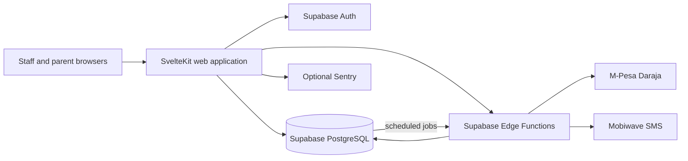

# eShule

> **School operations, connected and accountable.**
>
> eShule is a multi-tenant school-management platform for schools that need one operational system across administration, teaching, finance, payroll, communication, governance and programme workflows.

## What is eShule?

eShule is designed around the way school responsibilities are actually divided. Users do not receive the same dashboard simply because they belong to the same institution: their experience is derived from their base role, assignments, responsibilities and rights.

The platform brings together:

- **School administration** — students, guardians, teachers, classes, schedules and operational records.
- **Teaching & learning** — teacher workspaces, attendance and academic workflows.
- **School finance** — fees, invoices, receivables, reconciliation and financial reporting.
- **Payroll** — teacher compensation, allowances, remedial payments, committee payments and role-specific compensation.
- **ReClass** — the remedial learning and programme-management module.
- **Communication** — parent/guardian and teacher messaging, notifications and delivery tracking.
- **Governance & audit** — responsibilities, approvals, audit evidence and accountability workflows.
- **Receipts** — evidence of successful payments, kept distinct from invoices, obligations and payroll sheets.

## Responsibility model

The platform deliberately separates operational ownership:

| Area | Owner / responsibility |
|---|---|
| School finance | **Bursar** |
| Remedial operations | **ReClass** |
| Teacher compensation | **Payroll** |
| Actual payment evidence | **Receipts** |
| Notifications | **Shared service** |
| Audit | **Shared service** |
| School-wide oversight | **School administration / Principal according to assigned rights** |

A teacher's `teacher_type` can be `classroom`, `remedial`, or `both`. A remedial/committee role is an additional governance responsibility rather than a replacement for the teacher's teaching identity.

### Rights-driven UX

The intended interaction model is:

```text
User
  ↓
Base role
  ↓
Committee / functional assignment
  ↓
Responsibilities
  ↓
Rights
  ↓
Navigation → Dashboard → Queues → Actions
```

The UI uses this model to reduce irrelevant navigation and make ownership visible. **UI visibility is not a security boundary**: server-side authorization and database controls independently enforce every protected operation.

## Core workflows

### Teaching & attendance

Teachers work within their assigned teaching scope and record attendance. Authorized remedial committee members can review/approve remedial attendance according to their assigned rights. Teaching access does not automatically grant governance approval.

### ReClass

ReClass manages remedial programme operations, including remedial sessions, attendance and committee workflows. It remains separate from school-wide finance and teacher compensation.

### Finance

The Bursar is the owner of school finance. Financial obligations, invoices, payments and reconciliation are treated as accounting records rather than being embedded inside unrelated programme workflows.

### Payroll & teacher payments

Payroll owns teacher compensation. A consolidated payroll run can contain base pay, allowances, remedial compensation, committee compensation, role-specific payments and other configured components. Individual successful payments generate individual receipts.

The approval chain is designed to preserve separation of duties: preparation/submission, approval, payment initiation and payment approval are distinct responsibilities where configured by the school.

### Communication

The school is treated as a high-school environment: students are not direct messaging recipients. Student-list messaging resolves linked parents/guardians, while teachers can receive direct messages in their workspace. Audience selection, templates, personalization, recipient counts, delivery state and audit evidence belong to the communication workflow.

## Architecture

eShule is a **modular monolith**. The SvelteKit application contains authenticated pages, server loads/actions and domain services, while Supabase provides authentication and PostgreSQL persistence. Edge Functions isolate external payment and messaging integrations.



### Tenant isolation

The application is multi-tenant. Privileged server operations must derive the tenant from the verified session and scope queries, mutations and referenced records to that tenant. RLS remains defense-in-depth; service-role operations must not rely on RLS as their primary isolation mechanism.

The repository includes automated tenant-isolation checks intended to prevent unscoped privileged database access from silently returning to the codebase.

## Technology

| Layer | Implementation |
|---|---|
| Web | SvelteKit 2, Svelte 5, TypeScript 5, Vite 6, Tailwind CSS 4 |
| UI | bits-ui, Lucide Svelte, shared Svelte components |
| Validation | Zod, SvelteKit form actions/server loads |
| Identity & data | Supabase Auth, PostgREST/RPC, PostgreSQL, RLS migrations |
| Integrations | Supabase Edge Functions, M-Pesa Daraja STK/callback, Mobiwave SMS |
| Scheduling | `pg_cron`, `pg_net` where configured |
| Observability | Optional Sentry integration and request IDs |
| Testing | Vitest, Playwright configuration, ESLint, `svelte-check` |
| Delivery | GitHub Actions and Vercel adapter |

## Project status

**Status: active development / release candidate.**

The repository contains substantial implemented school-operations, finance, payroll, remedial, communication, governance and UX functionality. It should **not** be described as production-ready solely from source inspection.

Before a production release, the project still requires evidence for the live deployment path, database migration/replay and upgrade safety, privileged authorization against the actual hosted database, end-to-end workflows, provider integrations, observability, and backup/restore procedures.

The current `main` branch is the canonical integration branch. Recent work has been consolidated through a dedicated integration branch so that the complete source tree is preserved while today's UI, code, governance and operations changes are brought together.

## Local development

Prerequisites:

- Node.js `22.x` (`>=22 <23`)
- npm
- A local or dedicated non-production Supabase environment for database-backed work

```bash
nvm use
npm ci
cp .env.example .env
npm run dev
```

Never use production credentials or real school/customer data in a development environment.

### Environment variables

#### Web

| Variable | Visibility | Purpose |
|---|---|---|
| `PUBLIC_SUPABASE_URL` | Public | Supabase project URL |
| `PUBLIC_SUPABASE_ANON_KEY` | Public | Supabase browser authentication/data access key |
| `SUPABASE_SERVICE_ROLE_KEY` | Server secret | Privileged server operations |
| `IMPERSONATION_SECRET` | Server secret | Controlled administrative impersonation |
| `SENTRY_DSN` | Server | Optional Sentry integration |
| `PUBLIC_SENTRY_DSN` | Public | Optional browser Sentry integration |

#### Edge Functions

| Variable | Purpose |
|---|---|
| `SUPABASE_URL` | Supabase project URL |
| `SUPABASE_ANON_KEY` | Supabase authentication/access |
| `SUPABASE_SERVICE_ROLE_KEY` | Privileged Edge Function operations |
| `PUBLIC_URL` | Application/callback base URL where currently required |
| `MPESA_CALLBACK_SECRET` | Payment callback verification |
| `MOBIWAVE_BASE` | Optional SMS provider base URL |

Treat all provider credentials and secrets as sensitive. Do not commit them to Git.

## Checks

Run the repository checks from the project root:

```bash
npm run lint
npm run check
npm run test
npm run build
npm audit --audit-level=low
npx playwright test
```

Playwright requires an appropriate non-production test environment and is not equivalent to the unit/static checks.

The authoritative application type gate is `svelte-check` via the project's configured check/typecheck script. Do not introduce a raw `tsc --noEmit` requirement for Svelte component exports without first validating the Svelte 5 toolchain behavior.

## Repository structure

```text
.
├── src/
│   ├── routes/
│   │   ├── (app)/              authenticated application workspaces
│   │   ├── api/                application API/utility handlers
│   │   └── login/              authentication entry point
│   ├── lib/
│   │   ├── components/         shared Svelte UI and data components
│   │   ├── server/             auth, authorization, tenant and domain services
│   │   ├── supabase/           browser/server clients and generated types
│   │   └── __tests__/          automated application tests
│   ├── hooks.server.ts         server auth/middleware composition
│   └── hooks.client.ts         optional client instrumentation
├── supabase/
│   ├── migrations/             ordered database migrations
│   ├── functions/              payment, messaging and integration functions
│   ├── config.toml             local Supabase configuration
│   └── seed_comprehensive.sql  development seed data
├── e2e/                        Playwright specifications
├── scripts/                    audit and developer tooling
└── .github/workflows/          CI automation
```

## Documentation

| Document | Purpose |
|---|---|
| [ARCHITECTURE.md](ARCHITECTURE.md) | System architecture and major data/integration flows |
| [API.md](API.md) | Implemented endpoints, form actions, validation and authorization |
| [DATABASE.md](DATABASE.md) | Database schema, integrity, tenant isolation and migration analysis |
| [SECURITY.md](SECURITY.md) | Threat model, security findings and release controls |
| [DEPLOYMENT.md](DEPLOYMENT.md) | Deployment process and production gates |
| [OPERATIONS.md](OPERATIONS.md) | Health, observability, incident and recovery guidance |
| [CONTRIBUTING.md](CONTRIBUTING.md) | Development and review conventions |
| [ROADMAP.md](ROADMAP.md) | Product and engineering roadmap |
| [CHANGELOG.md](CHANGELOG.md) | Implementation-oriented change history |
| [AUDIT-2026-08.md](AUDIT-2026-08.md) | Dated audit baseline and historical findings |

Historical documents under `docs/` may describe earlier architecture or product assumptions. When they conflict with the current code, current root documentation and verified implementation take precedence.

## Security principles

- Tenant context comes from the verified authenticated session.
- Server-side authorization is the source of truth for protected actions.
- UI visibility is an experience layer, not an authorization mechanism.
- Financial records are tenant-scoped and protected against cross-domain/cross-tenant mutation.
- Payroll and payment workflows preserve separation of duties where configured.
- Receipts represent actual successful payments and are distinct from obligations and payroll documents.
- Audit and notification services provide shared accountability and operational feedback.
- Production credentials and real school data must never be committed to the repository.

## License

**Proprietary — Mobiwave Innovations Ltd.**

No open-source license or permission to use, copy, modify, or distribute this software is granted by this repository.
