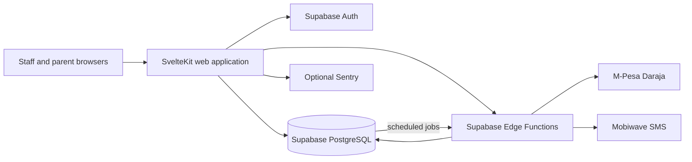

# eShule

> **School operations, connected and accountable.**
>
> eShule is a multi-tenant school-operations platform for schools that need one operational system across administration, student lifecycle, teaching operations, finance, payroll, communication, governance and programme workflows.

## Product boundary

eShule is the platform. **ReClass is the remedial learning and programme-management module within eShule**, not the product identity.

Current student-operations scope includes:

- **Admissions** — application intake, admission decisions and admission records. There is no screening workflow in the current scope.
- **Enrollment** — class/stream placement with preserved historical enrollments.
- **Student lifecycle** — admission, enrollment, progression, transfer, withdrawal, completion and reactivation/exit history.
- **Retention & history** — longitudinal student records and follow-up outcomes.
- **Graduation & exit** — completion, clearance, approval and archive/alumni handoff records.
- **ReClass** — remedial programmes, cohorts, sessions, attendance, progress and committee workflows.
- **Calendar & lessons** — school events, teaching schedules, rooms, lesson status and operational scheduling.
- **Teacher tasks/reminders** — upcoming lessons, attendance reminders, ReClass reminders, meetings and operational deadlines.

The platform also contains established finance, payroll, receipts, communication, governance/audit and role-based staff/parent workspaces.

## Responsibility model

| Area | Owner / responsibility |
|---|---|
| School finance | **Bursar** |
| Remedial operations | **ReClass** |
| Teacher compensation | **Payroll** |
| Actual payment evidence | **Receipts** |
| Notifications | **Shared service** |
| Audit | **Shared service** |
| School-wide oversight | **School administration / Principal according to assigned rights** |

A teacher's `teacher_type` can be `classroom`, `remedial`, or `both`. A remedial/committee role is an additional governance responsibility rather than a replacement for the teacher's teaching identity.

### Rights-driven UX

```text
User
  ↓
Base role
  ↓
Functional / committee assignment
  ↓
Responsibilities
  ↓
Rights
  ↓
Navigation → Dashboard → Queues → Actions
```

UI visibility is not a security boundary. Server-side authorization and database controls independently enforce protected operations.

## Student model

A **Student** is the person record. An **Enrollment** represents that student's relationship with the school for a particular academic period.

```text
Student
├── guardians
├── admissions
├── enrollments
├── lifecycle events
├── ReClass participation
├── documents/history
└── graduation / exit
```

Historical enrollments are preserved rather than overwritten. Student 360 should therefore provide the current enrollment alongside admission, guardian, programme and longitudinal history.

## Core workflows

### Admissions → Enrollment

```text
APPLICATION
   ↓
ADMISSION DECISION
   ↓
ADMITTED
   ↓
ENROLLMENT
   ↓
ACTIVE STUDENT
```

### Student lifecycle

```text
APPLICANT → ADMITTED → ENROLLED → ACTIVE → PROGRESSED → FINAL YEAR → GRADUATED
                                             └────────────→ TRANSFER / WITHDRAW / OTHER EXIT
```

Lifecycle changes are recorded as dated, auditable events rather than silently replacing history.

### ReClass

ReClass manages remedial programme operations, including cohorts, sessions, attendance, progress and committee responsibilities. ReClass participation is linked to the canonical student record; it does not create a second student identity.

### Calendar & lessons

School Calendar manages academic periods, holidays, meetings, ReClass sessions, deadlines and other school events. Lesson Management handles teacher/class/subject/date/time/room scheduling and lesson status. Teacher reminders support operations; these features are not an LMS or online-class system.

### Finance & payroll

The Bursar owns school finance. Payroll owns teacher compensation. Invoices/obligations, payment transactions, receipts and payroll runs remain separate accounting concepts. Separation of duties is enforced where configured.

### Communication

Student-list messaging resolves linked parents/guardians, while teachers can receive direct messages in their workspace. Audience selection, templates, personalization, delivery state and audit evidence belong to the communication workflow.

## Architecture

eShule is a **modular monolith**. The SvelteKit application contains authenticated pages, server loads/actions and domain services, while Supabase provides authentication and PostgreSQL persistence. Edge Functions isolate external payment and messaging integrations.



### Tenant isolation

The application is multi-tenant. Privileged server operations must derive the tenant from the verified session and scope queries, mutations and referenced records to that tenant. RLS is defense-in-depth; service-role operations must not rely on RLS as their primary isolation mechanism.

## Technology

| Layer | Implementation |
|---|---|
| Web | SvelteKit 2, Svelte 5, TypeScript 5, Vite 6, Tailwind CSS 4 |
| UI | bits-ui, Lucide Svelte, shared Svelte components |
| Validation | Zod, SvelteKit form actions/server loads |
| Identity & data | Supabase Auth, PostgREST/RPC, PostgreSQL, RLS migrations |
| Integrations | Supabase Edge Functions, M-Pesa Daraja STK/callback, Mobiwave SMS |
| Scheduling | `pg_cron`, `pg_net` where configured |
| Observability | Optional Sentry integration and request IDs |
| Testing | Vitest, Playwright configuration, ESLint, `svelte-check` |
| Delivery | GitHub Actions and Vercel adapter |

## Current status

**Status: active development / release-candidate hardening.**

The current codebase contains the complete implementation sequence for **Admissions → Enrollment → Student Lifecycle → Retention/History → Graduation/Exit → ReClass → Calendar/Lessons/Teacher Reminders**, alongside the existing finance, payroll, communication and governance modules.

The repository's latest CI baseline is green for lint, static tenant-isolation checks, type checking, tests, production build, local Supabase startup, migration replay and database cross-tenant isolation. E2E workflow configuration is present, but browser execution still depends on a configured non-production E2E environment.

A green repository CI run is not a production-readiness certificate. Live Supabase configuration, hosted migration state, provider callbacks/credentials, backup/restore, observability, deployment configuration and role-based UAT still require environment-specific verification before unrestricted production use.

## Local development

Prerequisites:

- Node.js `22.x` (`>=22 <23`)
- npm
- A local or dedicated non-production Supabase environment for database-backed work

```bash
nvm use
npm ci
cp .env.example .env
npm run dev
```

Never use production credentials or real school/customer data in development or automated tests.

### Environment variables

#### Web

| Variable | Visibility | Purpose |
|---|---|---|
| `PUBLIC_SUPABASE_URL` | Public | Supabase project URL |
| `PUBLIC_SUPABASE_ANON_KEY` | Public | Supabase browser authentication/data access key |
| `SUPABASE_SERVICE_ROLE_KEY` | Server secret | Privileged server operations |
| `IMPERSONATION_SECRET` | Server secret | Controlled administrative impersonation |
| `SENTRY_DSN` | Server | Optional Sentry integration |
| `PUBLIC_SENTRY_DSN` | Public | Optional browser Sentry integration |

#### Edge Functions

| Variable | Purpose |
|---|---|
| `SUPABASE_URL` | Supabase project URL |
| `SUPABASE_ANON_KEY` | Supabase authentication/access |
| `SUPABASE_SERVICE_ROLE_KEY` | Privileged Edge Function operations |
| `PUBLIC_URL` | Application/callback base URL where required |
| `MPESA_CALLBACK_SECRET` | Payment callback verification |
| `MOBIWAVE_BASE` | Optional SMS provider base URL |

Treat all provider credentials and secrets as sensitive. Never commit them to Git.

## Checks

Run the repository checks from the project root:

```bash
npm run lint
npm run check
npm run test
npm run build
npm audit --audit-level=low
npx playwright test
```

Playwright requires an appropriate non-production test environment and is not equivalent to the unit/static checks.

The authoritative application type gate is `svelte-check` via the project's configured check/typecheck script. Do not introduce a raw `tsc --noEmit` requirement for Svelte component exports without first validating the Svelte 5 toolchain behavior.

## Repository structure

```text
.
├── src/
│   ├── routes/                authenticated pages, APIs and login
│   ├── lib/
│   │   ├── components/        shared Svelte UI and data components
│   │   ├── server/             auth, authorization, tenant and domain services
│   │   ├── supabase/           browser/server clients and generated types
│   │   └── __tests__/          automated application tests
│   ├── hooks.server.ts         server auth/middleware composition
│   └── hooks.client.ts         optional client instrumentation
├── supabase/
│   ├── migrations/             ordered database migrations
│   ├── functions/              payment, messaging and integration functions
│   ├── config.toml             local Supabase configuration
│   └── seed_comprehensive.sql  development seed data
├── e2e/                        Playwright specifications
├── scripts/                    audit and developer tooling
└── .github/workflows/          CI automation
```

## Documentation

| Document | Purpose |
|---|---|
| [ARCHITECTURE.md](ARCHITECTURE.md) | Current system architecture and major data/integration flows |
| [API.md](API.md) | Implemented endpoints, form actions, validation and authorization |
| [DATABASE.md](DATABASE.md) | Database schema, integrity, tenant isolation and migration analysis |
| [SECURITY.md](SECURITY.md) | Security model, invariants and release controls |
| [DEPLOYMENT.md](DEPLOYMENT.md) | Deployment process and production gates |
| [OPERATIONS.md](OPERATIONS.md) | Health, observability, incident and recovery guidance |
| [CONTRIBUTING.md](CONTRIBUTING.md) | Development and review conventions |
| [ROADMAP.md](ROADMAP.md) | Product and engineering roadmap |
| [CHANGELOG.md](CHANGELOG.md) | Implementation-oriented change history |
| [AUDIT-2026-08.md](AUDIT-2026-08.md) | Dated audit baseline and historical findings |

Historical documents under `docs/` are retained for traceability. They may describe earlier architecture, scope or implementation assumptions; when they conflict with the current code, the current root documentation and verified implementation take precedence.

## Security principles

- Tenant context comes from the verified authenticated session.
- Server-side authorization is the source of truth for protected actions.
- UI visibility is an experience layer, not an authorization mechanism.
- Financial records are tenant-scoped and protected against cross-domain/cross-tenant mutation.
- Payroll and payment workflows preserve separation of duties where configured.
- Receipts represent actual successful payments and are distinct from obligations and payroll documents.
- Audit and notification services provide shared accountability and operational feedback.
- Production credentials and real school data must never be committed to the repository.

## License

**Proprietary — Mobiwave Innovations Ltd.**

No open-source license or permission to use, copy, modify, or distribute this software is granted by this repository.
