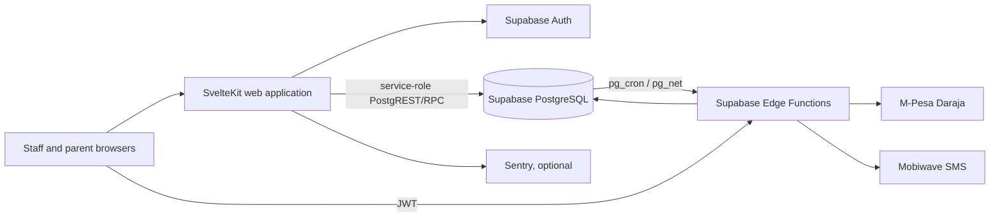

# eShule

> For the complete current technical audit, scores, Mermaid architecture diagrams, and prioritized remediation plan, see [AUDIT-2026-08.md](AUDIT-2026-08.md).

eShule is a multi-tenant school-management application for Kenyan schools. It covers school administration, scheduling, teacher delivery and payroll, student/guardian records, billing, M-Pesa payments, SMS notifications, parent messaging, and exam results.

> **Status: BLOCKED** (current audit: 2026-08-01). The repository has a green unit/static baseline, but migration replay, tenant isolation, privileged authorization, production observability, and recovery are not proven. Credentials are now encrypted through the database RPC and the payment callback fails closed when its secret is absent; remaining risks are tracked in [AUDIT-2026-08.md](AUDIT-2026-08.md).

Repository version `0.2.0` describes source present in Git. It is not evidence of a deployed or production-ready release.

## Roles and Features

| Role | Implemented surface |
|---|---|
| `super_admin` | Tenant overview, selective audit-log view, tenant impersonation |
| `school_admin` | Students, parents, teachers, users/roles, subjects, schedules, teacher attendance, fees, invoices, reconciliation, payroll, credentials, settings, reports/CSV, notifications, messages, exams/results |
| `principal` | Teacher-attendance review, reports, program-effectiveness views |
| `teacher` | Assigned timetable and teacher-attendance marking |
| `bursar` | Revenue, receivables aging, waivers, invoice/export views |
| `parent` | Linked-child timetable, fees, STK payment initiation, payment/invoice history, messages, academic results |

Important limitations are part of the current feature status: no versioned public REST API, no student login, no reliable offline attendance, no complete consent/STOP workflow, no production-proven deployment, and no implemented AI feature. Detailed behavior and defects are in [API.md](API.md) and [FINAL_REPORT.md](FINAL_REPORT.md).

## Actual Stack

| Layer | Repository implementation |
|---|---|
| Web | SvelteKit 2, Svelte 5, TypeScript 5, Vite 6, Tailwind CSS 4, bits-ui, Lucide Svelte |
| Validation/UI data | Zod 3, SvelteKit form actions and server loads |
| Identity/data | Supabase Auth, PostgREST/RPC, PostgreSQL 17 configuration, RLS migrations, Vault-dependent credential RPCs |
| Integrations | Supabase Deno Edge Functions, M-Pesa Daraja STK/callback, Mobiwave SMS, `pg_cron`, `pg_net` |
| Observability | Optional Sentry client/server integration and response request IDs |
| Testing/delivery | Vitest, Playwright configuration, ESLint, `svelte-check`, GitHub Actions, Vercel adapter; an audited but unusable Docker path also exists |

## Architecture

eShule is a modular monolith, not a microservice system. SvelteKit pages, loads, actions, middleware, and partial domain services deploy together; five Edge Functions isolate payment and SMS integration work. Durable state is held in a shared-schema, row-per-tenant PostgreSQL database.



Most server routes use `locals.srv`, which bypasses RLS. Tenant isolation therefore depends on every privileged query, mutation, and referenced-object check using the authoritative tenant from the verified server session. This is a fragile application convention, not a reliable database boundary. See [ARCHITECTURE.md](ARCHITECTURE.md) and [DATABASE.md](DATABASE.md).

## Local Setup

Prerequisites: Node.js `22.x` (`>=22 <23`), npm, and a local or dedicated non-production Supabase environment for database-backed work.

```bash
nvm use
npm ci
cp .env.example .env
npm run dev
```

`.env.example` contains Supabase local-development defaults. Never substitute production keys, provider credentials, user passwords, or customer data. The web app starts without proving that the current migrations replay or that payment/SMS integrations work.

### Web Environment Variables

| Name | Visibility | Status |
|---|---|---|
| `PUBLIC_SUPABASE_URL` | Browser and server | Required |
| `PUBLIC_SUPABASE_ANON_KEY` | Browser and server | Required |
| `SUPABASE_SERVICE_ROLE_KEY` | Server secret | Required by current implementation |
| `IMPERSONATION_SECRET` | Server secret | Strongly required; unsafe fallback exists |
| `SENTRY_DSN` | Server | Optional |
| `PUBLIC_SENTRY_DSN` | Browser | Optional |

`SECRET_KEY` appears in `.env.production.example`, but no current runtime use was found. Do not assume that setting it implements a security control.

### Edge Function Environment Variables

| Name | Status |
|---|---|
| `SUPABASE_URL` | Required/injected by Supabase |
| `SUPABASE_ANON_KEY` | Required/injected by Supabase |
| `SUPABASE_SERVICE_ROLE_KEY` | Required privileged secret |
| `PUBLIC_URL` | Required by current code but overloaded between web origin and callback base; must be redesigned before release |
| `MPESA_CALLBACK_SECRET` | Mandatory for production safety, although current code fails open when absent |
| `MOBIWAVE_BASE` | Optional provider-base override |

Daraja and Mobiwave credentials are stored as application records and resolved by database functions; they are not ordinary Edge environment variables. The current credential-save flow is release-blocking and must not receive live credentials.

## Checks and Audit Baseline

Run from the repository root:

```bash
npm run lint
npm run check
npm run test
npm run build
npm audit --audit-level=low
npx playwright test
```

Playwright has no npm script and is not run by current CI. It requires a built app, installed browser, dedicated non-production users, and appropriate test environment configuration.

Latest observed results on 2026-08-01:

| Check | Result |
|---|---|
| `npm test -- --run` | Pass: 10 files, 105 tests |
| `npm run lint` | Pass: 0 errors, 38 warnings |
| `npm run check` | Started successfully; runner did not return a completion status |
| `npm run build` | Reached Vite SSR transformation; runner did not return a completion status |
| `npm audit --audit-level=low` | 4 low findings; 0 moderate/high/critical (`cookie`, `GHSA-pxg6-pf52-xh8x`, through SvelteKit/adapters) |
| Docker validation | Not run: Docker is not installed on the audit host; static review found the image path unusable |

These results do not execute migrations, validate RLS against a live database, run E2E or accessibility automation, test provider sandboxes, prove backups/restores, or establish production readiness.

## Project Structure

```text
.
├── src/
│   ├── routes/
│   │   ├── (app)/              authenticated admin, bursar, parent, principal, teacher, super-admin routes
│   │   ├── api/                health and logout handlers
│   │   └── login/              Supabase password login
│   ├── lib/
│   │   ├── components/         shared Svelte UI, data table, layout, charts
│   │   ├── server/             auth, middleware, ownership, rate limits, domain/query helpers
│   │   ├── supabase/           browser/server clients and generated database types
│   │   ├── client/             browser validation helpers
│   │   └── __tests__/          Vitest unit/static contract tests
│   ├── hooks.server.ts         auth/middleware/Sentry composition
│   └── hooks.client.ts         optional client Sentry handling
├── supabase/
│   ├── migrations/             32 ordered SQL migrations; clean replay currently blocked
│   ├── functions/              five Edge Functions plus shared Deno helpers
│   ├── config.toml             local Supabase configuration
│   └── seed_comprehensive.sql  seed data
├── e2e/                        Playwright specification
├── .github/workflows/ci.yml    npm ci/lint/typecheck/test/build only
├── Dockerfile                  conflicting, non-authoritative deployment path
├── svelte.config.js            committed Vercel adapter configuration
└── *.md                        authoritative root audits and project guidance
```

## Documentation

| Document | Purpose |
|---|---|
| [FINAL_REPORT.md](FINAL_REPORT.md) | Consolidated 18-phase implementation audit, scores, risks, debt, and action plan |
| [ARCHITECTURE.md](ARCHITECTURE.md) | Current/target architecture, request/data/payment flows, scaling risks |
| [API.md](API.md) | Implemented endpoints and form actions, validation, roles, and errors |
| [DATABASE.md](DATABASE.md) | Intended schema, migration replay failure, integrity/RLS/concurrency analysis |
| [SECURITY.md](SECURITY.md) | Threat model, prioritized findings, OWASP mapping, and release blockers |
| [DEPLOYMENT.md](DEPLOYMENT.md) | Blocked deployment assessment and target Vercel/Supabase process |
| [OPERATIONS.md](OPERATIONS.md) | Health, observability, SLO proposals, incident and recovery runbooks |
| [CONTRIBUTING.md](CONTRIBUTING.md) | Development, tenant/security invariants, tests, and review workflow |
| [ROADMAP.md](ROADMAP.md) | Prioritized remediation, product, premium, analytics, monetization, and AI plan |
| [CHANGELOG.md](CHANGELOG.md) | Implementation-oriented source change ledger |

Lower-case documents under `docs/`, including `docs/api.md`, `docs/architecture.md`, `docs/security.md`, `docs/deployment.md`, and `docs/roadmap.md`, are **historical planning/design artifacts**. Where they conflict with dated root documents or code, the root documents and verified implementation evidence take precedence. Historical claims about Next.js, a public `/v1` API, comprehensive audit/RLS controls, Docker Compose, offline queues, or production readiness are not current facts.

## Security and Deployment Warnings

- Do not use live school data, production Supabase keys, Daraja credentials, or Mobiwave tokens with this build.
- Do not trust RLS to protect service-role traffic; derive tenant/role from the verified session and enforce tenant plus ownership on every privileged operation.
- Do not apply the current migration chain or ad hoc SQL to production. First reconcile hosted state, repair clean replay, test upgrades, and verify backups.
- Do not deploy the Dockerfile. The committed application build targets Vercel; Docker mutates the adapter, omits runtime dependencies, runs as root, and lacks a `.dockerignore`.
- Deployment remains blocked until the P0 gates in [DEPLOYMENT.md](DEPLOYMENT.md), [DATABASE.md](DATABASE.md), and [SECURITY.md](SECURITY.md) have recorded evidence.

## License

Proprietary. Copyright Mobiwave Innovations Ltd. No open-source license or permission to use, copy, modify, or distribute is granted by this repository.
