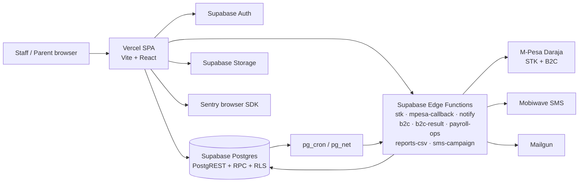

# eShule Architecture — React (Vite) Frontend + Supabase Backend

> **Status:** binding baseline per `docs/adr-001-frontend-and-deployment.md` (17 Sep 2026).
> Vite + React + TypeScript + Tailwind on Vercel + Supabase is the single supported
> web path. Next.js and DirectAdmin VPS are rejected unless a new ADR proves material
> business benefit. SvelteKit is frozen — no new routes there.

Stack anchor: `apps/web-react/package.json` — React 18, Vite 6, react-router-dom 7,
TanStack Query 5, react-hook-form + zod (`@hookform/resolvers`), recharts,
`@sentry/react`, Tailwind 4. SPA rewrite in `apps/web-react/vercel.json`.

---

## 1. C4: context and container

### Context (users ↔ eShule ↔ providers)

Staff (admin, principal, bursar, payroll, teachers, ReClass committee), parents,
and super-admins use the browser SPA. Money moves through Safaricom Daraja
(STK push in, B2C payout out); messages go out through Mobiwave SMS and Mailgun;
failures surface in Sentry.

### Container (mermaid)



Key flows:

| Flow | Path |
|---|---|
| Parent pays fees | SPA → `stk`/`reclass-stk` → Daraja STK → `mpesa-callback` → `reconcile_payment` RPC → receipt + SMS enqueue |
| Teacher payout | privileged UI → `payroll-ops` (state machine) → `b2c` → Daraja B2C → `b2c-result` finalizes |
| SMS fan-out | DB `notifications` queue → pg_cron → `notify` → Mobiwave; `sms-campaign` for bulk sends |
| Reports | SPA → `reports-csv` → CSV download (revenue, students, subjects, teachers, attendance) |
| Cleanup | pg_cron → `cleanup-pending-checkouts` expires stale `checkout_requests` |

---

## 2. Responsibility → rights → UI derivation

```text
User
  -> Base role (user_roles)
  -> Functional / committee assignment
  -> Responsibilities
  -> Rights / capabilities (role_permissions → permissions)
  -> Derived navigation (nav-data.ts, AppShell)
  -> Dashboard / queues (pages/*)
  -> Allowed actions (ProtectedRoute + useAuthorization + server checks)
```

- Roles (`src/lib/rbac.ts`): `super_admin, school_admin, principal, teacher,
  remedial_teacher, bursar, payroll, reclass_chair, reclass_secretary,
  reclass_treasurer, reclass_member, parent`.
- Permissions are fine-grained strings (`school.finance.view/manage/approve/…`,
  `reclass.programme/teaching/attendance/committee/finance/payments.*`,
  `users.manage, settings.manage, audit.view`) exposed via `PERMISSIONS`.
- Route groups in `src/App.tsx` combine **coarse role gates** (`ADMIN_ROLES,
  FINANCE_ROLES, RECLASS_*_ROLES, …`) with **fine permission gates** on ReClass
  routes (`PERMISSIONS.reclassProgramme.view`, `reclassFinance.view`, …).
- `useTenant()` (`src/hooks/useTenant.ts`, `['school-context']`, 60 s stale)
  resolves `{ userId, tenantId, roles, activeRole, permissions }` from
  `user_roles → role_permissions → permissions` (`super_admin` gets all).
  Multi-role users switch via `AuthContext.switchRole`, persisted in
  `localStorage` (`eshule_active_role`) and routed via `roleHome`.
- **The UI is not a security boundary.** Every mutation is re-authorized in Edge
  Functions (`verifyAuth`, per-op role lists) and by RLS/tenant scoping in Postgres.

Domain owners (from `ARCHITECTURE.md`): school finance → **Bursar**; remedial
operations → **ReClass** committee; teacher compensation → **Payroll**; payment
evidence → **Receipts**; notifications/audit → **shared services**. The Principal
approves where assigned but does not replace owners.

---

## 3. Frontend layers (`apps/web-react/src/`)

| Layer | Location | Responsibility |
|---|---|---|
| Entry | `main.tsx` | `ThemeProvider → QueryClientProvider → BrowserRouter → App` |
| Router | `App.tsx` | ~90 routes; `shell(roles, el, perms?)` wraps every page in `ProtectedRoute + AuthenticatedLayout` |
| Route guards | `components/ProtectedRoute.tsx` | Coarse: session → `user_roles` → active role ∈ `allowedRoles`. Fine: `role_permissions → permissions` lookup, `super_admin` bypass |
| Layout | `components/layout/authenticated-layout.tsx`, `app-sidebar.tsx`, `nav-data.ts`, `components/AppShell.tsx` | Sidebar + header shell, grouped nav filtered by active role (`filterNavByRole`), role switcher, logout |
| Pages | `pages/admin|finance|reclass|parent|teacher|comms|sis|misc` (+ `Login`, `Stub`) | Dashboards, queues, CRUD; thin — data via hooks, mutations via Edge invocations |
| Shared UI | `components/` (`DataTable`, `KpiCard`, `ui.tsx`, `TrendChart` (recharts), `FeeManager`, `PayrollPanel`, `ReceiptModal`, `SmsComposer`, `NotificationBell`, `ConfirmDelete`) | Presentational + domain widgets; no auth logic |
| Data hooks | `hooks/` (`useTenant`, `useFinance`, `useRemedial`, `useDashboard`, `useStudents`, `useParentScope`) | TanStack Query reads (`fee_types`, `payroll_runs?domain=`, `teacher_attendance`, `notifications`); `usePayrollOp` mutates via `payroll-ops`; CSV via `reports-csv`; STK via `stk`/`reclass-stk`/`sms-campaign` |
| Forms | RHF + zod (`@hookform/resolvers`) | Client-side schema validation; server re-validates |
| State/cache | TanStack Query | `['school-context']`, `['fee-types']`, `['payroll-runs', kind]`, `['attendance', …]`; `qc.invalidateQueries` on role switch / payroll ops; `qc.clear()` on logout |
| Auth ctx | `contexts/AuthContext.tsx` | `logout` (signOut → clear role → `qc.clear()` → `/login`), `switchRole` |
| Policy | `lib/rbac.ts` | Roles, `roleHome`, `PERMISSIONS`, `hasPermission/hasAnyPermission`, role-group constants, storage helpers |
| Backend glue | `integrations/supabase/client.ts` | Anon-key browser client only; never throws at import; warns without env. Privileged work goes through Edge Functions |
| Resilience | `components/ErrorBoundary.tsx`, suspense fallback, Sonner toasts | Route-level crash containment; async loading states; user feedback |

Route map (`App.tsx`, all via `shell()`):

| Prefix | Audience | Representative pages |
|---|---|---|
| `/admin/*` | admin, principal | Dashboard, SIS, students/teachers/parents, admissions, calendar, audit, users, settings, attendance, committee, fee, payroll, scheduling |
| `/finance/*`, `/bursar/*`, `/payrolls*`, `/receipts` | bursar, payroll | FinanceOverview, Fees, PaymentDefinitions, SchoolPayroll, Receipts (+print), FinanceReports, UnmatchedPayments |
| `/reclass`, `/admin/reclass/*` | committee, remedial teachers | ReclassDashboard, Attendance, RemedialFees, ParentPayments, RemedialPayroll, CommitteeManagement |
| `/parent/*` | parents | ParentDashboard, ParentPayments, ParentPay (STK), Timetable |
| `/teacher/*` | teachers | TeacherDashboard, MarkAttendance, classes, tasks, timetable, committee + committee/payroll |
| `/principal/*`, `/super-admin/*` | oversight, platform | PrincipalDashboard, SchoolOverview, SuperAdminDashboard, audit |
| `/comms`, `/admin/communications/*`, `/admin/notifications/*`, `/notifications` | admin (+ inbox for all roles) | CommsOverview, Announcements, CommTemplates, NotificationInbox |

---

## 4. Backend layers (Supabase)

| Layer | Responsibility |
|---|---|
| PostgREST + RPC | Direct reads for lists/detail (`fee_types`, `students`, `teachers`, `teacher_attendance`, `notifications`, `unmatched_payments`); writes only where RLS permits. Privileged transitions via RPCs: `reconcile_payment`, `claim_payroll_run`, `finalize_payroll_b2c`, `aggregate_payroll_counts`, `claim_notifications`, `resolve_credential`, `decrypt_tenant_credential`, `tenant_setting_enabled` |
| Edge workers (`supabase/functions/*/index.ts`) | `stk` (STK push, duplicate guard, channel check), `mpesa-callback` + `reclass-mpesa-callback` (secret-gated, idempotent reconcile, unmatched parking), `notify` (service-role-gated queue drain), `b2c` (claim → pre-flight → Daraja B2C), `b2c-result` (async finalize), `payroll-ops` (generate/approve/mark-paid state machine), `reports-csv` (role-gated exports), `sms-campaign`, `cleanup-pending-checkouts` |
| pg_cron jobs table | `cron.schedule` entries (see `supabase/migrations/20260714000001_cron_schedules.sql`): drain `notifications` via `notify`, payment reminders, `cleanup-pending-checkouts`, domain maintenance. pg_net performs the HTTP call into Edge |
| Postgres | System of record: schema + constraints + triggers + RLS in `supabase/migrations/`; deterministic receipt numbers (`RCP-<tenant>-<date>-<checkout5>`) so retried callbacks cannot mint duplicates |

AuthN/Z chain: Supabase Auth identity → `user_roles` (tenant + role) →
functional/committee assignment → `role_permissions → permissions` →
Edge/RPC/RLS re-check on every mutation. Service-role clients bypass RLS, so
Edge code scopes every query by `tenant_id` explicitly.

---

## 5. Financial model (separation enforced)

```text
Invoice / obligation  →  Payment transaction  →  Receipt / payment evidence
Payroll definition    →  Payroll run          →  Payment → Teacher receipt
```

- Student/parent obligations (incl. ReClass remedial fees) live on the
  **obligation side** (`fee_types`, `checkout_requests`, `unmatched_payments`).
- Teacher/committee compensation lives under **Payroll** (`payroll_runs`
  with `domain ∈ {school, remedial}`, upsert key
  `tenant_id,teacher_id,period_start,period_end,domain`).
- `payments` rows **are** receipts: `status='paid'` + `receipt_no` + channel
  reference (`mpesa_receipt` / `bank_reference`). Never conflate with invoices
  or payroll sheets.
- Reconciliation is tenant-scoped and idempotent: amount/phone match on STK
  path; `BillRefNumber` (admission no) routing on manual paybill path;
  `already_reconciled`/`duplicate` short-circuits; unknown refs park in
  `unmatched_payments` for bursar matching.
- State machine (`payroll-ops`, compare-and-set): `draft → approved → paid`;
  B2C claim `approved → processing` is atomic with idempotent checkout id.
  Separation of duties: generate (admin), approve (admin/principal),
  mark-paid/pay (admin/bursar).

---

## 6. Notifications and audit (shared services)

- Event/template/delivery model on the `notifications` table:
  `queued → (claimed) → sent | failed`, with `attempts`, `next_retry_at`
  (1/5/30-min backoff), `claimed_at` leases via `claim_notifications`,
  `external_id` dedupe (`mpesa-receipt:<id>`), `unsupported_channel` marking.
- `notify` drains ≤50/batch: `inapp` marked sent immediately (inbox reads live),
  `sms` via Mobiwave (`recipient, sender_id, type, message`), email left
  `failed` (not wired) rather than silently dropped.
- Audit rows capture actor, action, affected record, time, result, approval
  context; automated events distinguish the system event from the triggering
  human action. Receipt/payment SMS enqueues are idempotent inserts
  (unique-conflict tolerant).

---

## 7. Caching, jobs, storage

- **Client cache:** TanStack Query with per-domain keys and 60 s `staleTime` on
  tenant context; invalidation on mutation/role-switch; full clear on logout.
- **Jobs:** pg_cron schedules Edge invocations; DB-backed `notifications` queue
  is sufficient at current scale — before high-volume production, harden claim
  leases, retry/dead-letter paths, and queue observability (do not swap in a
  broker without an ADR).
- **Storage:** Supabase Storage for uploads/exports (CSV downloads stream from
  `reports-csv` as `text/csv` attachments, 5 000-row cap). No PII in object keys.
- **Secrets:** per-tenant provider credentials via `resolve_credential` /
  `decrypt_tenant_credential`; Daraja OAuth per request with fetch retry
  (3× exponential backoff); callback integrity via `x-callback-secret`
  (`verifySecret`, fail-closed) and 10 KB body cap.

---

## 8. Deployment

- **Vercel (frontend):** `framework: vite`, `dist` output, SPA rewrite
  `/(.*) → /index.html` so react-router owns deep links. Preview deploys per PR,
  production on main. Rollback = Vercel instant rollback to a prior deployment.
- **Supabase (backend):** migrations replay in order (`supabase/migrations/`);
  use expand-contract for breaking schema changes (add nullable → backfill →
  enforce → drop). Edge Functions deploy alongside; `public_url` platform config
  must match the live project so Daraja callbacks resolve.
- **Release gates:** `tsc --noEmit`, `vite build`, vitest, eslint, migration
  replay check, RLS/auth verification, Daraja sandbox + callback test,
  backup/restore drill, Sentry release tagging.
- **Rejected paths:** Next.js SSR and VPS/DirectAdmin hosting require a new ADR
  with threat model, backup/restore, supervision, TLS/firewall/patching, and
  rollback plan (per ADR-001 consequences).

---

## 9. Invariants (adapted from `ARCHITECTURE.md` to React)

1. Never use client visibility (`ProtectedRoute`, nav filtering) as the
   authorization boundary — Edge/RPC/RLS re-check every mutation.
2. Derive tenant context from the verified session (`useTenant` +
   `verifyAuth`), never from client-supplied tenant ids.
3. Preserve separation of duties for attendance → payroll → payout
   (teacher marks, committee approves, treasurer runs, chair authorizes).
4. Keep school finance under the Bursar (`FINANCE_ROLES`, `school.finance.*`).
5. Keep remedial operations under ReClass (`RECLASS_*_ROLES`, `reclass.*`).
6. Keep teacher compensation under Payroll (`payroll-ops` state machine;
   school vs remedial `domain` never mixed).
7. Treat receipts as payment evidence (`payments` + `receipt_no`), not invoices
   (`fee_types`/`checkout_requests`) or payroll sheets (`payroll_runs`).
8. Treat notifications and audit as shared infrastructure (queue + triggers,
   not per-domain re-implementations).
9. Add tenant/ownership checks to every privileged query and mutation
   (service-role bypasses RLS — scope explicitly).
10. Update tests and docs when changing a business invariant (this file,
    `ARCHITECTURE.md`, relevant migration + hook/function tests).

---

## 10. Migration note — SvelteKit frozen

- The SvelteKit tree is reference-only. **Do not add production routes,
  server loads, form actions, or CSV endpoints there** — `reports-csv` already
  replaced the six SvelteKit CSV endpoints.
- New work lands in `apps/web-react/src` (route in `App.tsx` + guard in
  `ProtectedRoute` + hook in `hooks/` + Edge/RPC behind it) with the
  expand-contract migration discipline above.
- Deleting SvelteKit code is a separate cleanup decision; until then it must
  not diverge from the React + Edge baseline documented here.

---

## Related documentation

- `ARCHITECTURE.md` — product boundary, current-state reference
- `docs/adr-001-frontend-and-deployment.md` — binding Vite/React/Vercel/Supabase decision
- `API.md`, `DATABASE.md`, `SECURITY.md`, `DEPLOYMENT.md`, `OPERATIONS.md` — interfaces, schema, security, release, runbooks
