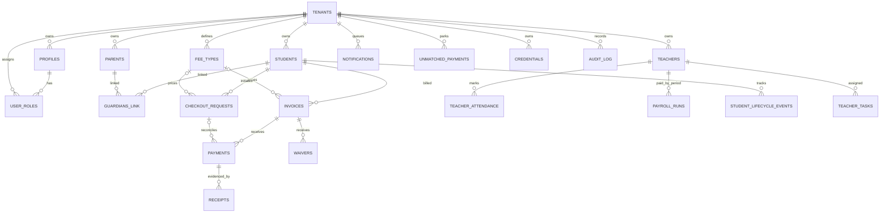

# eShule Database Design (React Vite + Supabase Postgres)

> Stack: React Vite SPA (anon browser client) + Supabase Postgres + Edge Functions (service_role).
> Model: multi-tenant, shared schema, row-per-tenant via `tenant_id`.
> Prior analysis: `DATABASE.md` (composite tenant FK recommendation, RLS risks, index caveats).

## 1. Tenancy model + auth

- `tenants(id PK, slug UNIQUE)` is the isolation root. Every tenant-owned row carries
  `tenant_id uuid NOT NULL REFERENCES tenants(id) ON DELETE CASCADE`
  (exception: `unmatched_payments.tenant_id` nullable — unroutable paybill deposits).
- Identity: Supabase Auth owns `auth.users`. `profiles(id PK = auth.uid(), tenant_id)` extends it.
  `user_roles(tenant_id, user_id, role)` is the membership/authorization table;
  unique `(tenant_id, user_id, role)`.
- Browser client uses the anon key + user JWT. The canonical membership lookup is
  `tenant_ids_for_user()` (`20260909120000_react_spa_rls_hardening.sql:6-14`):
  `SECURITY DEFINER, STABLE`, `select tenant_id from user_roles where user_id = auth.uid()`.
- RLS policies are claim-based: `tenant_id IN (SELECT tenant_ids_for_user())` for reads,
  same expression in `USING` + `WITH CHECK` for writes (`tenant_read` / `tenant_write_staff`).
  `tenants` uses self policies `tenant_self_read` / `tenant_self_update` on `id`.
  `user_roles` exposes `own_roles_read` (`user_id = auth.uid()`); management is service_role-only.
- Edge Functions (`stk`, `mpesa-callback`, `notify`) use service_role and bypass RLS;
  they enforce tenancy in code (`eq('tenant_id', ...)` filters, `resolve_credential(p_tenant, ...)`,
  `decrypt_tenant_credential(p_id, p_tenant)` tenant-bound decrypt).
- Legacy `current_setting('app.tenant_id')` policies (e.g. `student_lifecycle_events`,
  `school_calendar_events`, `teacher_tasks` in `20260907222552`) are superseded by the
  `tenant_ids_for_user()` loop in the hardening migration; do not set session vars from PostgREST.

## 2. Table inventory by domain

| Domain | Table | PK / keys |
|---|---|---|
| Tenancy/people | `tenants` | `id`, `slug UNIQUE`, `school_payment_channel` / `remedial_payment_channel` (`bank`\|`mpesa`) |
| Tenancy/people | `profiles` | `id (= auth.uid())`, `tenant_id` |
| Tenancy/people | `user_roles` | `id`, UNIQUE `(tenant_id, user_id, role)` |
| SIS | `students` | `id`, UNIQUE `(tenant_id, admission_no)`; `admission_no ≤ 12` chars (M-Pesa AccountReference) |
| SIS | `parents` | `id`, `profile_id → profiles`, `phone` (normalized to `254…` in `stk`) |
| SIS | `guardians_link` | PK `(student_id, parent_id)` + tenant-consistency trigger |
| SIS | `teachers` | `id`, `profile_id → profiles`, `subjects text[]` (GIN) |
| SIS | `sis_classes`, `sis_enrollments`, `sis_admissions`, `subjects` | `id`, `tenant_id` |
| Lifecycle/ops | `student_lifecycle_events` | `id`, `(tenant_id, student_id, event_date DESC)`; `event_type ∈ admitted,enrolled,class_changed,transferred,graduated,withdrawn,reactivated,note` |
| Lifecycle/ops | `school_calendar_events` | `id`, `(tenant_id, starts_at)`; `CHECK ends_at >= starts_at` |
| Lifecycle/ops | `teacher_tasks` | `id`, `(tenant_id, teacher_id, status, due_at)`; `status ∈ open,in_progress,completed,cancelled` |
| ReClass/finance | `fee_types` | `id`, `tenant_id`, `amount`, `domain ∈ school,remedial`, `deleted_at` soft delete |
| ReClass/finance | `invoices` | `id`, `tenant_id`, `student_id`, `amount_due ≥ 0`, cached `amount_paid`, `status` |
| ReClass/finance | `payments` | `id`, UNIQUE `(tenant_id, mpesa_checkout_id)` partial + global `receipt_no` partial unique; `status ∈ pending,paid,failed,cancelled,reversed`; immutable refs trigger |
| ReClass/finance | `checkout_requests` | `id`, UNIQUE `checkout_id`; partial unique `(tenant_id, student_id, fee_type_id) WHERE status='pending'` |
| ReClass/finance | `waivers`, `payment_reconciliations` | `id`, `invoice_id → invoices`, `tenant_id` |
| Payroll | `payroll_runs` | `id`, UNIQUE `(tenant_id, teacher_id, period_start, period_end, domain)`; `domain ∈ school,remedial`; `status` workflow; `no_anon_write` deny |
| Payroll | `payroll_run_items` / `payroll_components`, `teacher_attendance` | FK `→ payroll_runs(tenant_id, id)` composite; attendance UNIQUE `(occurrence_id, teacher_id)` |
| Receipts | `payments.receipt_no` deterministic `RCP-<TENANT6>-<YYYYMMDD>-<CHECKOUT5>`; `receipts` table where present | UNIQUE `receipt_no WHERE NOT NULL` |
| Comms | `notifications` | `id`, `tenant_id`, `channel ∈ sms,in_app,…`, `status ∈ queued,processing,sent,failed,optout`, `attempts 0..10`, `claimed_at`, `next_retry_at`, `external_id` idempotency |
| Comms | `comm_announcements`, `comm_templates`, `messages` | `id`, `tenant_id` (+ conversation threading) |
| Governance | `credentials` | `id`, `(tenant_id, provider, scope)`; Vault + `pgp_sym_*`; `resolve_credential` / `decrypt_tenant_credential` |
| Governance | `audit_log` / `audit_logs`, `unmatched_payments` | `id bigserial/uuid`, `(tenant_id, created_at DESC)`; unmatched UNIQUE `checkout_id`, open partial `matched_at IS NULL` |

## 3. ER diagram



## 4. Integrity rules

- **Uniques:** `tenants(slug)`; `students(tenant_id, admission_no)`; `user_roles(tenant_id, user_id, role)`;
  `payments(tenant_id, mpesa_checkout_id) WHERE NOT NULL` (`20260901171500`);
  `payments(receipt_no) WHERE NOT NULL` (`phase_2v`); `checkout_requests(checkout_id)`;
  `checkout_requests_one_pending_per_student_fee (tenant_id, student_id, fee_type_id) WHERE status='pending'`
  (`20260803123020`); `payroll uq_payroll_runs_tenant_teacher_period_domain`;
  `teacher_attendance(occurrence_id, teacher_id)`; `session_occurrences(session_id, occurs_on)`;
  `exam_results(exam_id, student_id, subject_id)` where exams module present.
- **Checks:** `payments.amount > 0`, `waivers.amount > 0`, `invoices.amount_due >= 0`,
  `payroll_runs.amount >= 0`; `notifications.attempts 0..10`; `students_admission_no_maxlen (≤12)`;
  `tenants` channel checks; `teacher_tasks.priority/status/reminder_minutes 0..10080`;
  `calendar ends_at >= starts_at`; `payments_status_check`; `prevent_payment_reference_mutation`
  trigger (checkout/receipt/amount immutable after write).
- **FKs / deletes:** children reference `tenants(id) ON DELETE CASCADE`; financial parents
  (`students → invoices → payments/waivers/checkout_requests`) must use `RESTRICT`, never cascade
  payment evidence away (`DATABASE.md §4`). Soft-delete (`fee_types.deleted_at`) preferred.
- **Composite tenant FK target (from `DATABASE.md` + `20260901172000`):** add
  `UNIQUE (tenant_id, id)` on `tenants`-scoped parents (`uq_payments_tenant_id_id_key`,
  `uq_invoices_tenant_id_id_key` already exist; extend to `students`, `fee_types`,
  `payroll_runs` — `uq_payroll_runs_tenant_id_id` exists) and repoint children to
  `FOREIGN KEY (tenant_id, parent_id) REFERENCES parent(tenant_id, id)` so cross-tenant
  `invoice.student_id` / `payment.invoice_id` / `attendance.teacher_id` inserts fail in the DB.

## 5. RLS matrix

| Table(s) | anon | authenticated | service_role |
|---|---|---|---|
| All `tenant_*` tables in hardening list (`students`, `parents`, `teachers`, `sis_*`, `subjects`, `fee_types`, `invoices`, `payments`, `checkout_requests`, `receipts`, `expenses`, `other_income`, `sessions`, `session_occurrences`, `teacher_attendance`, `notifications`, `comm_*`, `teacher_tasks`, `school_calendar_events`, `discipline_cases`, `student_lifecycle_events`, `unmatched_payments`, `audit_log(s)`) | NO ACCESS (no policy; writes fail closed) | `tenant_read` SELECT + `tenant_write_staff` ALL via `tenant_ids_for_user()` | BYPASS (enforce `tenant_id` in code) |
| `tenants` | NO ACCESS | `tenant_self_read` SELECT, `tenant_self_update` UPDATE on `id IN (…)`; no insert/delete | BYPASS |
| `payroll_runs` | DENY ALL (`no_anon_write USING false`) + no tenant policy | `tenant_read` / `tenant_write_staff` | BYPASS; privileged transitions via RPC only |
| `user_roles` | NO ACCESS | `own_roles_read` (`user_id = auth.uid()`); no write | BYPASS; role mgmt server-side |
| RPCs (`reconcile_payment`, `claim_notifications`, `grant_waiver`, `resolve_credential`, `decrypt_tenant_credential`, `tenant_setting_enabled`, `enqueue_teacher_task_reminders`, `cleanup_*`, `purge_retention`) | REVOKED | REVOKED (except explicitly granted read RPCs) | EXECUTE only |

Notes:

- Policies are `TO authenticated` (plus explicit `TO anon USING (false)` deny on `payroll_runs`);
  with RLS enabled and no anon policy, anon reads/writes fail closed by default.
- `tenant_write_staff` is `FOR ALL` with identical `USING`/`WITH CHECK`, so a row can never be
  moved across tenants via UPDATE. Role narrowing (bursar vs teacher vs parent) lives in app/RPC
  layer, not in this policy set — a known follow-up is per-role write policies.
- `unmatched_payments` is in the hardening loop only when `tenant_id` is non-null; rows with
  `tenant_id IS NULL` are invisible to authenticated users by design (service_role triage only).
- Credential RPCs are doubly tenant-bound: `resolve_credential(p_tenant, p_provider)` returns only
  the id, and `decrypt_tenant_credential(p_id, p_tenant)` re-checks tenancy before decrypting,
  so a stolen id from another tenant decrypts to nothing.
- `tenant_setting_enabled(p_tenant, p_key)` defaults TRUE for unknown keys; SMS-gated inserts
  (`sms_attendance`, `sms_payment_receipt`) call it service-side, never trusting client flags.

## 6. Transactions / concurrency

- `reconcile_payment(p_checkout_id, p_amount, p_phone, p_tenant_id, p_student_id, p_fee_type_id, p_domain)`
  (`phase_2y`): `SELECT … FROM payments WHERE mpesa_checkout_id = … FOR UPDATE`; duplicate `paid`
  → `duplicate`; else promote `pending → paid` with `COALESCE` student/fee/domain stamping; else INSERT.
  Tenant-scoped unique `(tenant_id, mpesa_checkout_id)` + `unique_violation → duplicate` guard
  (`20260901171500:70-72`). Callback validates amount/phone equality and derives domain from the
  checkout's `fee_types.domain` before calling (`mpesa-callback/index.ts:69-97`).
- `grant_waiver`: locks invoice `FOR UPDATE`, validates outstanding, inserts waiver + updates
  invoice + audit in one function (service_role only).
- STK saga (`stk/index.ts:182-195`): pre-insert `checkout_requests(status='pending')` → Daraja push →
  update `checkout_id`/fail. Friendly app-level pending-count check (107-115) + authoritative
  partial unique `checkout_requests_one_pending_per_student_fee`; `23505 → 429 DUPLICATE_REQUEST`.
  `cleanup_stale_checkout_requests` cron (`*/5`) fails timed-out pendings.
- Notify queue (`claim_notifications`, `20260805000003`): single statement
  `candidates … FOR UPDATE SKIP LOCKED … LIMIT` → `status='processing', claimed_at=now()`;
  stale `processing` reclaimable after 5 min; `attempts < 3`. `notify/index.ts`: in-app fast-path
  (`sent` immediately), `sms` via Mobiwave v3 with per-tenant `senderCache`, backoff 1/5/30 min,
  `MAX_ATTEMPTS=3 → failed`; unsupported channels → `failed/unsupported_channel`.
- `enqueue_teacher_task_reminders` (cron `*/10`): inserts `notifications(…, external_id='teacher-task-reminder:<id>')`
  `ON CONFLICT DO NOTHING`, then stamps `reminder_sent_at`; service_role/postgres only.

Failure modes handled explicitly:

- Retried Daraja callback: `checkout_requests.status = 'completed'` short-circuits to
  `already_reconciled` before any money moves; `reconcile_payment` duplicate path is the second net.
- Manual paybill with unknown `BillRefNumber`: parked in `unmatched_payments` (with best-effort
  `tenant_id` = first tenant for alert routing), never force-fit into `payments.tenant_id NOT NULL`.
- Manual paybill with zero `BillRefNumber`: logged as `missing_bill_ref`, no row written.
- Non-JSON/5xx Daraja response after pre-insert: checkout row marked `failed` with
  `UPSTREAM_HTTP_<code>` reason so the bursar queue shows cause, not a ghost pending.
- `notify` crash mid-batch: rows stay `processing` with `claimed_at`; next `claim_notifications`
  call reaps them after the 5-minute lease without double-send (single claim → single send).

## 7. Indexes

Existing (keep): `idx_student_lifecycle_tenant_student_date`; `idx_school_calendar_tenant_start`;
`idx_teacher_tasks_tenant_teacher_due`; `uq_payments_tenant_checkout`; `payments_receipt_no_key`;
`idx_payments_receipt_phone (tenant_id, receipt_no, phone) WHERE paid`; `idx_checkout_id`;
`idx_checkout_requests_status_date`; `checkout_requests_one_pending_per_student_fee`;
`idx_notifications_claimable (status, next_retry_at, claimed_at, created_at)`;
`idx_unmatched_payments_open WHERE matched_at IS NULL`; `uq_payroll_runs_*`;
`uq_*_tenant_id_id_key` composites; tenant/status/date invoice + payroll + audit composites.

Required (add with `CONCURRENTLY`, verify with `EXPLAIN (ANALYZE, BUFFERS)`):

- Keyset pagination: `(tenant_id, created_at DESC, id DESC)` on `payments`, `notifications`,
  `audit_log`, `messages`; `(tenant_id, starts_at, id)` on `school_calendar_events`.
- Partial active: `… WHERE deleted_at IS NULL` on `fee_types`; `… WHERE status='pending'`
  on payroll/attendance approval queues; `… WHERE status IN ('unpaid','partial')` on invoices.
- Queue claim: already `idx_notifications_claimable`; add `(tenant_id, status, channel, next_retry_at)`
  if per-tenant worker sharding is introduced.

Query patterns (what the planner must show):

- Bursar receipt search (`tenant_id = ? AND status='paid' AND (receipt_no/phone/mpesa_receipt ILIKE ?)`):
  bitmap on `idx_payments_receipt_phone` + `uq_payments_tenant_checkout`, no seq scan at 100k rows.
- Parent payment history: `invoices WHERE tenant_id AND student_id` → `payments WHERE tenant_id AND
  invoice_id ORDER BY created_at DESC` — needs composite `(tenant_id, invoice_id, created_at DESC)`,
  not two single-column indexes plus sort.
- Notification claim: `WHERE attempts < 3 AND ((queued AND next_retry_at <= now()) OR
  (processing AND claimed_at < now() - 5m)) ORDER BY created_at … FOR UPDATE SKIP LOCKED` must hit
  `idx_notifications_claimable`; alert if it falls back to seq scan.
- All production index adds via `CREATE INDEX CONCURRENTLY` (migrations use plain `CREATE INDEX`;
  run the heavy ones out-of-band first, then record them idempotently).

## 8. Lifecycle / soft-delete / retention

- Soft-delete: `fee_types.deleted_at` (STK filters `is('deleted_at', null)`); prefer
  `deleted_at` over hard delete for students/parents/teachers; never hard-delete rows
  referenced by `payments`/`audit_log`.
- Notifications: **archive, don't delete, for 90 days.** `purge_retention()` currently hard-deletes
  terminal notifications > 90 d and all > 180 d (`20260727000001`); required change: move to
  `notifications_archive` (or object storage) before delete; same for `cleanup_notifications(90)`.
- Finance/audit: retain `payments`, `receipts`, `payroll_runs`, `audit_log` **7 years**
  (jurisdiction-tunable); current `purge_retention` 365 d audit delete violates this — gate it
  behind archive + legal hold. `unmatched_payments` retained until `matched_at` + 7 y.
- Lifecycle: `student_lifecycle_events` append-only (no updates/deletes from app; `ON DELETE RESTRICT`
  on student); calendar/tasks use `updated_at` touch triggers.

## 9. Scaling

- Partition append-heavy `notifications` (+ archive), `audit_log`, `payments`/`checkout_requests`
  by range on `created_at` (monthly), with tenant-leading local indexes; script
  create/detach/archive in cron; keep hot partition small for `claim_notifications`.
- Read replica for dashboards/reports (bursar lists, payroll aggregates) with staleness contract;
  authoritative reads (balances, `reconcile_payment`, waiver, payroll transitions) on primary only.
- Archive cold immutable rows (sent notifications, reconciled payments > 1 y metadata + receipt)
  to encrypted object storage; keep searchable `(tenant_id, receipt_no, phone, mpesa_receipt)`.
- Pooling (PgBouncer transaction mode) + statement timeouts; keyset pagination everywhere
  (no offset past 1k rows); `pg_stat_statements` + autovacuum/bloat alerts before new indexes.
  Tenant-placement/sharding only after pooling + partitioning + replica are exhausted; keep one
  invoice's ledger on one primary.

## 10. P0 remediation checklist

| # | Fix | Acceptance evidence |
|---|---|---|
| 1 | Unify RLS on `tenant_ids_for_user()`; remove `app.tenant_id()`/`app.tenant_id` stragglers; keep `no_anon_write` + `own_roles_read` | `supabase db reset` green **twice** from zero; `pg_policies` dump shows `tenant_read`/`tenant_write_staff` on all 30 tables; negative cross-tenant test (user A selects/inserts tenant B row → 0 rows / 42501) as anon + authenticated |
| 2 | Composite tenant FKs: `UNIQUE (tenant_id, id)` parents + `FK (tenant_id, parent_id)` children for invoices/payments/waivers/checkouts/attendance/payroll/receipts | Cross-tenant insert test fails with FK violation; drift query returns zero: invoices/payments whose `tenant_id ≠ parent.tenant_id` |
| 3 | Financial immutability: `RESTRICT` deletes on ledger parents; keep `prevent_payment_reference_mutation`; reconcile `reconcile_payment` overloads to single 7-arg version | Delete-student-with-payments fails; double-callback returns `duplicate` with one `payments` row; concurrent `grant_waiver` + callback test preserves balance |
| 4 | Queue + STK races: keep partial unique pending checkout + `claim SKIP LOCKED`; `cleanup_stale_checkout_requests` + reminder cron enabled | Concurrent STK ×2 → one `pending`, one `429`; concurrent `claim_notifications` ×2 → disjoint sets, one send per SMS (Mobiwave mock) |
| 5 | Retention: replace delete-only `cleanup_notifications(90)`/`purge_retention` audit path with archive-first; enforce 7 y finance/audit | Archive table holds pre-delete rows; `SELECT count(*) FROM payments WHERE created_at < now() - interval '7 years'` policy documented; restore drill report timed + verified |

## Appendix: operational verification queries

```sql
-- Cross-tenant FK drift (must return zero rows each).
SELECT i.id FROM invoices i JOIN students s ON s.id = i.student_id
 WHERE i.tenant_id <> s.tenant_id LIMIT 20;
SELECT p.id FROM payments p JOIN invoices i ON i.id = p.invoice_id
 WHERE p.tenant_id <> i.tenant_id LIMIT 20;
SELECT c.id FROM checkout_requests c JOIN students s ON s.id = c.student_id
 WHERE c.tenant_id <> s.tenant_id LIMIT 20;

-- Invoice cache drift (paid ledger vs cached amount_paid).
SELECT i.id, i.tenant_id, i.amount_paid,
       coalesce(sum(p.amount) FILTER (WHERE p.status = 'paid'), 0) AS paid_ledger
FROM invoices i LEFT JOIN payments p
  ON p.invoice_id = i.id AND p.tenant_id = i.tenant_id
GROUP BY i.id, i.tenant_id, i.amount_paid
HAVING i.amount_paid <> coalesce(sum(p.amount) FILTER (WHERE p.status = 'paid'), 0)
LIMIT 20;

-- Queue health: claimable vs stuck-processing.
SELECT status, count(*) FROM notifications GROUP BY status;
SELECT count(*) AS stuck FROM notifications
 WHERE status = 'processing' AND claimed_at < now() - interval '15 minutes';

-- RLS + policy inventory.
SELECT tablename, policyname, roles, cmd FROM pg_policies
 WHERE schemaname = 'public' ORDER BY tablename, policyname;
```
