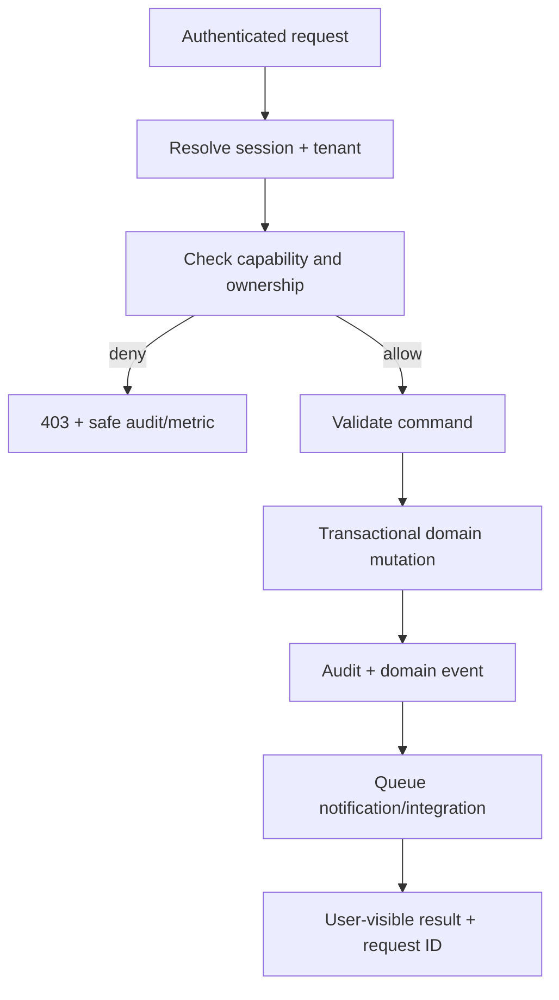
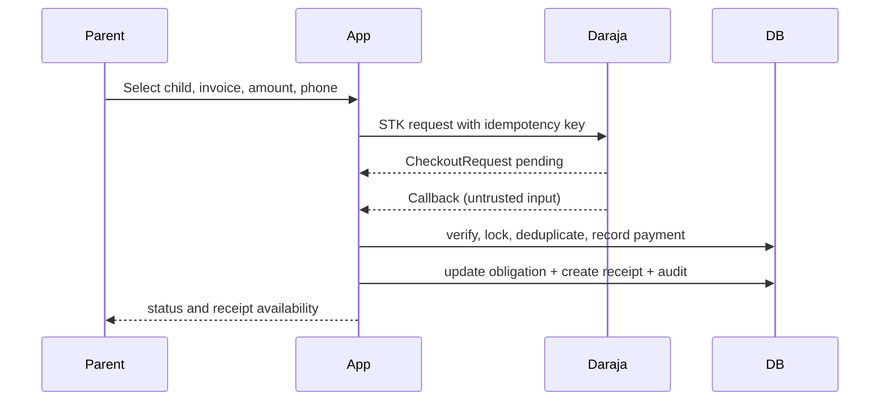
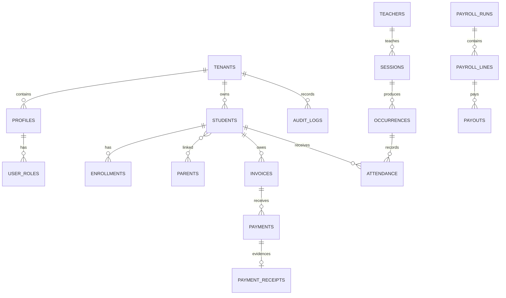

# eShule Software Requirements & Architecture Package

**Status:** Target-state design baseline — approval required before new scope
**Version:** 1.0 · 17 September 2026
**Client:** TBD
**Industry:** Education technology / school operations
**Product:** eShule; ReClass is the remedial learning and programme-management module

## How to use this package

This is the product and architecture baseline for engineering, design, QA, operations and client sign-off. “Current” describes evidence in this repository; “Target” describes the production standard; “Decision” requires client/product approval. No implementation work should begin for a decision item until it is resolved.

### Decisions required before build

1. Client legal entity, first pilot schools, number of schools, curriculum and retention policy.
2. Supported deployment: current Vite/React SPA + Supabase is the repository standard; the supplied Next.js requirement is a proposed alternative, not an approved migration.
3. Whether parents receive accounts by invitation, phone OTP, email/password, or both.
4. Whether students ever receive accounts; current boundary says no student login.
5. M-Pesa collection model: PayBill/Till, C2B reconciliation, STK Push, and B2C payroll payout eligibility.
6. SMS/WhatsApp providers, sender IDs, consent owner, template approval and budget.
7. Required data residency, Data Protection Act obligations, school contracts, DPIA and processor agreements.
8. Offline attendance scope and conflict policy.

## 1. Executive summary

### Problem

Schools operate student records, timetable, remedial programmes, attendance, fees, payments, payroll and parent communication across spreadsheets, paper, messaging apps and disconnected systems. This creates duplicate records, weak accountability, slow fee reconciliation, delayed parent updates and poor visibility into whether remedial intervention is working.

### Solution

eShule is a multi-tenant school-operations SaaS for Kenyan schools. It provides a canonical student record, role-specific workspaces, admissions-to-exit lifecycle, timetable and lessons, ReClass remedial operations, attendance, fees and receipts, payroll, M-Pesa, messaging, reports, governance and audit. The product is mobile-first for parents and operationally efficient for staff.

### Goals and benefits

- Reduce duplicate data entry and paper reconciliation.
- Make every high-risk action attributable, reviewable and tenant-scoped.
- Give parents timely balances, receipts, attendance and school updates.
- Turn remedial activity into measurable intervention evidence.
- Create a modular platform that can serve many schools without cross-tenant leakage.

### Success metrics

Baseline during pilot; targets after 90 days:

| Metric | Target |
|---|---:|
| Active schools completing onboarding | ≥90% |
| Staff critical task completion without support | ≥85% |
| Attendance entry median time | ≤60 seconds per class/session |
| M-Pesa transactions auto-reconciled | ≥95% |
| Duplicate student records | <1% of active records |
| Parent monthly active rate | ≥60% of invited guardians |
| Critical tenant-isolation incidents | 0 |
| Availability excluding planned maintenance | ≥99.5% |
| P95 read interaction | ≤2 seconds on supported 4G |
| Remedial progress review completion | ≥80% per cycle |

## 2. Market research

Comparable African products commonly combine attendance, fees, results, staff management, parent portals, communications and online payments. 365schools advertises this broad suite; Lardi emphasizes lightweight African deployment and parent visibility; SchoolFlow emphasizes fee tracking, parent balances, receipts and WhatsApp support; MyEncore differentiates through local government export/compliance; Skola positions as a broad African school operating system. See [365schools](https://365schools.ng/pricing), [Lardi](https://lardigh.com/), [SchoolFlow](https://www.myschoolflowapp.com/), [MyEncore](https://www.myencore.co.za/za/index.html), and [Skola](https://skolahq.com/).

| Competitor pattern | Strength | Weakness/opportunity for eShule |
|---|---|---|
| Full-suite SIS | Broad coverage and one login | Often generic; make domain ownership and workflows explicit |
| Fee-first tools | Strong collections and receipts | Add attendance, remedial outcomes and student lifecycle |
| Parent portals | Good visibility and engagement | Make linked-child authorization, consent and audit first-class |
| Mobile-money integrations | Familiar local payment behavior | Model callback replay, unmatched payments and reversals rigorously |
| Regional products | Local pricing and terminology | Provide Kenya-native M-Pesa/SMS, exportability and low-bandwidth UX |
| International suites | Mature reporting and integrations | Avoid over-complexity; price and deploy for Kenyan schools |

### Positioning

**“The accountable operating system for Kenyan schools: one student record, one operational truth, and ReClass built in.”** ReClass is the wedge, not a separate identity. The defensible product advantage is the combination of remedial programme evidence, separation of duties, mobile-money reconciliation and parent trust.

### Market gaps to exploit

- Remedial interventions tracked from referral through outcome, not merely attendance.
- Finance evidence that distinguishes obligation, payment, receipt, waiver and reversal.
- Rights-driven UX matching real school responsibilities.
- Reliable low-bandwidth, mobile-first parent journeys.
- Migration/export guarantees that reduce vendor lock-in fear.

## 3. Stakeholders and personas

### Stakeholders

| Stakeholder | Need / authority |
|---|---|
| Super admin / platform operator | Tenant lifecycle, support, modules, platform audit; no implicit school rights |
| School admin | Configuration, users, SIS, operations and reports |
| Principal | Oversight, approvals assigned by policy, effectiveness views |
| Bursar | Fees, receivables, reconciliation, waivers and finance reports |
| Teacher | Assigned lessons, attendance, tasks and permitted progress evidence |
| ReClass committee | Remedial programme governance, review and payroll approvals |
| Payroll operator | Compensation definitions, runs, payout evidence |
| Parent/guardian | Linked-child schedule, attendance, fees, receipts and messages |
| Student | Subject of records; no direct account in current boundary |
| Accountant/auditor | Read-only evidence and exports where authorized |
| Support/implementation | Onboarding and migration under controlled access |
| Safaricom, SMS, WhatsApp, Mailgun/SMTP | External delivery/payment services |
| Regulator/data subject | Privacy, access, correction, retention and deletion rights |

### Personas

- **Grace, school administrator:** high operational knowledge, moderate technical ability; starts the day with exceptions and staff questions; needs queues, bulk actions and safe imports.
- **Brian, bursar:** spreadsheet-fluent, mobile plus desktop; reconciles payments under time pressure; needs idempotent matching, audit history and exportable evidence.
- **Amina, remedial teacher:** mobile-first, limited time between lessons; needs today’s sessions, one-tap attendance and notes that work on unstable networks.
- **Peter, principal:** low-frequency, high-consequence user; wants exceptions, trends, approvals and confidence in data freshness.
- **Wanjiku, parent:** primarily Android phone, intermittent data, prefers SMS/WhatsApp; needs clear child switcher, balance, payment status and receipts.
- **Joseph, platform operator:** technical, multi-tenant; needs health, audit, support impersonation with reason, and tenant-level controls.

## 4–8. Requirements, stories and feature scope

### Requirement convention

IDs are stable: `AUTH`, `TEN`, `SIS`, `ADM`, `ENR`, `LIF`, `RCL`, `CAL`, `ATT`, `FIN`, `PAY`, `COM`, `REP`, `AUD`, `OPS`, `AI`. Priority: Must, Should, Could, Future.

### AUTH — identity and access

**Purpose:** authenticate users and derive tenant, roles, functional assignments and capabilities.

**Must:** invitation/provisioning; sign-in/out; password/OTP recovery; session expiry; tenant-scoped role resolution; parent linked-child scope; server-side capability enforcement; audit of privileged access; optional MFA for staff and mandatory MFA for platform operators; safe impersonation with reason, expiry and banner.

**Rules:** UI visibility is not authorization; a user may have multiple roles only within authorized tenants; disabled/deleted users cannot establish new sessions; parent access is only through active guardian links.

**Edge cases:** expired invite, duplicate phone, removed role during active session, multiple schools, lost phone, clock skew, revoked session, impersonation nesting.

**Acceptance:** unauthorized API calls return a generic 403; cross-tenant reads return no data; role changes take effect on next authorization check; every impersonation has actor, target, reason and expiry.

### TEN — tenant and configuration

Schools, academic years/terms, branding, timezone, currency, enabled modules, contacts, policies, imports/exports and retention settings. Tenant deletion is a controlled, delayed workflow with export and legal hold checks.

### SIS / ADM / ENR / LIF — student operations

Canonical student, guardian, teacher, class/stream, subject, admissions, enrollment, transfers, progression, retention, graduation and exit history. Preserve historical enrollments; never overwrite identity to represent progression. Deduplicate by tenant using admission number plus reviewable candidate matching.

**Acceptance:** importing the same admission number is idempotent or produces a review queue; parent sees only linked children; a withdrawn student remains in historical reports but cannot be enrolled in new activity without reactivation.

### RCL — ReClass

Programme, cohort/group, membership, referral/reason, session template, occurrence, teacher delivery, attendance, progress checkpoints, committee assignment, approvals, remedial fees and eligible compensation.

**Rules:** ReClass does not create a second student identity; capacity and schedule conflicts are checked; attendance edits after approval require a reason and authorized reopen; remedial payroll uses approved eligible records only.

### CAL / ATT — scheduling and attendance

Academic calendar, events, lessons, rooms, recurrence, occurrences, teacher attendance, student attendance, absence reasons, approval and reminders.

**Edge cases:** DST/timezone is fixed to tenant timezone; overlapping room/teacher/student schedules; cancelled occurrence; late joiner; offline duplicate; missing roster.

### FIN / PAY — finance and payroll

Fee definitions, invoices/obligations, discounts/waivers, payments, M-Pesa STK, C2B import/reconciliation, unmatched payments, reversals, receipts, expenses, payroll components, runs, approvals, B2C payout and payment evidence.

**Rules:** payment cannot exceed an obligation unless overpayment policy explicitly allows it; receipt only follows successful payment; invoice is not receipt; waiver requires reason and authority; payroll preparation and approval are separated; provider transaction IDs are unique and idempotent.

### COM — communication

Templates, audiences, linked recipient resolution, consent, SMS, email, WhatsApp, push and in-app inbox. Queue delivery with retry/backoff/dead-letter, provider IDs, opt-out and delivery audit.

### REP / AUD / OPS

Role-scoped dashboards, reports, CSV/PDF exports, scheduled reports, freshness indicators, audit explorer, health checks, provider queue, backups, data-quality exceptions, feature entitlements and incident runbooks.

### Priority feature list

**Must:** tenant isolation; auth/RBAC; SIS; enrollment/lifecycle; ReClass core; timetable; attendance; fees/invoices; M-Pesa STK + callback + reconciliation; receipts; role dashboards; notifications; audit; exports; backups/restore; accessibility; monitoring.

**Should:** offline attendance with sync review; bulk imports with dry-run; parent payment reminders; scheduled reports; WhatsApp; calendar sync; data-quality dashboard; MFA; configurable approval policies.

**Could:** OCR admission documents; mobile PWA install; predictive attendance risk; self-service onboarding; API keys/webhooks; BI connector.

**Future:** student accounts/LMS; multi-currency; multi-country tax/localization; marketplace; autonomous AI actions (prohibited until governance is proven).

### User stories (representative acceptance backlog)

1. As a school admin, I want to invite staff by role so that access is controlled before onboarding.
2. As a school admin, I want to bulk import students with a dry run so that errors do not corrupt records.
3. As a parent, I want to switch between linked children so that I can manage one family account.
4. As a teacher, I want today’s assigned sessions first so that I can act quickly.
5. As a teacher, I want bulk attendance and an edit reason so that marking is fast and accountable.
6. As a committee reviewer, I want pending attendance in a review queue so that payroll inputs are trustworthy.
7. As a bursar, I want unmatched M-Pesa transactions separated from invoices so that I can investigate safely.
8. As a parent, I want to initiate an STK Push and see pending/failed/success states so that I know whether to retry.
9. As a bursar, I want receipts downloadable only after payment success so that evidence is accurate.
10. As a principal, I want a freshness indicator on reports so that I do not act on stale data.
11. As a payroll operator, I want a locked run snapshot so that later attendance edits do not silently change pay.
12. As a platform operator, I want time-limited impersonation with a reason so that support is auditable.
13. As a user, I want accessible keyboard navigation so that I can operate without a mouse.
14. As a user, I want a recoverable error with a request ID so that support can diagnose a failure.
15. As a data subject, I want a controlled export/correction request so that privacy rights are actionable.

Each story must also specify role, tenant scope, validation, audit event, loading/empty/error states, accessibility behavior and an automated test before it is considered done.

## 9–10. System logic and business rules

### Core workflow



### Payments



Payment timeout is not payment failure. The UI offers status refresh/reconciliation, never blindly creates a second charge. Reversal creates a compensating state and audit record; it does not delete history.

### Attendance and payroll

Occurrence scheduled → teacher marks → reviewer approves/rejects → approved snapshot becomes payroll-eligible → payroll run generated → maker approval → payout initiated → provider result reconciled → receipt/evidence attached. A cancelled occurrence is not payable. A reopened approval requires reason and new audit event.

### Business rules

- Every tenant-owned row has tenant identity and server-enforced scope.
- Parent sees only active linked students and permitted fields.
- Teachers see assigned classes/sessions, not all school data.
- School admin rights are configurable but never bypass platform isolation.
- Principal approval is explicit, not implied by title.
- Financial totals are calculated from immutable transaction lines and constrained at database boundary.
- No destructive delete for financial, attendance, audit or lifecycle history; use status/soft delete and retention jobs.
- All dates are stored UTC/timestamptz where events are instants; display uses tenant timezone.
- External callbacks are replay-safe and bound to stored provider state.
- Notifications honor consent, channel preference, quiet hours and STOP/opt-out.
- Exports are logged, permission-checked, time-limited and redacted by role.

## 11–13. UX, design system and information architecture

### UX direction

Operate-first SaaS: every dashboard answers “what matters now, what do I do, what evidence proves it?” Use dense but calm tables for staff, one-handed cards for parents, progressive disclosure, clear ownership language and human recovery paths. WCAG 2.2 AA is the target; the current repository records WCAG 2.1 AA as the minimum.

### Sitemap

```text
Sign in / Recover
Workspace
├── Overview
├── Students
│   ├── Admissions → Enrollment → Student 360 → Lifecycle → Exit
│   ├── Guardians / Teachers / Classes / Subjects
│   └── Imports / Data quality
├── Teaching
│   ├── Timetable / Lessons / Attendance / Tasks
│   └── Results / Progress (where enabled)
├── ReClass
│   ├── Programmes / Cohorts / Sessions / Attendance / Progress
│   ├── Committee / Approvals / Remedial fees / Payroll
├── Finance
│   ├── Fee definitions / Invoices / Payments / Unmatched / Receipts
│   └── Expenses / Reports / Exports
├── Communications
│   ├── Inbox / Compose / Templates / Deliveries / Consent
├── Reports & Analytics
├── Audit
└── Settings
    ├── School / Users & roles / Modules / Integrations / Policies
```

Parent navigation is intentionally smaller: Home, Children, Timetable, Attendance, Fees, Pay, Receipts, Messages, Account.

### Page standards

Every page defines title, purpose, primary action, filters, table/card view, empty state, loading skeleton, recoverable error, permission-denied state, mobile behavior, keyboard order and analytics events. Destructive actions require confirmation with consequence and reason. Tables support responsive card transformation, sticky key columns only when necessary, pagination and export permission checks.

### Design tokens

Use semantic tokens, not raw colors: `surface`, `surface-raised`, `text`, `muted`, `border`, `primary`, `success`, `warning`, `danger`, `info`. Base palette: ink `#172033`, slate `#526176`, canvas `#F7F9FC`, indigo `#4F46E5`, teal `#0F766E`, amber `#B45309`, red `#B42318`; verify contrast in light/dark themes. Type: system sans or Inter-compatible fallback; 12/14/16/18/24/32 scale; body 1.5 line-height. Spacing: 4px base; 8/12/16/24/32/48 rhythm. Radius: 6 inputs, 10 cards, 14 dialogs. Motion 150–220ms, transform/opacity only, disabled for reduced motion.

Full component contract belongs in [`design.md`](design.md); this package makes its required states binding: default, hover, focus-visible, pressed, disabled, loading, success, error, empty, permission denied and offline/sync pending.

## 14. Database design

PostgreSQL in Supabase; normalized transactional schema, tenant key on every tenant-owned table, UUID primary keys, `created_at`, `updated_at`, actor fields and `deleted_at` only where soft deletion is valid. Use foreign keys, check constraints, unique tenant-scoped natural keys, partial indexes for active rows and composite indexes beginning with `tenant_id`.



Core aggregates: Tenant, User/Role, Student/Enrollment, GuardianLink, Teacher, Class/Subject, Programme/Cohort, Session/Occurrence, Attendance, Obligation/Invoice, Payment/Receipt, PayrollRun/Line/Payout, Notification/Delivery, AuditLog. Current migrations already contain many of these domains; future changes must use forward-only expand-and-contract migrations.

Security: enable RLS on every exposed table and revoke default grants as appropriate. Supabase documents RLS as database-level granular authorization and notes that service-role bypasses RLS; therefore privileged operations require explicit tenant predicates and narrow server-only functions. See [Supabase RLS guidance](https://supabase.com/docs/guides/database/postgres/row-level-security).

## 15. API design

Target versioned REST boundary: `/api/v1`. Existing form actions/RPCs remain compatibility internals until migrated.

| Method | Resource | Capability |
|---|---|---|
| GET/POST | `/tenants/{id}/students` | `students.read/write` |
| GET/PATCH | `/students/{id}` | scoped student access |
| POST | `/admissions` | `admissions.write` |
| GET/POST | `/reclass/sessions/{id}/attendance` | assigned/committee rights |
| GET/POST | `/invoices`, `/payments/stk` | finance / linked parent |
| POST | `/payments/{id}/reconcile` | `finance.reconcile` |
| GET | `/reports/{report}` | report capability |
| POST | `/notifications/dispatch` | internal/service only |
| GET | `/audit-events` | audit capability |

Use bearer Supabase JWT for users; service-to-service signed secret or mTLS where supported. Standard response envelope includes `data`, `meta`, `request_id`; errors include stable `code`, safe `message`, `details` only for validation. Cursor pagination for large collections; allowlisted filters/sorts; 429 rate limits with `Retry-After`; idempotency keys required for charges, imports and payout commands. OpenAPI is the contract artifact and must be generated/validated in CI.

## 16–17. Backend and frontend architecture

### Backend

Modular monolith with Clean Architecture boundaries: routes/controllers → application commands/queries → domain policies/services → repositories/adapters → Supabase/Postgres. Integrations live behind ports: Daraja, SMS, WhatsApp, email, storage and calendar. Workers claim queue rows using leases, exponential backoff and dead-letter state. Cache only derived, non-authoritative data; invalidate on domain events.

### Frontend decision

**Approved incumbent:** Vite + React + TypeScript SPA under `apps/web-react/`, Supabase client, Tailwind and shared components, static deployment. SvelteKit remains deprecated reference code. **Next.js is not to be introduced without an ADR** covering migration cost, routing/auth parity, deployment, SEO need, bundle impact and rollback. This avoids maintaining two application shells.

Suggested target folders:

```text
apps/web-react/src/
  app/ routes/ layouts/
  components/ui components/domain
  features/{auth,sis,reclass,finance,communications,reports}
  lib/{api,auth,permissions,validation,telemetry}
  hooks/ stores/ styles/
```

Use TanStack Query or equivalent for server state, React Hook Form + Zod for forms, URL state for filters, error boundaries per route, optimistic updates only for reversible low-risk actions, and explicit mutation confirmation for financial/governance actions.

## 18. Security and threat model

Threats: cross-tenant IDOR, privilege escalation, service-role leakage, XSS in messages, SQL injection/import abuse, CSRF, credential stuffing, callback replay, duplicate charging, data export abuse, malicious files, provider outage and insider misuse.

Controls: RLS + server ownership checks; least privilege; MFA; secure cookies; CSRF protection for cookie mutations; output encoding/sanitization; parameterized SQL; upload MIME/size scanning; rate limits; CSP/security headers; secret manager; audit and alerting; signed callback verification; idempotency; encrypted transport/at rest; retention and redaction. Map controls to OWASP Top 10 and test each release. Never place service-role keys in browser bundles.

## 19–20. Integrations and notifications

M-Pesa Daraja STK Push/C2B/B2C (only capabilities approved by Safaricom), Supabase Auth/Storage, SMTP/Mailgun, Mobiwave SMS, WhatsApp Business provider, optional Google/Microsoft calendar. Each adapter has sandbox credentials, timeout, retry, circuit-breaker, health check, provider correlation ID and runbook.

Notification pipeline: domain event → recipient resolver → consent/policy check → template render → queue → leased delivery → provider → delivery receipt → audit/metrics. Retry transient errors 1m/5m/30m/2h; dead-letter after bounded attempts; never retry permanent opt-out/invalid recipient. Templates are versioned, localized later, previewable and redact sensitive values in logs.

## 21–22. Analytics and AI

KPIs: enrollment funnel, attendance rate, chronic absence, remedial participation/outcome, fee collection rate, aging, reconciliation latency, notification delivery, staff task completion, parent engagement, system latency and error rate. Every dashboard shows date range, timezone, freshness, denominator and export timestamp.

AI opportunities: import field suggestions, OCR for admission documents, natural-language report filters, draft parent messages, attendance anomaly triage, remedial progress summaries and support search. AI must be opt-in per tenant, minimize data, log prompts/results, disclose uncertainty, require human confirmation for grades/attendance/payments/waivers/payroll/access/welfare, enforce cost limits and provide a kill switch.

## 23. Testing strategy

Unit-test domain policies, money arithmetic, permission matrices and state machines. Integration-test RLS, repository queries, migrations, callbacks, queue claims and provider adapters. E2E-test login, parent scope, attendance approval, STK success/failure/replay, reconciliation, payroll separation and exports. Add performance tests at realistic tenant distributions, security tests for OWASP/IDOR, automated axe checks, keyboard/screen-reader checks, device/network throttling and role-based UAT.

Release minimum: lint, typecheck, unit/integration, migration replay, cross-tenant negatives, build, E2E critical paths, accessibility smoke, dependency scan, backup restore evidence and staging provider callbacks.

## 24–25. Deployment, operations and scale

Environments: local → staging → production, isolated Supabase projects and provider credentials. Deploy the current Vite SPA to Vercel static hosting and Edge Functions/Supabase; DirectAdmin EVO VPS is a decision item and should not be mixed into the supported path. CI promotes the same tested commit. Use PITR/backup, restore drills, Sentry/structured logs, health endpoints, alerting and incident runbooks.

Scale plan:

| Scale | Design posture | Bottleneck watch |
|---|---|---|
| 100 users | single project, indexed queries, basic queue | authorization correctness |
| 1,000 | composite indexes, pagination, queue leases | dashboard fan-out |
| 10,000 | read models/materialized aggregates, CDN, batch exports | reporting and notifications |
| 100,000 | tenant partitioning strategy, broker, dedicated workers/read replicas | noisy neighbors, provider quotas |

Do not shard or add microservices before profiling. Partition high-volume audit/notification/payment-event tables by time or tenant only when measured. Apply per-tenant quotas and backpressure.

## 26–27. Roadmap and risks

**Phase 1 release foundation:** resolve decisions; verify tenancy/RLS; finish auth/MFA; harden finance/payment lifecycle; provider sandbox; backup/restore; critical E2E and accessibility; pilot onboarding.

**Phase 2 operations:** offline attendance; bulk imports; scheduled reports; consent/STOP; WhatsApp; calendar sync; data quality; billing/entitlements.

**Phase 3 intelligence/commercial:** governed analytics, AI assistive features, self-service onboarding, API/webhooks, multi-country readiness.

| Risk | Mitigation |
|---|---|
| Wrong stack migration | ADR and costed decision; keep one supported shell |
| Cross-tenant breach | RLS, explicit service-role predicates, negative tests, security review |
| Payment mismatch/replay | state machine, unique provider IDs, reconciliation queue, compensating records |
| Low parent adoption | SMS-first onboarding, low-bandwidth UX, assisted support |
| Provider outage | status transparency, retries, manual reconciliation, circuit breakers |
| Privacy breach | DPIA, minimization, retention, access/export/delete workflows |
| Scope explosion | priority gates and domain ownership |
| Poor data migration | dry run, mapping, duplicate review, signed acceptance |

## 28. Areas for improvement

The highest-value improvements are not more screens: enforce database invariants, complete consent/STOP, make restore and callback evidence operational, add data freshness, formalize a public API only after internal contracts stabilize, and provide export/offboarding to build trust. Revenue options are per-student or per-school tiers, paid onboarding/migration, messaging usage, premium reporting and payment reconciliation services; never charge for basic data portability or security.

## 29. Documentation map

The repository’s root documents are current-state sources of truth. This package is the target-state decision baseline.

| Document | Purpose |
|---|---|
| `README.md` | product and local development entry point |
| `ARCHITECTURE.md` | current architecture |
| `DATABASE.md` | current schema/integrity |
| `API.md` | current interfaces |
| `SECURITY.md` | current security model |
| `DEPLOYMENT.md` | supported deployment |
| `docs/design.md` | visual and interaction system |
| `docs/guides/*` | developer/user/admin operations |
| this package | complete requirements and target architecture |

Required maintenance: update affected docs in the same change as schema, API, permission, integration or global UX changes. `CHANGELOG.md` records user-visible changes; `ROADMAP.md` records sequencing.

## 30. Development plan

| Milestone | Complexity | Indicative effort | Dependency |
|---|---|---:|---|
| Product decisions, DPIA, data dictionary | M | 1–2 weeks | client workshops |
| Tenant/auth/RBAC/MFA/RLS verification | L | 2–4 weeks | decisions |
| SIS/admissions/enrollment migration hardening | L | 3–5 weeks | schema/data mapping |
| ReClass/attendance/approval state machine | L | 3–5 weeks | SIS + roles |
| Finance/M-Pesa/reconciliation/receipts | XL | 4–7 weeks | provider approval |
| Payroll separation and payout evidence | L | 3–5 weeks | attendance/finance |
| Communications/consent/delivery | L | 2–4 weeks | provider contracts |
| Reports/exports/analytics | M | 2–4 weeks | stable domain data |
| UX/accessibility/responsive hardening | L | 3–5 weeks | stable flows |
| Deployment/observability/restore/UAT | L | 2–4 weeks | all critical flows |
| Pilot, training, migration and hypercare | M | 2–4 weeks | release evidence |

Effort assumes a small senior team (product/BA, designer, 2–3 engineers, QA/DevOps) and excludes provider procurement delays and large-scale data cleansing. Recommended order is security/data foundations → critical operational flows → financial correctness → communication → reporting → polish and expansion.

## Traceability and sign-off

Before implementation, the client approves: product boundary, personas, roles, workflows, priority list, data categories/retention, integration contracts, deployment target, success metrics and UAT participants. Engineering then maps `REQ-ID → user story → API/schema → test → release evidence`.
